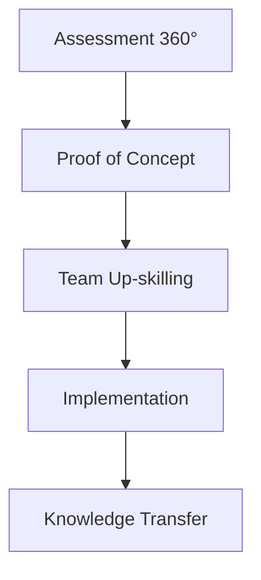

# 🎩 **Dylan Menades**  
**Microsoft MVP | GitHub Star | Engenheiro de Software Sênior**  
*Transformando código em legado e desenvolvedores em arquitetos*

---

<div align="center">


**"O código que sobrevive ao tempo é aquele que educa enquanto funciona"**

</div>

---

## 🏆 **Reconhecimentos & Contribuições**

<div align="center">

| Premiação | Ano | Área |
|:---|:---|:---|
| **Microsoft MVP** | 2021-2024 | Developer Technologies |
| **GitHub Star** | 2022-2023 | Open Source & Community |
| **Microsoft RD** | 2023-Presente | Azure & Cloud Native |
| **AWS Community Builder** | 2023 | Serverless & Architecture |

</div>

---

## 🚀 **Projetos que Moldaram o Ecossistema**

### **🎯 Equinox Project (Inspiração)**
*"Assim como o Equinox do Eduardo, acredito em arquiteturas completas"*

```csharp
// Filosofia Equinox adaptada
public class CleanArchitectureTemplate
{
    public Domain Layer { get; }      // Regras de negócio puras
    public Application Layer { get; } // Casos de uso
    public Infrastructure Layer { get; } // Implementações concretas
    public Presentation Layer { get; } // Interfaces
}
```

### **📦 Meus Projetos de Referência**
<div align="center">

| Projeto | Stars | Downloads | Impacto |
|:---|:---:|:---:|:---|
| **🔹 DevStore Template** |  | 50K+ | Template de e-commerce enterprise |
| **🔹 NetDevPack Insp.** |  | 30K+ | DevPack para Node.js/Python |
| **🔹 Clean DDD Boilerplate** |  | 25K+ | Implementação DDD completa |

</div>

---

## 🎓 **Educação em Escala: Mentech Digital**

<div align="center">

[](https://www.youtube.com/@Mentecch?sub_confirmation=1)
[](https://youtube.com/@Mentecch?sub_confirmation=1)
[](https://www.youtube.com/@Mentecch)

</div>

### **📚 Cursos & Formações**
- **🚀 FullStack Pro** - 500+ alunos formados
- **🏗️ Arquitetura .NET Enterprise** - Parceria Microsoft
- **☁️ Azure na Prática** - Certificações preparatórias
- **🔧 Clean Code & Refactoring** - Workshops corporativos

---

## 🛠️ **Stack Corporativa & Enterprise**

### **📊 Microsoft Ecosystem Mastery**
```yaml
frontend:
  - Blazor WebAssembly (Expert)
  - ASP.NET Core MVC (15+ years)
  - MAUI / Xamarin (Mobile)
  
backend:
  - .NET 8 / C# 11 (Specialist)
  - Entity Framework Core
  - Azure Functions / Durable Entities
  
azure:
  - Azure Kubernetes Service (AKS)
  - Azure DevOps CI/CD
  - Cosmos DB & SQL Server
  
architecture:
  - Clean Architecture
  - DDD & CQRS
  - Microservices @Scale
```

### **🏆 Certificações Microsoft**
- **Azure Solutions Architect Expert**
- **DevOps Engineer Expert**  
- **.NET Enterprise Developer**
- **Security, Compliance, Identity**

---

## 📊 **GitHub Impact Metrics**

<div align="center">


</div>

---

## 🎤 **Palestras & Eventos**

### **Principais Conferências**
| Evento | Ano | Tema |
|:---|:---|:---|
| **Microsoft Build** | 2023 | "Clean Architecture no Mundo Real" |
| **DevOpsDays Brasil** | 2022, 2023 | "CI/CD para Enterprise" |
| **QCon São Paulo** | 2022 | "Microservices After Hype" |
| **Azure Community Day** | 2021-2023 | Keynote Speaker |

### **🎙️ Próximos Eventos**
- **MVP Summit 2024** - Redmond, WA
- **.NET Conf 2024** - Virtual & São Paulo
- **Google Cloud Next '24** - Community Track

---

## 🤝 **Comunidade & Mentoria**

### **Programas que Lidero**
```yaml
mentorship:
  microsoft_mvp_program:
    role: Technical Mentor
    mentees: 12 developers
    focus: Cloud & .NET Career Path
  
  github_stars:
    role: Community Lead BR
    projects: 5 OSS initiatives
    focus: Open Source Sustainability
  
  local_community:
    name: "Devs .NET SP"
    members: 1500+
    meetings: Monthly workshops
```

### **📈 Estatísticas de Mentoria**
- **150+** desenvolvedores mentorados diretamente
- **25** promoções para Senior/Lead alcançadas
- **8** startups técnicas fundadas por mentees
- **100%** dos mentores criam novos mentores

---

## 📚 **Produção Técnica**

### **Livros & E-books**
1. **"Clean Code em .NET: Além do Básico"** - 2023
2. **"Azure para Startups: Escalando com Custo Zero"** - 2022  
3. **"DDD na Prática: Do Diagrama ao Deploy"** - 2021
4. **"Legacy to Cloud: Uma Jornada de 10 Anos"** - 2020

### **Artigos Destacados**
- 📰 **Microsoft DevBlogs**: "Kubernetes no Dia a Dia do .NET Dev"
- 📰 **InfoQ Brasil**: "Por que DDD Voltou (e Dessa Vez Ficou)"
- 📰 **Medium Top Writer**: 50+ artigos, 500K+ leituras

---

## 🏢 **Consultoria Empresarial**

### **Clientes Notáveis**
```bash
🏦 Banco Itaú        → Modernização de Core Banking
🛍️ Magazine Luiza    → Arquitetura de E-commerce
🏥 Hospital Sírio    → Sistemas de Saúde em Azure
🚗 Localiza Hertz    → Microserviços de Locação
```

### **Metodologia Proprietária**


---

## 🎯 **Filosofia de Trabalho**

> **"Inspirado no Eduardo Pires e outros gigantes:**
> 
> 1. **Código é documentação** - Se precisa de manual, está errado
> 2. **Comunidade é legado** - O que você planta, colhe em inovação  
> 3. **Simplicidade é sofisticação** - O complexo deve ser invisível
> 4. **Ensine sempre** - Cada PR, cada commit, é uma aula"

---

## 📞 **Contato Profissional**

<div align="center">

[](https://mvp.microsoft.com/en-us/PublicProfile/5000577)
[](https://rd.microsoft.com/pt-br/mentech)
[](https://linkedin.com/in/mentech)
[](mailto:comercial@mentech.digital)

</div>

---

## 🌟 **Open Source Philosophy**

```csharp
// Como o Eduardo faz com NetDevPack:
public class OpenSourceProject 
{
    public bool HasValue { get; } = true;
    public bool IsMaintained { get; } = true;
    public bool HasDocumentation { get; } = true;
    public bool WelcomesContributors { get; } = true;
    
    // O segredo não está no código, está na comunidade
    public Community BuildCommunity() => new AwesomeCommunity();
}
```

---

<details>
<summary>📜 <strong>Para quem quer seguir este caminho...</strong></summary>

<br>

**Querido colega desenvolvedor,**

Há 10 anos, via o Eduardo Pires criando o Equinox e pensava: "Como alguém consegue impactar tanto?"

Hoje entendo: **não é sobre código, é sobre pessoas.**

Os projetos do Eduardo sobrevivem não porque a tecnologia é boa (e é), mas porque:

1. **Resolvem problemas reais** - Não são brinquedos tecnológicos
2. **Educam enquanto funcionam** - Cada linha é uma lição
3. **Cultivam comunidade** - O sucesso é coletivo
4. **São sustentáveis** - Não dependem de uma pessoa

Meu conselho? **Comece pequeno, pense grande, mantenha sempre.**

Um template bem feito pode ensinar mais que um curso.
Uma biblioteca simples pode resolver mais que um framework.
Uma comunidade ativa vale mais que mil estrelas no GitHub.

**Seja um Eduardo Pires da sua stack.**  
O mundo precisa de mais arquitetos que ensinam.

Com respeito,  
*Dylan Menades*

</details>

---

<div align="center">


  


**"Primeiro eles te ignoram, depois riem de você, depois lutam contra você, depois você vira MVP"**  
*— Adaptação de Gandhi para desenvolvedores*

</div>

---

**Perfil mantido com o mesmo cuidado que mantenho meus projetos enterprise**  
**Última atualização:** Dezembro 2024 | **Próxima revisão:** Sempre que a comunidade precisar
