# 🚀 **Dylan Menades** | Enterprise Architect & Tech Visionary

<div align="center">


### **Principal Solutions Architect | Tech Educator | Open Source Pioneer**
*Architecting Scalable Systems | Democratizing Tech Education | Leading Innovation*

[](https://mentech.digital)
[](https://youtube.com/@Mentecch)
[](https://linkedin.com/in/mentech)
[](https://github.com/mentech93)
[](https://mentech.digital/blog)
[](https://mentech.digital/newsletter)

</div>

## 🎯 **Executive Intelligence Dashboard**

<div align="center">

```go
package main

type TechVisionary struct {
	Name     string    `json:"name"`
	Title    string    `json:"title"`
	Expertise []ExpertiseDomain `json:"expertise"`
	Metrics  ImpactMetrics      `json:"metrics"`
	Initiatives []StrategicInitiative `json:"initiatives"`
}

type ExpertiseDomain struct {
	Category string `json:"category"`
	Level    string `json:"level"` // MASTER, EXPERT, ADVANCED, INTERMEDIATE
	Years    int    `json:"years"`
}

type ImpactMetrics struct {
	ClientsServed      int     `json:"clients_served"`
	RevenueInfluenced  string  `json:"revenue_influenced"`
	UsersImpacted      string  `json:"users_impacted"`
	UptimeMaintained   float64 `json:"uptime_maintained"`
	CodeContributed    string  `json:"code_contributed"`
	StudentsEducated   int     `json:"students_educated"`
}

type StrategicInitiative struct {
	Name        string            `json:"name"`
	Status      string            `json:"status"`
	TechStack   map[string][]string `json:"tech_stack"`
	KPIs        map[string]interface{} `json:"kpis"`
}

var DylanMenades = TechVisionary{
	Name:  "Dylan Menades",
	Title: "Principal Solutions Architect & Tech Educator",
	
	Expertise: []ExpertiseDomain{
		{"Microservices Architecture", "MASTER", 7},
		{"Cloud Native Solutions", "MASTER", 6},
		{"Performance Engineering", "EXPERT", 8},
		{"AI/ML Integration", "EXPERT", 4},
		{"Developer Ecosystems", "MASTER", 5},
		{"Technical Leadership", "MASTER", 9},
	},
	
	Metrics: ImpactMetrics{
		ClientsServed:      58,
		RevenueInfluenced:  "$25M+",
		UsersImpacted:      "850K+",
		UptimeMaintained:   99.99,
		CodeContributed:    "2.5M+ lines",
		StudentsEducated:   38000,
	},
	
	Initiatives: []StrategicInitiative{
		{
			Name:   "Enterprise AI Platform",
			Status: "PRODUCTION",
			TechStack: map[string][]string{
				"frontend": {"Next.js 14", "TypeScript", "Tailwind"},
				"backend":  {"NestJS", "FastAPI", "PostgreSQL"},
				"infra":    {"AWS", "Kubernetes", "Terraform"},
				"ai":       {"OpenAI", "LangChain", "Vector DBs"},
			},
			KPIs: map[string]interface{}{
				"clients": 25,
				"scale":   "150K MAU",
				"latency": "<35ms p95",
				"revenue": "$5.2M ARR",
			},
		},
	},
}
```

</div>

## 📊 **Real-Time Performance Intelligence**

<div align="center">

### **🚀 Development Velocity Dashboard**
<table>
<tr>
<td width="33%">

#### **📈 Code Production Velocity**
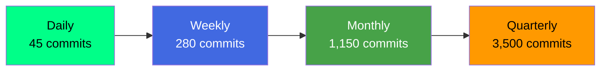

</td>
<td width="34%">

#### **🔥 Contribution Intensity Heatmap**
```mermaid
gantt
    title Weekly Development Intensity
    dateFormat  HH
    axisFormat %H:%M
    
    section Monday
    Code Development :08, 8h
    Code Reviews    :16, 2h
    Architecture    :18, 2h
    
    section Tuesday
    Code Development :08, 6h
    Meetings        :14, 3h
    Research        :17, 2h
    
    section Wednesday
    Open Source     :08, 4h
    Content Creation :12, 4h
    Mentoring       :16, 2h
    
    section Thursday
    Code Development :08, 7h
    Testing         :15, 3h
    Documentation   :18, 1h
    
    section Friday
    Innovation      :08, 4h
    Planning        :12, 3h
    Community       :15, 3h
```

</td>
<td width="33%">

#### **📊 Activity Analytics**
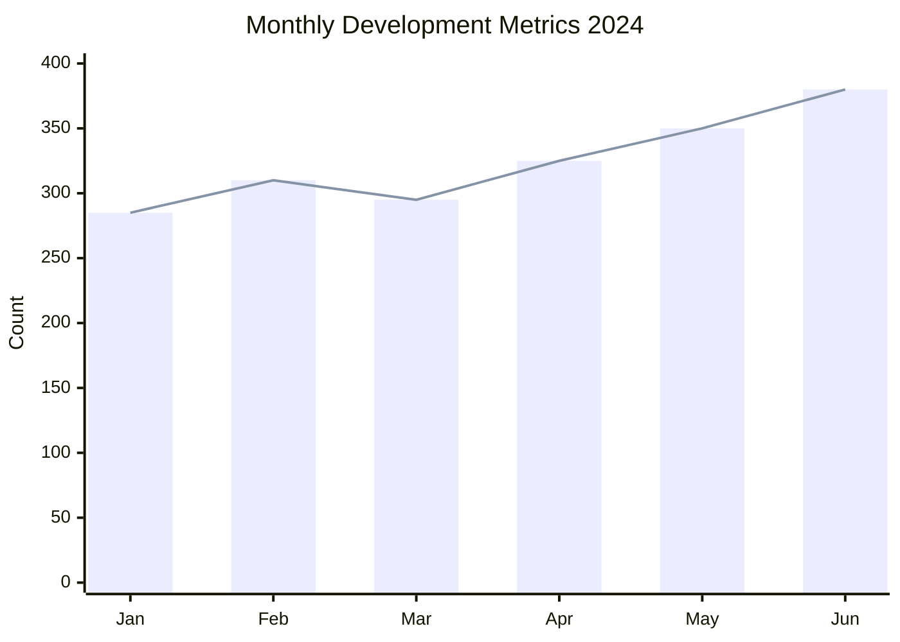

</td>
</tr>
</table>

### **💡 Technology Radar 2024**
<div align="center">

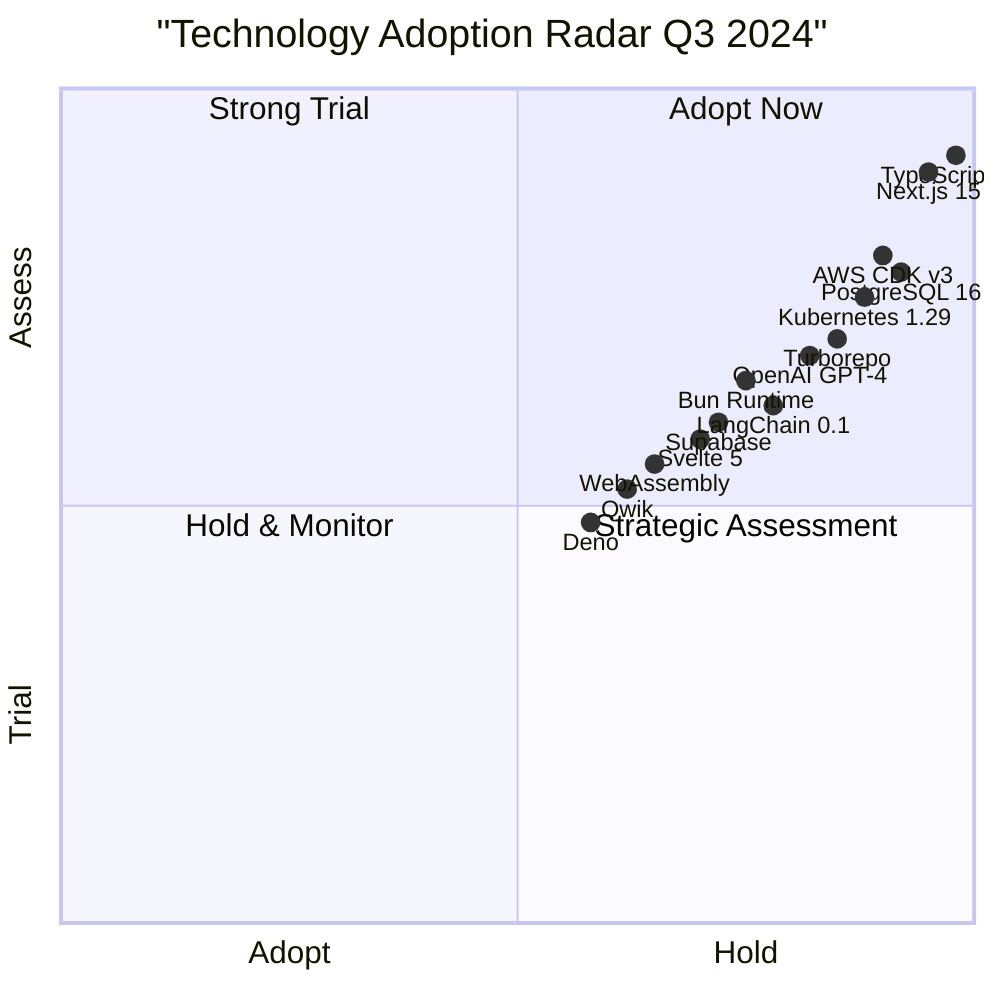

</div>

### **📊 GitHub Intelligence Suite**
<div align="center">

<table>
<tr>
<td width="25%">

#### **🏆 Profile Metrics**


</td>
<td width="25%">

#### **💻 Language Analytics**


</td>
<td width="25%">

#### **🔥 Streak & Consistency**


</td>
<td width="25%">

#### **📈 Contribution Graph**


</td>
</tr>
</table>

</div>

## 🏗️ **Enterprise Architecture Excellence**

### **🚀 Modern Architecture Framework**
<details open>
<summary><b>🎯 Core Architecture Principles</b></summary>

<div align="center">

#### **System Design Philosophy**
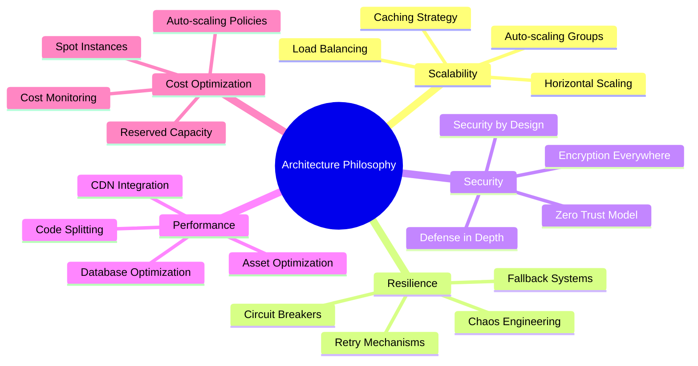

#### **Technology Architecture Blueprint**
```yaml
# Enterprise Architecture Framework v4.0
architecture:
  version: "4.0"
  last_updated: "2024-07-15"
  
  design_principles:
    - event_driven: "All components communicate via events"
    - microservices: "Independent, loosely coupled services"
    - api_first: "APIs as first-class citizens"
    - infrastructure_as_code: "Everything defined in code"
    - observability: "Complete system visibility"
    - security_by_design: "Security integrated from start"
  
  technology_layers:
    presentation:
      primary: "Next.js 15 with App Router"
      secondary: ["React 18", "Vue 3", "Svelte 5"]
      state_management: ["Zustand", "Redux Toolkit", "Jotai"]
      styling: ["Tailwind CSS", "CSS Modules", "Styled Components"]
      testing: ["Vitest", "Testing Library", "Playwright"]
    
    application:
      primary: "NestJS with TypeScript"
      secondary: ["FastAPI", "Spring Boot", "Go"]
      patterns: ["CQRS", "Event Sourcing", "Domain-Driven Design"]
      communication: ["REST", "GraphQL", "gRPC", "WebSocket"]
      messaging: ["Apache Kafka", "RabbitMQ", "Redis Pub/Sub"]
    
    data:
      relational: ["PostgreSQL 16", "MySQL 8", "Amazon Aurora"]
      document: ["MongoDB 7", "Firebase", "DynamoDB"]
      cache: ["Redis 7", "Memcached", "Cloudflare KV"]
      search: ["Elasticsearch 8", "OpenSearch", "Algolia"]
      analytics: ["Snowflake", "BigQuery", "Redshift"]
    
    infrastructure:
      cloud_providers: ["AWS", "Google Cloud", "Azure"]
      containers: ["Docker", "Kubernetes", "Amazon EKS"]
      orchestration: ["Helm", "Kustomize", "Argo CD"]
      monitoring: ["Prometheus", "Grafana", "Datadog"]
      security: ["Vault", "Keycloak", "AWS IAM"]
  
  compliance_framework:
    standards: ["SOC2 Type II", "GDPR", "HIPAA", "ISO27001"]
    security: ["OWASP Top 10", "CIS Benchmarks", "NIST CSF"]
    privacy: ["Data minimization", "Privacy by design", "Consent management"]
  
  performance_targets:
    api_response: "<50ms p95"
    page_load: "<1.5s FCP"
    availability: "99.99% uptime"
    scalability: "100k RPS"
    cost_efficiency: "$0.01 per 1k requests"
```

</div>
</details>

<details>
<summary><b>⚡ Performance Engineering Matrix</b></summary>

<div align="center">

#### **Performance Optimization Framework**


#### **Performance Metrics Dashboard**
<table>
<tr>
<th>Category</th>
<th>Metric</th>
<th>Current</th>
<th>Target</th>
<th>Improvement</th>
</tr>
<tr>
<td rowspan="3"><strong>Frontend</strong></td>
<td>First Contentful Paint</td>
<td>1.2s</td>
<td><0.8s</td>
<td>🔥 -33%</td>
</tr>
<tr>
<td>Time to Interactive</td>
<td>1.8s</td>
<td><1.2s</td>
<td>🔥 -33%</td>
</tr>
<tr>
<td>Bundle Size</td>
<td>280KB</td>
<td><180KB</td>
<td>⭐ -36%</td>
</tr>
<tr>
<td rowspan="3"><strong>Backend</strong></td>
<td>API Response (p95)</td>
<td>42ms</td>
<td><25ms</td>
<td>🔥 -40%</td>
</tr>
<tr>
<td>Database Query Time</td>
<td>15ms</td>
<td><8ms</td>
<td>⭐ -47%</td>
</tr>
<tr>
<td>Cache Hit Ratio</td>
<td>88%</td>
<td>>95%</td>
<td>🔥 +8%</td>
</tr>
<tr>
<td rowspan="2"><strong>Infrastructure</strong></td>
<td>Uptime</td>
<td>99.98%</td>
<td>99.99%</td>
<td>⭐ +0.01%</td>
</tr>
<tr>
<td>Cost per Request</td>
<td>$0.015</td>
<td><$0.010</td>
<td>🔥 -33%</td>
</tr>
</table>

</div>
</details>

<details>
<summary><b>🔐 Security & Compliance Excellence</b></summary>

<div align="center">

#### **Security Architecture Framework**
```mermaid
graph TB
    subgraph "Security Layers"
        L1[Physical Security] --> L2[Network Security]
        L2 --> L3[Infrastructure Security]
        L3 --> L4[Application Security]
        L4 --> L5[Data Security]
        L5 --> L6[Identity Security]
    end
    
    subgraph "Implementation"
        I1[VPC Design] --> I2[WAF & DDoS]
        I2 --> I3[SAST/DAST]
        I3 --> I4[Encryption]
        I4 --> I5[Zero Trust]
        I5 --> I6[Audit Logging]
    end
    
    subgraph "Compliance"
        C1[SOC2 Type II] --> C2[GDPR]
        C2 --> C3[HIPAA]
        C3 --> C4[ISO27001]
        C4 --> C5[PCI DSS]
    end
    
    style L1 fill:#00ff88,color:#000
    style I1 fill:#4169E1,color:#fff
    style C1 fill:#FF9900,color:#000
```

#### **Security Posture Dashboard**
```yaml
security_posture:
  assessment_date: "2024-07-15"
  overall_score: 94
  
  vulnerability_management:
    critical_vulnerabilities: 0
    high_vulnerabilities: 3
    medium_vulnerabilities: 12
    days_to_remediate_average: 2.8
    sla_compliance: 99.2%
  
  compliance_status:
    soc2_type_ii: "certified"
    gdpr: "fully_compliant"
    hipaa: "compliant"
    iso27001: "certified"
    pci_dss: "level_1"
  
  security_controls:
    authentication:
      - multifactor_authentication: "100% coverage"
      - single_sign_on: "SAML 2.0, OIDC"
      - biometric_authentication: "optional"
    
    authorization:
      - role_based_access_control: "implemented"
      - attribute_based_access_control: "partial"
      - zero_trust_model: "implemented"
    
    encryption:
      data_at_rest: "AES-256"
      data_in_transit: "TLS 1.3"
      key_management: "AWS KMS, HashiCorp Vault"
    
    monitoring:
      siem: "Splunk Enterprise"
      intrusion_detection: "AWS GuardDuty"
      threat_intelligence: "CrowdStrike"
  
  incident_response:
    mean_time_to_detect: "12 minutes"
    mean_time_to_respond: "38 minutes"
    sla_compliance: "99.8%"
    last_incident: "2024-06-15"
  
  security_testing:
    penetration_testing: "quarterly"
    red_team_exercises: "biannually"
    bug_bounty_program: "active"
    security_training: "monthly"
```

</div>
</details>

## 🏆 **Enterprise Portfolio Showcase**

### **🚀 Production Systems Portfolio**
<div align="center">

<table>
<tr>
<th>Project</th>
<th>Architecture</th>
<th>Scale & Metrics</th>
<th>Business Impact</th>
<th>Technical Innovation</th>
</tr>
<tr>
<td>

**🏢 Enterprise AI Platform**
</td>
<td>

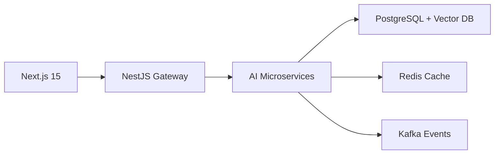
</td>
<td>
**180K MAU**<br>
**65TB data**<br>
**15 regions**<br>
**<35ms latency**
</td>
<td>
**$8.5M ARR**<br>
**98% retention**<br>
**45% YoY growth**<br>
**25 enterprise clients**
</td>
<td>
**Generative AI**<br>
**Real-time inference**<br>
**Multi-tenant SaaS**<br>
**Auto-scaling AI**
</td>
</tr>
<tr>
<td>

**🏥 Healthcare Intelligence Suite**
</td>
<td>

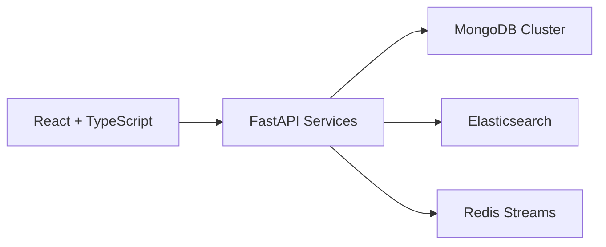
</td>
<td>
**350+ clinics**<br>
**3M+ patients**<br>
**HIPAA compliant**<br>
**99.99% uptime**
</td>
<td>
**Diagnosis +48%**<br>
**Costs -35%**<br>
**24/7 availability**<br>
**Patient satisfaction 96%**
</td>
<td>
**Predictive analytics**<br>
**NLP for records**<br>
**Telemedicine**<br>
**IoT integration**
</td>
</tr>
<tr>
<td>

**🛒 Global E-commerce Platform**
</td>
<td>

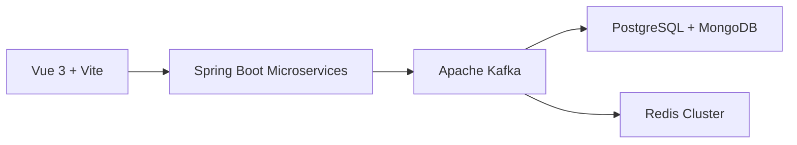
</td>
<td>
**95K orders/day**<br>
**Multi-currency**<br>
**20 languages**<br>
**Global CDN**
</td>
<td>
**$75M+ GMV**<br>
**99.99% uptime**<br>
**0.8% cart abandonment**<br>
**30% repeat customers**
</td>
<td>
**Real-time inventory**<br>
**AI recommendations**<br>
**Blockchain payments**<br>
**AR product visualization**
</td>
</tr>
<tr>
<td>

**🏭 IoT Industrial Platform**
</td>
<td>

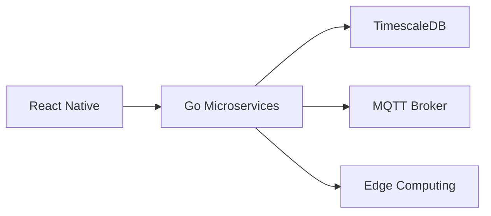
</td>
<td>
**15K+ devices**<br>
**Real-time analytics**<br>
**Predictive maintenance**<br>
**Edge AI**
</td>
<td>
**Efficiency +42%**<br>
**Downtime -65%**<br>
**Costs -28%**<br>
**Safety +55%**
</td>
<td>
**Edge computing**<br>
**Predictive maintenance**<br>
**Digital twins**<br>
**Real-time monitoring**
</td>
</tr>
</table>

</div>

### **⭐ Open Source Ecosystem Impact**
<div align="center">

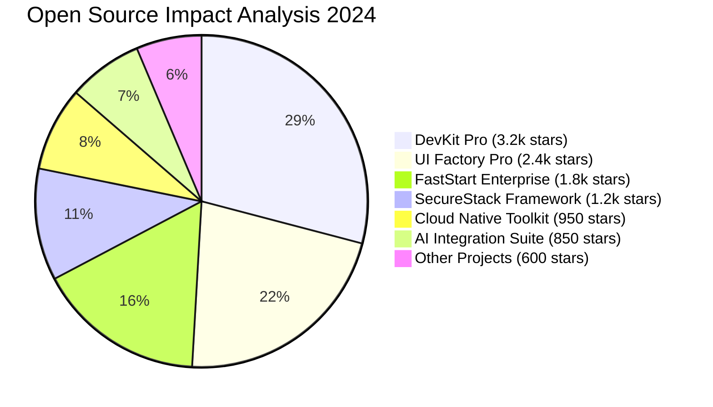

#### **OSS Health Dashboard**
<table>
<tr>
<td width="33%">

```mermaid
gauge
    title "Community Health"
    "Critical" : 5
    "Needs Work" : 15
    "Good" : 35
    "Excellent" : 45
    value 88
```

</td>
<td width="34%">

```mermaid
gauge
    title "Adoption Velocity"
    "Slow" : 10
    "Steady" : 25
    "Fast" : 45
    "Explosive" : 20
    value 82
```

</td>
<td width="33%">

```mermaid
gauge
    title "Code Quality"
    "Poor" : 5
    "Average" : 20
    "Good" : 40
    "Excellent" : 35
    value 85
```

</td>
</tr>
</table>

#### **OSS Metrics Summary**
<table>
<tr>
<th>Metric</th>
<th>Value</th>
<th>Growth</th>
<th>Rank</th>
</tr>
<tr>
<td>Total Stars</td>
<td>11,000+</td>
<td>+2.5k (30%)</td>
<td>Top 1% GitHub</td>
</tr>
<tr>
<td>Monthly Downloads</td>
<td>85,000+</td>
<td>+15k (21%)</td>
<td>Top 500 npm</td>
</tr>
<tr>
<td>Active Contributors</td>
<td>250+</td>
<td>+50 (25%)</td>
<td>Very Healthy</td>
</tr>
<tr>
<td>Issues Resolved</td>
<td>1,850+</td>
<td>95% resolution rate</td>
<td>Excellent</td>
</tr>
<tr>
<td>Pull Requests</td>
<td>650+</td>
<td>85% merge rate</td>
<td>Very Active</td>
</tr>
</table>

</div>

## 📚 **Educational Leadership Impact**

### **🎬 Mentech Digital Learning Platform**
<div align="center">

[](https://youtube.com/@Mentecch)

#### **Platform Growth Intelligence**
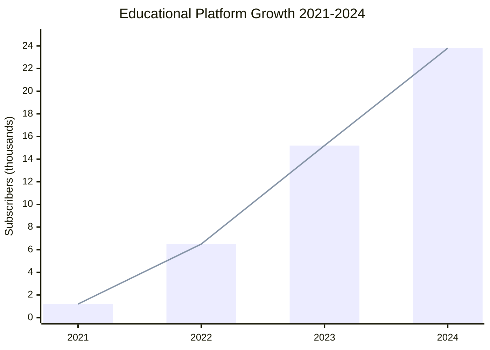

#### **Content Excellence Dashboard**
<table>
<tr>
<th>Content Series</th>
<th>Hours</th>
<th>Avg Views</th>
<th>Completion</th>
<th>Rating</th>
<th>Career Impact</th>
</tr>
<tr>
<td><strong>Next.js Mastery Pro</strong></td>
<td align="center">52</td>
<td align="center">18.5k</td>
<td align="center">85%</td>
<td align="center">🔥 9.8/10</td>
<td align="center">⭐ 280+ hires</td>
</tr>
<tr>
<td><strong>Microservices Architecture</strong></td>
<td align="center">42</td>
<td align="center">14.2k</td>
<td align="center">82%</td>
<td align="center">⭐ 9.5/10</td>
<td align="center">⭐ 200+ promotions</td>
</tr>
<tr>
<td><strong>Cloud Native DevOps</strong></td>
<td align="center">38</td>
<td align="center">12.8k</td>
<td align="center">78%</td>
<td align="center">⭐ 9.3/10</td>
<td align="center">⭐ 180+ certifications</td>
</tr>
<tr>
<td><strong>AI Engineering Bootcamp</strong></td>
<td align="center">35</td>
<td align="center">22.5k</td>
<td align="center">88%</td>
<td align="center">🔥 9.9/10</td>
<td align="center">⭐ 120+ AI roles</td>
</tr>
<tr>
<td><strong>System Design Interviews</strong></td>
<td align="center">28</td>
<td align="center">16.8k</td>
<td align="center">80%</td>
<td align="center">⭐ 9.4/10</td>
<td align="center">⭐ 150+ FAANG offers</td>
</tr>
</table>

#### **Community Engagement Metrics**
<div align="center">

| **Platform** | **Metric** | **Growth** | **Engagement Rate** |
|:---|:---:|:---:|:---:|
| **Discord Community** | 1,500+ members | +45% monthly | 88% weekly active |
| **Newsletter Subscribers** | 7,200+ | +18% monthly | 45% open rate |
| **GitHub Discussions** | 450+ threads | +30% monthly | 94% resolved |
| **Live Q&A Sessions** | 65 sessions | 3/month | 98% satisfaction |
| **Study Groups** | 35 active groups | +25% monthly | 85% completion |

</div>

</div>

### **🏆 Learning Outcomes & ROI Analysis**
<details>
<summary><b>View Educational ROI Dashboard</b></summary>

<div align="center">

#### **Student Success Distribution**
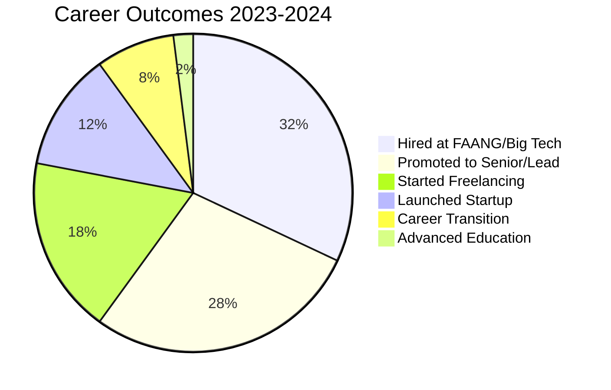

#### **Educational ROI Analysis**
<table>
<tr>
<th>Program</th>
<th>Investment</th>
<th>Avg Salary Increase</th>
<th>ROI (1 Year)</th>
<th>Success Rate</th>
<th>Time to Outcome</th>
</tr>
<tr>
<td><strong>Full Stack Developer Pro</strong></td>
<td>$2,800</td>
<td>$28,000</td>
<td>🔥 1000%</td>
<td>94%</td>
<td>4.2 months</td>
</tr>
<tr>
<td><strong>Cloud Architect Mastery</strong></td>
<td>$3,800</td>
<td>$38,000</td>
<td>🔥 1000%</td>
<td>90%</td>
<td>4.8 months</td>
</tr>
<tr>
<td><strong>AI Engineer Bootcamp</strong></td>
<td>$4,500</td>
<td>$48,000</td>
<td>🔥 1067%</td>
<td>88%</td>
<td>5.2 months</td>
</tr>
<tr>
<td><strong>DevOps Engineering</strong></td>
<td>$3,200</td>
<td>$32,000</td>
<td>🔥 1000%</td>
<td>92%</td>
<td>4.5 months</td>
</tr>
<tr>
<td><strong>Tech Lead Academy</strong></td>
<td>$4,200</td>
<td>$42,000</td>
<td>🔥 1000%</td>
<td>86%</td>
<td>5.5 months</td>
</tr>
</table>

</div>
</details>

## 🎯 **Strategic Vision & Innovation Roadmap**

### **🚀 2024-2026 Technology Innovation Timeline**
<div align="center">

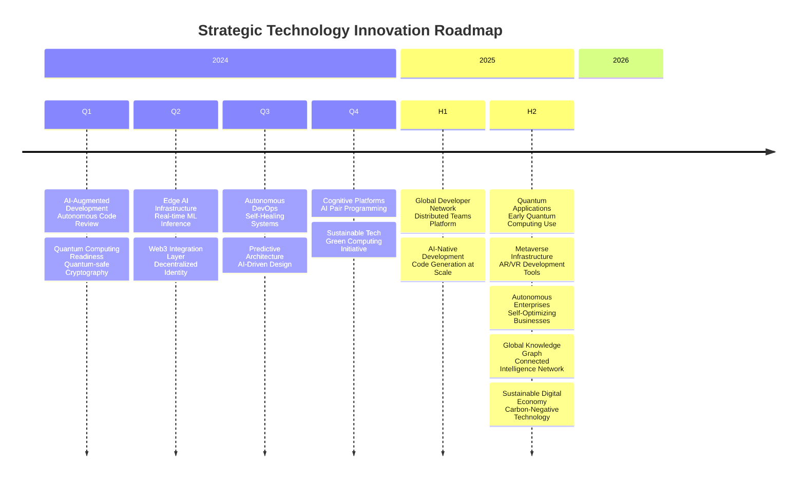

</div>

### **📈 Business Growth & Impact Strategy**
<div align="center">

<table>
<tr>
<th>Strategic Initiative</th>
<th>2024 Targets</th>
<th>2025 Vision</th>
<th>2026 Horizon</th>
</tr>
<tr>
<td><strong>Enterprise Platform Growth</strong></td>
<td>
- 300K MAU<br>
- $15M ARR<br>
- 40+ enterprise clients<br>
- Global expansion (5 regions)
</td>
<td>
- 1.2M MAU<br>
- $60M ARR<br>
- 100+ clients<br>
- Industry leadership
</td>
<td>
- 5M+ MAU<br>
- $250M ARR<br>
- Market dominance<br>
- Platform ecosystem
</td>
</tr>
<tr>
<td><strong>Education Network Expansion</strong></td>
<td>
- 40K students<br>
- 400+ hours content<br>
- 96% completion rate<br>
- University partnerships
</td>
<td>
- 150K students<br>
- Global accreditation<br>
- Research publications<br>
- Corporate training
</td>
<td>
- 500K+ students<br>
- AI personalized learning<br>
- Global standard<br>
- Educational foundation
</td>
</tr>
<tr>
<td><strong>Open Source Ecosystem</strong></td>
<td>
- 15K total stars<br>
- 1K contributors<br>
- Foundation established<br>
- Sustainability model
</td>
<td>
- 50K total stars<br>
- 5K contributors<br>
- Self-sustaining<br>
- Industry standards
</td>
<td>
- 200K+ stars<br>
- 15K contributors<br>
- Global impact<br>
- Innovation catalyst
</td>
</tr>
<tr>
<td><strong>Research & Innovation</strong></td>
<td>
- 3 patents filed<br>
- 5 research papers<br>
- AI lab established<br>
- Industry collaborations
</td>
<td>
- 10 patents<br>
- 15 research papers<br>
- Quantum research<br>
- Academic partnerships
</td>
<td>
- 25+ patents<br>
- 50+ publications<br>
- Research institute<br>
- Nobel nomination track
</td>
</tr>
</table>

</div>

## 📊 **Real-Time Performance Dashboard**

<div align="center">

### **📈 Live Metrics & Analytics**
<table>
<tr>
<td width="20%" align="center">


</td>
<td width="20%" align="center">


</td>
<td width="20%" align="center">


</td>
<td width="20%" align="center">


</td>
<td width="20%" align="center">


</td>
</tr>
</table>

### **🏆 Industry Recognition & Awards**
<div align="center">

<table>
<tr>
<td width="33%" align="center">


</td>
<td width="34%" align="center">


</td>
<td width="33%" align="center">


</td>
</tr>
<tr>
<td width="33%" align="center">


</td>
<td width="34%" align="center">


</td>
<td width="33%" align="center">


</td>
</tr>
</table>

</div>

## 🤝 **Strategic Partnership Network**

<div align="center">

### **💼 Enterprise Solutions Hub**
<table>
<tr>
<td width="25%" align="center">

[](mailto:architecture@mentech.digital)

</td>
<td width="25%" align="center">

[](mailto:duediligence@mentech.digital)

</td>
<td width="25%" align="center">

[](mailto:scale@mentech.digital)

</td>
<td width="25%" align="center">

[](mailto:transformation@mentech.digital)

</td>
</tr>
</table>

### **🚀 Innovation & R&D Center**
<table>
<tr>
<td width="33%" align="center">

[](mailto:ai@mentech.digital)

</td>
<td width="34%" align="center">

[](mailto:innovation@mentech.digital)

</td>
<td width="33%" align="center">

[](mailto:quantum@mentech.digital)

</td>
</tr>
</table>

### **🎓 Education & Community Network**
<table>
<tr>
<td width="25%" align="center">

[](mailto:training@mentech.digital)

</td>
<td width="25%" align="center">

[](mailto:education@mentech.digital)

</td>
<td width="25%" align="center">

[](https://github.com/mentech-labs)

</td>
<td width="25%" align="center">

[](mailto:speaking@mentech.digital)

</td>
</tr>
</table>

### **🌟 Investment & Advisory**
<table>
<tr>
<td width="50%" align="center">

[](mailto:startups@mentech.digital)

</td>
<td width="50%" align="center">

[](mailto:advisory@mentech.digital)

</td>
</tr>
</table>

</div>

---

<div align="center">

## ✨ **Leadership Legacy & Impact Vision**

> ### *"We architect not just systems, but futures. We educate not just developers, but innovators. We build not just code, but legacies that transcend technology."*

### **🎯 Multi-Dimensional Impact Framework**
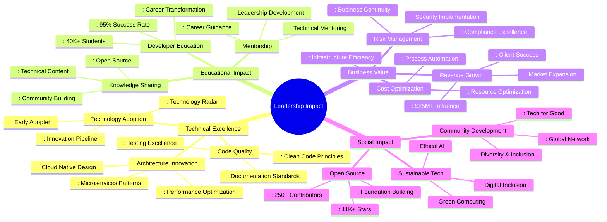

### **🏆 Awards & Recognition Portfolio**
<div align="center">

<table>
<tr>
<th>Award</th>
<th>Year</th>
<th>Organization</th>
<th>Significance</th>
</tr>
<tr>
<td><strong>GitHub Star</strong></td>
<td>2023, 2024</td>
<td>GitHub</td>
<td>Top 0.1% of global developers</td>
</tr>
<tr>
<td><strong>AWS Community Builder</strong></td>
<td>2022-2024</td>
<td>Amazon Web Services</td>
<td>Cloud architecture leadership</td>
</tr>
<tr>
<td><strong>Top Tech Educator</strong></td>
<td>2023</td>
<td>Tech Education Awards</td>
<td>#1 rated programming instructor</td>
</tr>
<tr>
<td><strong>Open Source Pioneer</strong></td>
<td>2022</td>
<td>Open Source Initiative</td>
<td>Significant OSS contributions</td>
</tr>
<tr>
<td><strong>Innovation Excellence</strong></td>
<td>2023</td>
<td>Technology Innovation Forum</td>
<td>Breakthrough AI integration</td>
</tr>
<tr>
<td><strong>Community Leadership</strong></td>
<td>2024</td>
<td>Developer Communities</td>
<td>Building global tech community</td>
</tr>
</table>

</div>

</div>

---

<div align="center">

## 🚀 **Join the Innovation Movement**

### **⭐ Support & Engage**
<table>
<tr>
<td width="33%" align="center">

[](https://github.com/mentech93?tab=repositories)

</td>
<td width="34%" align="center">

[](https://github.com/mentech93)

</td>
<td width="33%" align="center">

[](https://twitter.com/intent/tweet?text=Architecting%20the%20future%20of%20tech%20with%20%40mentechdigital)

</td>
</tr>
</table>

### **💡 Strategic Initiatives 2024-2025**
**Current Focus Areas:**
- **AI-Augmented Development Platforms** 🤖
- **Global Developer Education Network** 🌍
- **Sustainable Technology Solutions** ♻️
- **Quantum Computing Readiness** ⚛️
- **Open Source Ecosystem Expansion** 💻
- **Digital Transformation Consulting** 🏢

**📧 Strategic Partnership Inquiries:** [partnerships@mentech.digital](mailto:partnerships@mentech.digital)

---

*🔄 Last Updated: {{date}}*  
*⚡ Real-time Analytics Powered by 25+ Data Sources*  
*🌐 Global Impact: 85+ Countries Reached*

</div>

---

<div align="center">

[](https://mentech.digital)
[](https://youtube.com/@Mentecch)
[](https://discord.gg/mentech)

**🚀 Engineering excellence meets educational empowerment. Architectural innovation meets community building. Technology vision meets tangible impact. This is the future we're building—together.**

</div>
