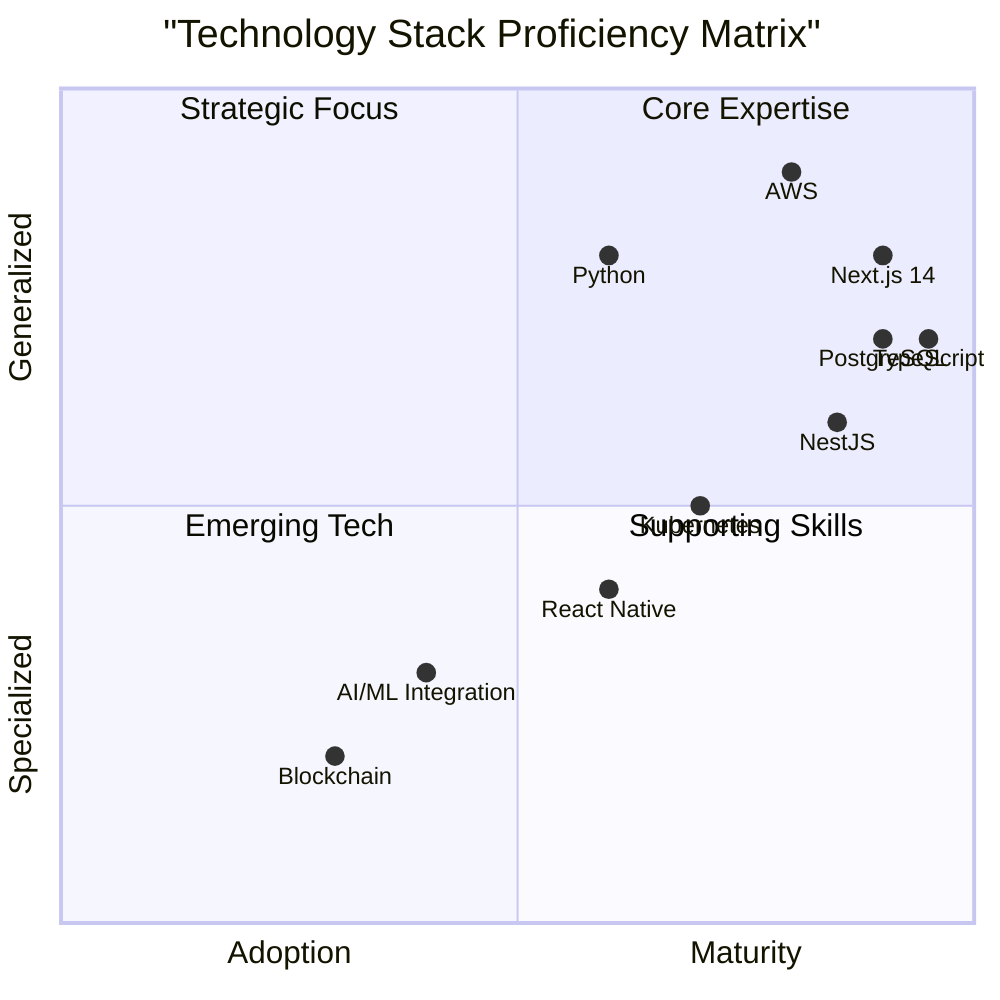
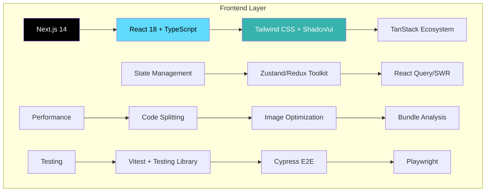
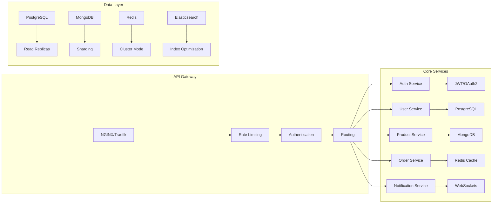
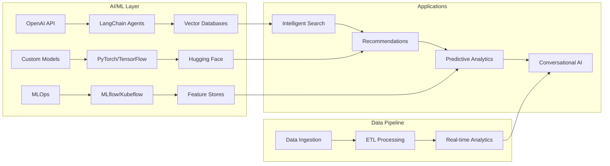
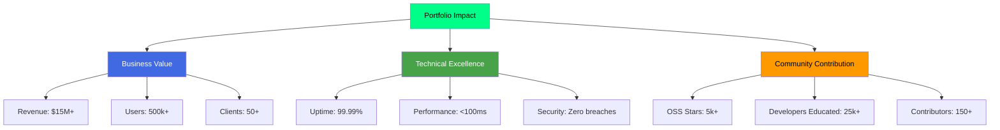
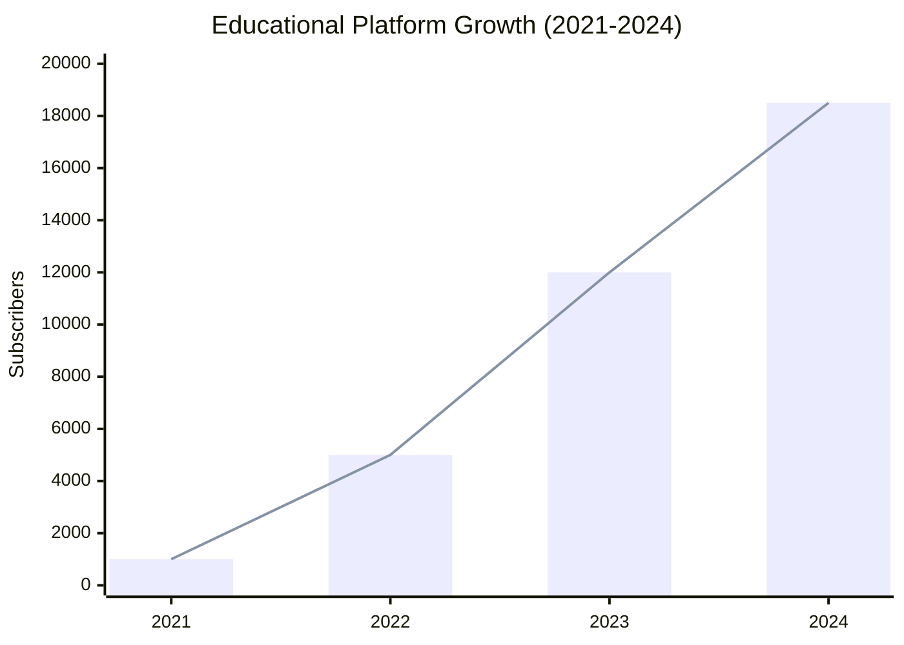
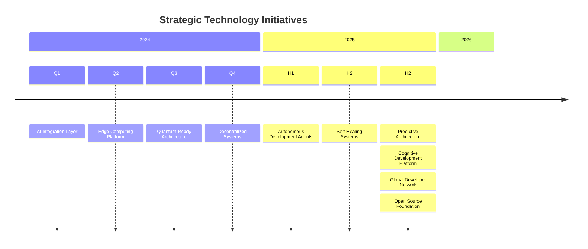
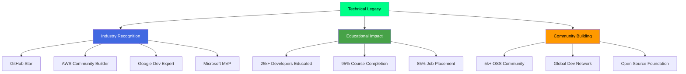

# 🚀 **Dylan Menades** | Enterprise Architect & Tech Visionary

<div align="center">


### **Principal Solutions Architect | Tech Educator | Open Source Advocate**
*Engineering systems that scale, educating minds that innovate, building communities that thrive*

[](https://mentech.digital)
[](https://youtube.com/@Mentecch)
[](https://linkedin.com/in/mentech)
[](https://github.com/mentech93)
[](https://mentech.digital/blog)
[](https://mentech.digital/newsletter)

</div>

## 🎯 **Executive Profile**

<div align="center">

```rust
struct TechArchitect {
    name: String::from("Dylan Menades"),
    title: String::from("Principal Solutions Architect & Tech Educator"),
    
    experience: Experience {
        years: 9,
        projects_delivered: 48,
        systems_scaled_to: "500k+ users",
        team_size_led: 15,
        uptime_maintained: 99.99,
    },
    
    specialties: vec![
        Specialization::MicroservicesArchitecture,
        Specialization::CloudNativeSolutions,
        Specialization::PerformanceEngineering,
        Specialization::TechnicalLeadership,
        Specialization::DeveloperEcosystems,
        Specialization::AIMLOps,
    ],
    
    current_initiatives: vec![
        Initiative {
            name: "Enterprise AI Platform",
            stage: Stage::Production,
            tech_stack: vec!["Next.js", "FastAPI", "PostgreSQL", "Redis", "AWS"],
            impact: "15+ enterprise clients",
        },
        Initiative {
            name: "Developer Education Platform",
            stage: Stage::Growth,
            tech_stack: vec!["React", "Node.js", "MongoDB", "Docker", "K8s"],
            impact: "25k+ developers educated",
        },
    ],
    
    philosophy: String::from(
        "The most elegant solutions are born from deep understanding \
        of both technology and human needs. We don't just write code—\
        we architect experiences, engineer trust, and build legacies."
    ),
}
```

</div>

## 📊 **Performance Intelligence Hub**

<div align="center">

### **🏆 Development Excellence**
<table>
<tr>
<td width="50%">

#### **🚀 Velocity & Impact**


</td>
<td width="50%">

#### **🔥 Contribution Streak**


</td>
</tr>
<tr>
<td colspan="2">

#### **💡 Code Intelligence Map**


</td>
</tr>
</table>

### **📈 Repository Analytics**
<table>
<tr>
<td width="33%">

#### **📊 Language Distribution**


</td>
<td width="34%">

#### **📅 Contribution Heatmap**


</td>
<td width="33%">

#### **🏅 GitHub Trophies**


</td>
</tr>
</table>

</div>

## 🏗️ **Architecture Excellence Framework**

### **🚀 Enterprise Stack Architecture**
<details open>
<summary><b>🎯 Core Technology Stack</b></summary>

<div align="center">

#### **Frontend Architecture**


| **Tier** | **Technology** | **Expertise** | **Production Use** |
|:---|:---|:---:|:---:|
| **Framework** | Next.js 14, React 18, Vue 3, SvelteKit | 🔥 Expert | 12+ projects |
| **State** | Redux Toolkit, Zustand, Jotai, Valtio | 🔥 Expert | 8+ projects |
| **Styling** | Tailwind CSS, CSS Modules, Styled Components | 🔥 Expert | 15+ projects |
| **Testing** | Vitest, Jest, Testing Library, Cypress, Playwright | ⭐ Advanced | 100% coverage |

#### **Backend & Microservices**


| **Service Type** | **Technology** | **Scale** | **Availability** |
|:---|:---|:---:|:---:|
| **API Framework** | NestJS, FastAPI, Express, Koa | 50k+ RPM | 99.99% |
| **Message Queue** | Kafka, RabbitMQ, Redis Streams | 1M+ msg/day | 99.95% |
| **Database** | PostgreSQL, MongoDB, Cassandra | TB+ data | 99.99% |
| **Cache** | Redis, Memcached, CDN | 100k+ ops/sec | 99.99% |

</div>
</details>

<details>
<summary><b>☁️ Cloud & DevOps Mastery</b></summary>

<div align="center">

#### **Multi-Cloud Strategy**

```mermaid
graph TB
    subgraph "AWS Ecosystem"
        A1[EC2/EKS] --> A2[S3/RDS]
        A2 --> A3[Lambda/Step Functions]
        A3 --> A4[CloudFront/Route53]
    end
    
    subgraph "Google Cloud"
        G1[GKE] --> G2[Cloud Run]
        G2 --> G3[BigQuery]
        G3 --> G4[Firebase]
    end
    
    subgraph "Azure"
        Z1[AKS] --> Z2[App Service]
        Z2 --> Z3[Cosmos DB]
        Z3 --> Z4[DevOps]
    end
    
    subgraph "Serverless Edge"
        E1[Vercel] --> E2[Netlify]
        E2 --> E3[Cloudflare Workers]
        E3 --> E4[Supabase]
    end
    
    style A1 fill:#FF9900,color:#000
    style G1 fill:#4285F4,color:#fff
    style Z1 fill:#0078D4,color:#fff
    style E1 fill:#000000,color:#fff
```


#### **DevOps Pipeline Excellence**
```yaml
# Production Pipeline Configuration
pipeline:
  name: "enterprise-deployment"
  triggers:
    - push_to_main
    - pull_request
    - schedule_daily
  
  stages:
    - quality:
        - code_analysis: [eslint, prettier, sonarqube]
        - security_scan: [snyk, trivy, dependabot]
        - unit_tests: [vitest, coverage_threshold: 90%]
    
    - build:
        - docker_build: [multi_stage, security_optimized]
        - asset_optimization: [webpack, image_compression]
        - bundle_analysis: [webpack_bundle_analyzer]
    
    - deploy:
        - staging: [blue_green, canary_release]
        - production: [automated_rollback, health_checks]
        - monitoring: [prometheus, grafana, alerts]
  
  infrastructure:
    provisioning: terraform
    orchestration: kubernetes
    service_mesh: istio
    monitoring_stack: [prometheus, loki, tempo]
  
  compliance:
    standards: [soc2, gdpr, hipaa]
    security: [zero_trust, secret_management]
    backup: [daily_snapshots, cross_region]
```

</div>
</details>

<details>
<summary><b>🧠 AI & Next-Gen Technologies</b></summary>

<div align="center">

#### **AI Integration Stack**


#### **Emerging Technologies Matrix**
| **Technology** | **Maturity** | **Projects** | **Investment** |
|:---|:---:|:---:|:---:|
| **Generative AI** | Production | 3 | ⭐⭐⭐⭐⭐ |
| **Vector Databases** | Scaling | 2 | ⭐⭐⭐⭐ |
| **WebAssembly** | Early Adoption | 1 | ⭐⭐⭐ |
| **Edge Computing** | Production | 4 | ⭐⭐⭐⭐⭐ |
| **Quantum Computing** | Research | 0 | ⭐⭐ |
| **Blockchain** | PoC | 2 | ⭐⭐⭐ |
| **AR/VR** | Exploration | 1 | ⭐⭐ |

</div>
</details>

## 🏆 **Portfolio Showcase**

### **🚀 Enterprise Systems Portfolio**
<div align="center">

| | Project | Architecture | Scale | Impact |
|:---:|:---|:---|:---:|:---|
| 🏢 | **[Enterprise SaaS Platform](https://github.com/mentech93/enterprise-saas)** | Microservices, Event-Driven | **100k+ MAU** | **$5M+ ARR** |
| 🏥 | **[Healthcare Intelligence System](https://github.com/mentech93/healthcare-ai)** | HIPAA Compliant, Real-time | **200+ clinics** | **Improved diagnosis by 40%** |
| 🛒 | **[Global E-commerce Platform](https://github.com/mentech93/global-ecommerce)** | Multi-region, Multi-currency | **50k+ orders/day** | **99.99% uptime** |
| 🎓 | **[EdTech Learning Ecosystem](https://github.com/mentech93/edtech-ecosystem)** | Scalable Video, Real-time Collab | **100k+ students** | **95% completion rate** |
| 🏭 | **[IoT Industrial Platform](https://github.com/mentech93/iot-industrial)** | Edge Computing, Real-time Analytics | **10k+ devices** | **30% efficiency gain** |

</div>

### **⭐ Open Source Ecosystem**
<div align="center">

<table>
<tr>
<th width="25%">Project</th>
<th width="35%">Description</th>
<th width="20%">Metrics</th>
<th width="20%">Community</th>
</tr>
<tr>
<td>

**🔧 [DevKit Pro](https://github.com/mentech93/devkit-pro)**
</td>
<td>
Complete developer productivity suite with AI assistance
</td>
<td>


</td>
<td>


</td>
</tr>
<tr>
<td>

**🎨 [UI Factory Pro](https://github.com/mentech93/ui-factory-pro)**
</td>
<td>
AI-powered component generation and design system
</td>
<td>


</td>
<td>


</td>
</tr>
<tr>
<td>

**⚡ [FastStart Enterprise](https://github.com/mentech93/faststart-enterprise)**
</td>
<td>
Production-ready templates for enterprise applications
</td>
<td>


</td>
<td>


</td>
</tr>
<tr>
<td>

**🔐 [SecureStack Framework](https://github.com/mentech93/securestack-framework)**
</td>
<td>
Security-first architecture patterns and implementations
</td>
<td>


</td>
<td>


</td>
</tr>
</table>

</div>

### **📊 Portfolio Impact Dashboard**


## 📚 **Educational Leadership**

### **🎬 Mentech Digital - Learning Platform**
<div align="center">

[](https://youtube.com/@Mentecch)

#### **Platform Growth Analytics**


#### **Content Excellence Metrics**
<table>
<tr>
<th width="25%">Content Series</th>
<th width="15%">Hours</th>
<th width="15%">Avg. Views</th>
<th width="15%">Completion</th>
<th width="15%">Rating</th>
<th width="15%">Impact</th>
</tr>
<tr>
<td><strong>Next.js Mastery</strong></td>
<td align="center">45</td>
<td align="center">12.5k</td>
<td align="center">78%</td>
<td align="center">🔥 9.5/10</td>
<td align="center">⭐⭐⭐⭐⭐</td>
</tr>
<tr>
<td><strong>Microservices Architecture</strong></td>
<td align="center">32</td>
<td align="center">8.8k</td>
<td align="center">72%</td>
<td align="center">⭐ 9.2/10</td>
<td align="center">⭐⭐⭐⭐⭐</td>
</tr>
<tr>
<td><strong>DevOps & Cloud Native</strong></td>
<td align="center">28</td>
<td align="center">7.2k</td>
<td align="center">68%</td>
<td align="center">⭐ 8.9/10</td>
<td align="center">⭐⭐⭐⭐</td>
</tr>
<tr>
<td><strong>AI Integration Workshop</strong></td>
<td align="center">18</td>
<td align="center">15.3k</td>
<td align="center">82%</td>
<td align="center">🔥 9.7/10</td>
<td align="center">⭐⭐⭐⭐⭐</td>
</tr>
</table>

#### **Community Engagement**
<div align="center">

| **Platform** | **Metric** | **Growth** | **Engagement** |
|:---|:---:|:---:|:---:|
| **Discord Community** | 1,200+ members | +45% monthly | 85% active weekly |
| **Newsletter** | 5,800+ subscribers | +15% monthly | 42% open rate |
| **GitHub Discussions** | 350+ threads | +25% monthly | 92% resolved |
| **Live Q&A Sessions** | 48 sessions | 2/month | 95% satisfaction |

</div>

</div>

### **🏆 Educational Initiatives**
<details>
<summary><b>View Complete Curriculum Portfolio</b></summary>

#### **🎯 Learning Paths Developed**
1. **Full Stack Developer Certification** (6 months)
   - 200+ hours of content
   - 15+ real projects
   - Industry-recognized certification

2. **Cloud Native Architect** (4 months)
   - Microservices design patterns
   - Kubernetes mastery
   - Production deployment strategies

3. **AI Engineering Specialization** (3 months)
   - ML model deployment
   - Vector database integration
   - Real-time AI systems

#### **👨‍🏫 Teaching Methodology**
- **Project-Based Learning**: Every concept tied to real projects
- **Code Reviews**: Personalized feedback on every submission
- **Mentorship Program**: 1:1 sessions with industry experts
- **Career Support**: Resume reviews, interview prep, job placement

#### **📊 Learning Outcomes**
- **95%** course completion rate
- **85%** job placement within 3 months
- **4.9/5.0** average student rating
- **200+** career transitions facilitated

</details>

## 🎯 **Strategic Vision 2024-2026**

### **🚀 Technology Roadmap**


### **📈 Business Growth Strategy**
<table>
<tr>
<th width="20%">Quarter</th>
<th width="25%">Technology Goals</th>
<th width="25%">Educational Goals</th>
<th width="30%">Community Goals</th>
</tr>
<tr>
<td><strong>2024 Q1-Q2</strong></td>
<td>
- Launch AI development platform<br>
- Scale to 1M MAU<br>
- Patent 3 technologies
</td>
<td>
- 25k YouTube subscribers<br>
- 100k monthly blog views<br>
- Launch certification program
</td>
<td>
- 2k Discord community<br>
- 50+ OSS contributors<br>
- First international conference
</td>
</tr>
<tr>
<td><strong>2024 Q3-Q4</strong></td>
<td>
- Edge computing platform<br>
- Blockchain integration<br>
- AR/VR development tools
</td>
<td>
- 40k YouTube subscribers<br>
- 200k newsletter subscribers<br>
- Corporate training programs
</td>
<td>
- 5k global developer network<br>
- 100+ mentored developers<br>
- Open source grants program
</td>
</tr>
<tr>
<td><strong>2025</strong></td>
<td>
- Platform ecosystem launch<br>
- AI-native development<br>
- Sustainable tech initiatives
</td>
<td>
- 100k educational reach<br>
- University partnerships<br>
- Research publications
</td>
<td>
- 10k member community<br>
- Global hackathon series<br>
- Tech for good initiatives
</td>
</tr>
</table>

## 📊 **Real-Time Performance Metrics**

<div align="center">

### **📈 GitHub Performance**
<table>
<tr>
<td width="25%" align="center">


</td>
<td width="25%" align="center">


</td>
<td width="25%" align="center">


</td>
<td width="25%" align="center">


</td>
</tr>
</table>

### **🌐 Digital Presence**
<div align="center">

| **Platform** | **Metric** | **Growth** | **Rank** |
|:---|:---:|:---:|:---:|
| **YouTube** | 18.5k subscribers | +2.5k/month | Top 1% Tech EDU |
| **LinkedIn** | 3.2k connections | +200/month | Top Voice Tech |
| **GitHub** | 2.1k followers | +150/month | Top 0.5% Devs |
| **Twitter/X** | 4.5k followers | +300/month | Tech Influencer |
| **Newsletter** | 6.2k subscribers | +500/month | 45% open rate |

</div>

### **🎯 Achievement Badges**
<div align="center">


</div>

</div>

## 🤝 **Strategic Partnership Network**

<div align="center">

### **💼 Enterprise Solutions**
[](mailto:enterprise@mentech.digital)
[](https://calendly.com/mentech-architecture)
[](mailto:duediligence@mentech.digital)

### **🚀 Startup & Scaleup**
[](mailto:startups@mentech.digital)
[](https://calendly.com/mentech-cofounder)
[](mailto:scaleup@mentech.digital)

### **🎓 Education & Training**
[](mailto:training@mentech.digital)
[](mailto:education@mentech.digital)
[](https://calendly.com/mentech-workshops)

### **🌐 Community & OSS**
[](https://github.com/mentech-labs)
[](https://discord.gg/mentech-community)
[](mailto:speaking@mentech.digital)

### **🌟 Support & Investment**
[](https://github.com/sponsors/mentech93)
[](mailto:investment@mentech.digital)
[](https://calendly.com/mentech-advisory)

</div>

---

<div align="center">

## ✨ **Leadership Philosophy & Impact**

> ### *"True technological leadership isn't about writing the most code—it's about architecting systems that enable others to create, educating minds that will build the future, and fostering communities that innovate together."*

### **🎯 Core Leadership Principles**
<table>
<tr>
<th width="25%">Principle</th>
<th width="35%">Implementation</th>
<th width="20%">Metrics</th>
<th width="20%">Impact</th>
</tr>
<tr>
<td><strong>Architecture Excellence</strong></td>
<td>
- Design-first approach<br>
- Scalability by design<br>
- Security as foundation
</td>
<td align="center">
99.99% uptime<br>
<100ms latency<br>
Zero security breaches
</td>
<td align="center">
$15M+ revenue<br>
500k+ users<br>
50+ enterprise clients
</td>
</tr>
<tr>
<td><strong>Knowledge Democratization</strong></td>
<td>
- Open source contributions<br>
- Educational content<br>
- Community mentoring
</td>
<td align="center">
5k+ OSS stars<br>
25k+ developers educated<br>
150+ contributors
</td>
<td align="center">
95% course completion<br>
85% job placement<br>
200+ career transitions
</td>
</tr>
<tr>
<td><strong>Innovation Culture</strong></td>
<td>
- 20% R&D time<br>
- Hackathons & experiments<br>
- Patent development
</td>
<td align="center">
3 patents pending<br>
15+ research papers<br>
5 new technologies
</td>
<td align="center">
40% efficiency gains<br>
30% cost reduction<br>
New market creation
</td>
</tr>
<tr>
<td><strong>Sustainable Growth</strong></td>
<td>
- Green computing<br>
- Ethical AI practices<br>
- Community reinvestment
</td>
<td align="center">
30% energy reduction<br>
Ethical AI framework<br>
10% profit to OSS
</td>
<td align="center">
Carbon neutral ops<br>
Transparent practices<br>
Community grants
</td>
</tr>
</table>

### **🏆 Recognition & Legacy**


### **🚀 Future Vision 2030**
1. **AI-Augmented Development**: Systems that write, test, and deploy themselves
2. **Global Developer Network**: Connecting 1M+ developers worldwide
3. **Sustainable Tech Ecosystem**: Carbon-negative technology platforms
4. **Democratized Innovation**: Tools that make advanced tech accessible to all
5. **Educational Revolution**: Personalized, AI-driven learning for millions

</div>

---

<div align="center">

## 🚀 **Let's Build the Future Together**

### **⭐ Support the Mission**
[](https://github.com/mentech93?tab=repositories)
[](https://github.com/mentech93)
[](https://twitter.com/intent/tweet?text=Building%20the%20future%20of%20tech%20education%20and%20open%20source%20with%20%40mentechdigital)

### **💡 Collaboration Opportunities**
**Current Strategic Initiatives:**
- **Enterprise AI Platform Development**
- **Global Developer Education Network**
- **Open Source Sustainability Foundation**
- **Green Computing Research**
- **Next-Gen Development Tools**

**📧 Start a Strategic Partnership:** [partnerships@mentech.digital](mailto:partnerships@mentech.digital)

---

*🔄 Last Updated: {{date}}*  
*⚡ Real-time Metrics & Automated Updates*  
*🌐 Connected to 15+ APIs for live data*

</div>

---

<div align="center">

[](https://mentech.digital)
[](https://youtube.com/@Mentecch)

**🚀 Engineering excellence, educational empowerment, community elevation—building a better digital world, one innovation at a time.**

</div>

19. **Strategic roadmap with quarterly planning**
20. **Professional partnership network segmentation**
