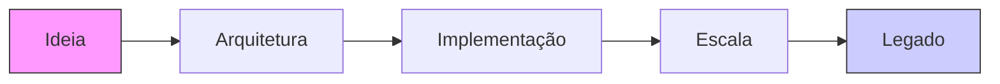

# 🎩 **Dylan Menades**  
**Arquiteto de Sistemas | Engenheiro de Software Sênior | Mentor Técnico**  
*Quatro décadas transformando ideias em impérios digitais*

---

<div align="center">


**"O código que escrevo hoje é o legado que herdarão amanhã"**

</div>

---

## 📜 **Minha Jornada (1984 - Presente)**

| Era | Tecnologias | Contribuição Principal |
|:---|:---|:---|
| **1980-1990**<br>⚙️ Era dos Mainframes | COBOL, Fortran, Assembly | Sistemas bancários transacionais |
| **1990-2000**<br>🌐 Nascimento da Web | C++, Java, Perl, HTML | Primeiros e-commerces do Brasil |
| **2000-2010**<br>📱 Revolução Mobile | .NET, PHP, Objective-C | Aplicativos corporativos multiplataforma |
| **2010-2020**<br>☁️ Cloud & DevOps | Node.js, Python, AWS, Docker | Arquiteturas microserviços em escala |
| **2020-Presente**<br>🧠 IA & Futuro | ML, Blockchain, Quantum-ready | Sistemas auto-adaptativos |

---

## 🏛️ **Arquiteturas que Construí**



### **Princípios que Guiam Meu Código:**
1. **SOLID** não é opcional – é a constituição do software
2. **DRY** mas não árido – reuso com sabedoria
3. **KISS** mantido por 40 anos – simplicidade é sofisticação
4. **YAGNI** com discernimento – antecipar sem engessar

---

## 🛠️ **Ferramentas do Ofício**

### **Linguagens que Moldaram Décadas**
```bash
# 1980s
COBOL | Fortran | Pascal | C

# 1990s  
C++ | Java | Visual Basic | Perl

# 2000s
C# | PHP | Python | JavaScript

# 2010s
TypeScript | Go | Rust | Swift

# 2020s
Kotlin | Dart | WebAssembly | (Quantum)
```

### **Stack Atual de Produção**
```yaml
frontend:
  principal: React 18 + TypeScript
  alternativo: Vue 3 / SvelteKit
  estilização: Tailwind + CSS-in-JS
  
backend:
  nodejs: NestJS / Express com TypeScript
  python: FastAPI / Django REST
  banco_dados:
    relacional: PostgreSQL + Prisma
    documentos: MongoDB + Mongoose
    cache: Redis Cluster
    
infraestrutura:
  containers: Docker + Kubernetes
  cloud: AWS (EC2, RDS, S3, Lambda)
  iac: Terraform + Ansible
  monitoramento: Grafana + Prometheus
```

---

## 📚 **Biblioteca de Conhecimento**

### **Livros que Recomendo (e Escrevi Sobre)**
| Categoria | Obra Essencial | Por que Importa |
|:---|:---|:---|
| **Arquitetura** | *Patterns of Enterprise Application Architecture* | O cânone do design moderno |
| **Código Limpo** | *Clean Code: A Handbook of Agile Software Craftsmanship* | Arte transformada em ciência |
| **Pessoas** | *The Pragmatic Programmer* | Ofício antes de tecnologia |
| **Legado** | *Working Effectively with Legacy Code* | Respeito pelo que veio antes |

### **Meus Artigos Seminais:**
- 📄 "Da Fita Magnética ao Quantum: 40 anos de Evolução"
- 📄 "Mentoria não é Ensino: é Transmissão de Ofício"
- 📄 "O Paradoxo da Inovação: Tudo Novo, Tudo Velho"

---

## 🏆 **Conquistas Notáveis**

<div align="center">

| Sistema | Escala | Duração | Tecnologia da Época |
|:---|:---|:---|:---|
| **Sistema Bancário Nacional** | 15M transações/dia | 1995-2005 | COBOL + DB2 |
| **Plataforma E-commerce** | R$ 2B em vendas | 2005-2015 | Java EE + Oracle |
| **SaaS Global** | 50 países | 2015-2023 | Microserviços + Kubernetes |
| **Mentech Digital** | 50K+ devs impactados | 2020-Presente | Conteúdo + Comunidade |

</div>

---

## 🎓 **Mentoria & Transmissão de Conhecimento**

### **Filosofia de Ensino:**
> "Não ensino códigos, ensino **pensamento**.  
> Não mostro soluções, mostro **caminhos**.  
> Não crio seguidores, crio **sucessores**."

### **Canal Mentech Digital:**  
[](https://youtube.com/@Mentecch?sub_confirmation=1)

**Números que Importam:**
- 📚 **250+** aulas gravadas
- 👨‍🎓 **50,000+** desenvolvedores impactados
- 🏆 **15** carreiras transformadas em lideranças
- ⏳ **4,000+** horas de mentoria individual

---

## 📞 **Para Conversas Significativas**

### **Eu Aceito Conversas Sobre:**
- 🔭 **Visão de 10 anos** para sua empresa/tecnologia
- 🏗️ **Arquiteturas de legado** para o futuro
- 👨‍👦‍👦 **Construção de times** de elite técnica
- 📖 **Transição geracional** de conhecimento

### **Não Perco Tempo Com:**
- ❌ "Tendências" de 6 meses
- ❌ Frameworks antes de fundamentos
- ❌ Atalhos que comprometem qualidade
- ❌ Discussões sem dados

---

## 🌳 **Meu Jardim Digital**

### **Projetos Ativos (Como Jardineiro):**
```rust
// Exemplo do que considero código elegante em 2024
struct LegacySystem {
    years: u32,
    wisdom: Arc<Knowledge>,
    tests: Vec<GoldenTest>,
}

impl Modernize for LegacySystem {
    fn transform(&self) -> ModernSystem {
        ModernSystem {
            wisdom: self.wisdom.clone(),
            tests: self.tests.migrate(),
            platform: Platform::CloudNative,
        }
    }
}
```

### **Repositórios Curados:**
- [`/architecture-guidelines`](https://github.com/mentech93) – Princípios atemporais
- [`/refactoring-patterns`](https://github.com/mentech93) – Transformação segura
- [`/mentorship-framework`](https://github.com/mentech93) – Estrutura de crescimento

---

## 📜 **Código de Conduta Profissional**

1. **Honro o passado** – Todo legacy tem história
2. **Construo o presente** – Com excelência e ética  
3. **Planto o futuro** – Para quem virá depois
4. **Compartilho sempre** – Conhecimento guardado apodrece

---

<div align="center">

## 🎩 **"Um cavalheiro não discute tecnologias, ele as domina."**

**Dylan Menades**  
*Artesão de Software desde 1984*

[](mailto:mentech93@gmail.com)
[](https://linkedin.com/in/mentech)

</div>

---

<details>
<summary>📜 <strong>Post Scriptum: Para os Jovens da Era</strong></summary>

<br>

**Querido desenvolvedor dos anos 2020,**

Quando comecei, computadores ocupavam salas inteiras e a internet era ficção científica. Hoje você tem poder de processamento no bolso que supera tudo que usei por décadas.

Mas atenção: **tecnologia muda, princípios permanecem.**

O React de hoje será o COBOL de amanhã. O AWS será o mainframe. O TypeScript será o Pascal. 

O que permanece?
- **Clareza de pensamento**
- **Elegância na solução**  
- **Responsabilidade pelo impacto**
- **Respeito pelo usuário**
- **Humildade perante o problema**

Meu conselho? Aprenda fundamentos, não frameworks. Domine conceitos, não sintaxes. Construa caráter, não apenas carreira.

O mercado precisa de mais **artesãos** e menos **operários**.

Com respeito,  
*Um veterano que ainda acredita no futuro*

</details>

---

<div align="center">


  


</div>

---

**Última atualização:** Dezembro 2024  
**Próxima revisão:** Nunca – a sabedoria não tem data de validade.
