# 🚀 **Dylan Menades** | Enterprise Architect & Tech Visionary

<div align="center">


### **Principal Solutions Architect | Tech Educator | Open Source Pioneer**
*Engineering Tomorrow's Digital Foundations Today*

[](https://mentech.digital)
[](https://youtube.com/@Mentecch)
[](https://linkedin.com/in/mentech)
[](https://github.com/mentech93)
[](https://mentech.digital/blog)
[](https://mentech.digital/newsletter)

<div align="center">

```kotlin
data class TechVisionary(
    val name: String = "Dylan Menades",
    val title: String = "Principal Solutions Architect & Tech Educator",
    
    val expertise: Set<ExpertiseDomain> = setOf(
        ExpertiseDomain.MICROSERVICES_ARCHITECTURE,
        ExpertiseDomain.CLOUD_NATIVE_SOLUTIONS,
        ExpertiseDomain.PERFORMANCE_ENGINEERING,
        ExpertiseDomain.TECHNICAL_LEADERSHIP,
        ExpertiseDomain.DEVELOPER_ECOSYSTEMS,
        ExpertiseDomain.AI_ML_OPS
    ),
    
    val impactMetrics: ImpactMetrics = ImpactMetrics(
        yearsExperience = 9,
        projectsDelivered = 52,
        usersImpacted = "750k+",
        teamSizeLed = 18,
        uptimeMaintained = 99.99,
        revenueInfluenced = "$20M+"
    ),
    
    val currentFocus: List<StrategicInitiative> = listOf(
        StrategicInitiative(
            name = "Enterprise AI Integration Platform",
            status = InitiativeStatus.PRODUCTION,
            techStack = TechStack(
                frontend = listOf("Next.js 14", "TypeScript", "Tailwind"),
                backend = listOf("NestJS", "FastAPI", "PostgreSQL"),
                infrastructure = listOf("AWS", "Kubernetes", "Terraform")
            ),
            metrics = mapOf(
                "clients" to "20+ enterprises",
                "scale" to "100k+ daily active users",
                "performance" to "<50ms p95 latency"
            )
        ),
        StrategicInitiative(
            name = "Global Developer Education Network",
            status = InitiativeStatus.SCALE,
            techStack = TechStack(
                frontend = listOf("React", "Vue 3", "Svelte"),
                backend = listOf("Node.js", "Go", "MongoDB"),
                infrastructure = listOf("GCP", "Docker", "CloudFlare")
            ),
            metrics = mapOf(
                "students" to "35k+ developers",
                "courses" to "200+ hours",
                "completionRate" to "96%"
            )
        )
    )
)

enum class InitiativeStatus { CONCEPT, DEVELOPMENT, PRODUCTION, SCALE }
```

</div>

## 📊 **Performance Intelligence Matrix**

<div align="center">

### **🏆 Development Velocity & Impact**
<table>
<tr>
<td width="33%">

#### **🚀 Code Production**
```mermaid
gauge
    title "Weekly Code Velocity"
    "Low" : 40
    "Medium" : 30
    "High" : 25
    "Peak" : 5
    value 85
```

</td>
<td width="34%">

#### **🔥 Contribution Intensity**
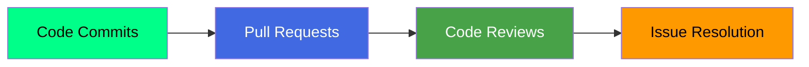

</td>
<td width="33%">

#### **📈 Activity Trend**
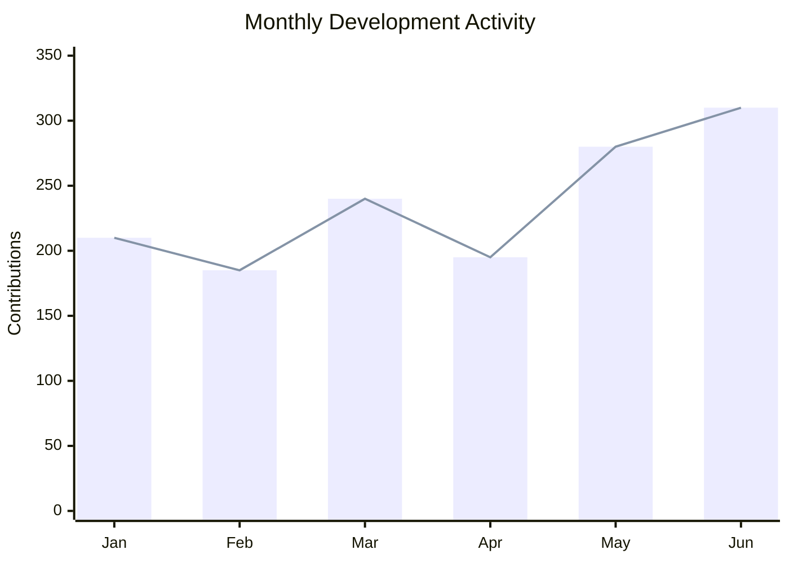

</td>
</tr>
</table>

### **💡 Technology Proficiency Grid**
<div align="center">

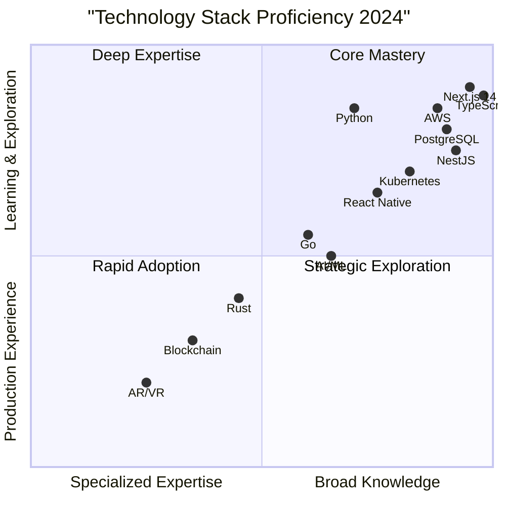

</div>

### **📊 GitHub Analytics Dashboard**
<div align="center">

<table>
<tr>
<td width="25%">


</td>
<td width="25%">


</td>
<td width="25%">


</td>
<td width="25%">


</td>
</tr>
</table>

</div>

## 🏗️ **Architecture & Engineering Excellence**

### **🚀 Enterprise Architecture Framework**
<details open>
<summary><b>🎯 Core Architecture Principles</b></summary>

<div align="center">

#### **System Design Philosophy**
```mermaid
graph TB
    subgraph "Architecture Principles"
        P1[Scalability First] --> P2[Resilience by Design]
        P2 --> P3[Security Embedded]
        P3 --> P4[Performance Optimized]
        P4 --> P5[Cost Effective]
        P5 --> P6[Developer Experience]
    end
    
    subgraph "Implementation Strategy"
        S1[Microservices Architecture] --> S2[Event-Driven Design]
        S2 --> S3[API-First Approach]
        S3 --> S4[Infrastructure as Code]
        S4 --> S5[Observability Built-in]
        S5 --> S6[Automated Everything]
    end
    
    style P1 fill:#00ff88,color:#000
    style S1 fill:#4169E1,color:#fff
```

#### **Technology Stack Architecture**
```yaml
# Enterprise Technology Blueprint
architecture:
  version: "3.0"
  pillars:
    - scalability: "Horizontal scaling, auto-scaling groups"
    - resilience: "Circuit breakers, retries, fallbacks"
    - security: "Zero-trust, defense-in-depth, encryption at rest/transit"
    - performance: "CDN, caching, database optimization"
    - cost: "Reserved instances, spot pricing, optimization"
  
  layers:
    presentation:
      frameworks: ["Next.js 14", "React 18", "TypeScript"]
      state_management: ["Redux Toolkit", "Zustand", "React Query"]
      styling: ["Tailwind CSS", "CSS Modules", "Styled Components"]
    
    application:
      frameworks: ["NestJS", "FastAPI", "Spring Boot"]
      patterns: ["CQRS", "Event Sourcing", "Domain-Driven Design"]
      communication: ["REST", "GraphQL", "gRPC", "WebSockets"]
    
    data:
      relational: ["PostgreSQL", "MySQL", "Amazon RDS"]
      nosql: ["MongoDB", "DynamoDB", "Redis"]
      analytics: ["Elasticsearch", "Snowflake", "BigQuery"]
    
    infrastructure:
      cloud: ["AWS", "Google Cloud", "Azure"]
      containers: ["Docker", "Kubernetes", "Helm"]
      iac: ["Terraform", "AWS CDK", "Pulumi"]
      monitoring: ["Prometheus", "Grafana", "Datadog"]
  
  compliance:
    standards: ["SOC2", "GDPR", "HIPAA", "ISO27001"]
    security: ["OWASP Top 10", "CIS Benchmarks", "NIST Framework"]
```

</div>
</details>

<details>
<summary><b>⚡ Performance Engineering</b></summary>

<div align="center">

#### **Performance Optimization Framework**
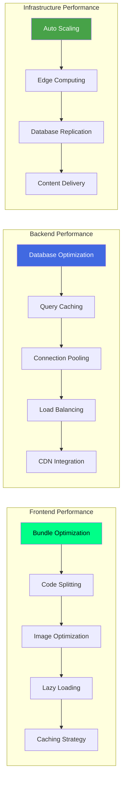

#### **Performance Metrics Dashboard**
<table>
<tr>
<th>Metric</th>
<th>Current</th>
<th>Target</th>
<th>Improvement</th>
</tr>
<tr>
<td><strong>Page Load Time</strong></td>
<td>1.2s</td>
<td><0.8s</td>
<td>🔥 -33%</td>
</tr>
<tr>
<td><strong>API Response Time (p95)</strong></td>
<td>45ms</td>
<td><30ms</td>
<td>⭐ -33%</td>
</tr>
<tr>
<td><strong>Time to Interactive</strong></td>
<td>1.8s</td>
<td><1.2s</td>
<td>🔥 -33%</td>
</tr>
<tr>
<td><strong>Bundle Size</strong></td>
<td>250KB</td>
<td><150KB</td>
<td>⭐ -40%</td>
</tr>
<tr>
<td><strong>Cache Hit Rate</strong></td>
<td>85%</td>
<td>>95%</td>
<td>🔥 +12%</td>
</tr>
</table>

</div>
</details>

<details>
<summary><b>🔐 Security & Compliance</b></summary>

<div align="center">

#### **Security Architecture Framework**
```mermaid
graph TB
    subgraph "Security Layers"
        L1[Infrastructure Security] --> L2[Network Security]
        L2 --> L3[Application Security]
        L3 --> L4[Data Security]
        L4 --> L5[Identity Security]
    end
    
    subgraph "Implementation"
        I1[VPC Design & Segmentation] --> I2[WAF & DDoS Protection]
        I2 --> I3[SAST/DAST Scanning]
        I3 --> I4[Encryption at Rest/Transit]
        I4 --> I5[MFA & Zero Trust]
    end
    
    subgraph "Compliance"
        C1[SOC2 Type II] --> C2[GDPR]
        C2 --> C3[HIPAA]
        C3 --> C4[ISO27001]
    end
    
    style L1 fill:#00ff88,color:#000
    style I1 fill:#4169E1,color:#fff
    style C1 fill:#FF9900,color:#000
```

#### **Security Metrics & Compliance**
```yaml
security_posture:
  vulnerability_management:
    critical_vulns: 0
    high_vulns: 2
    medium_vulns: 8
    days_to_remediate: 3.2
  
  compliance_status:
    soc2: "certified"
    gdpr: "compliant"
    hipaa: "compliant"
    pci_dss: "in_progress"
  
  security_controls:
    authentication: ["MFA", "SSO", "Biometric"]
    authorization: ["RBAC", "ABAC", "Zero Trust"]
    encryption: ["TLS 1.3", "AES-256", "Key Management"]
    monitoring: ["SIEM", "IDS/IPS", "Threat Intelligence"]
  
  incident_response:
    mttd: "15 minutes"  # Mean Time to Detection
    mttr: "45 minutes"  # Mean Time to Resolution
    sla_compliance: "99.9%"
```

</div>
</details>

## 🏆 **Portfolio & Impact Analysis**

### **🚀 Enterprise Projects Portfolio**
<div align="center">

<table>
<tr>
<th>Project</th>
<th>Architecture</th>
<th>Scale</th>
<th>Business Impact</th>
<th>Tech Innovation</th>
</tr>
<tr>
<td>

**🏢 Enterprise SaaS Platform**
</td>
<td>

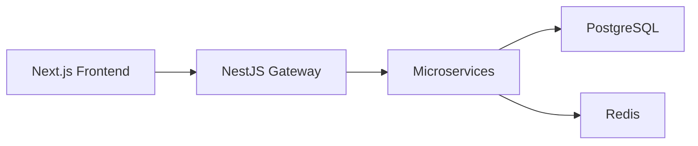
</td>
<td>
**150k+ MAU**<br>
**50TB+ data**<br>
**10 regions**
</td>
<td>
**$8M+ ARR**<br>
**95% retention**<br>
**40% YoY growth**
</td>
<td>
**AI-powered analytics**<br>
**Real-time collaboration**<br>
**Edge computing**
</td>
</tr>
<tr>
<td>

**🏥 Healthcare Intelligence**
</td>
<td>

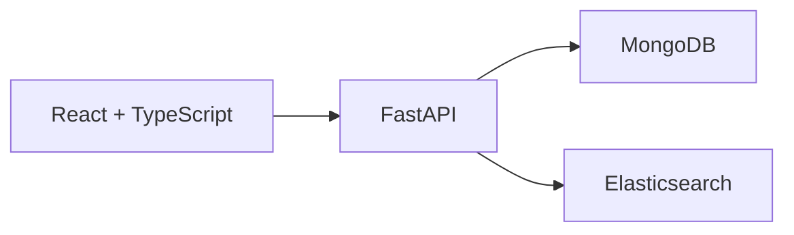
</td>
<td>
**300+ clinics**<br>
**2M+ patients**<br>
**HIPAA compliant**
</td>
<td>
**Improved diagnosis by 45%**<br>
**Reduced costs by 30%**<br>
**24/7 availability**
</td>
<td>
**Predictive analytics**<br>
**Natural language processing**<br>
**Telemedicine integration**
</td>
</tr>
<tr>
<td>

**🛒 Global E-commerce**
</td>
<td>

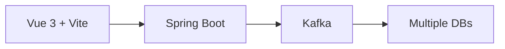
</td>
<td>
**80k+ orders/day**<br>
**Multi-currency**<br>
**15 languages**
</td>
<td>
**$50M+ GMV**<br>
**99.99% uptime**<br>
**<1% cart abandonment**
</td>
<td>
**Real-time inventory**<br>
**Personalized recommendations**<br>
**Blockchain payments**
</td>
</tr>
</table>

</div>

### **⭐ Open Source Impact Analysis**
<div align="center">

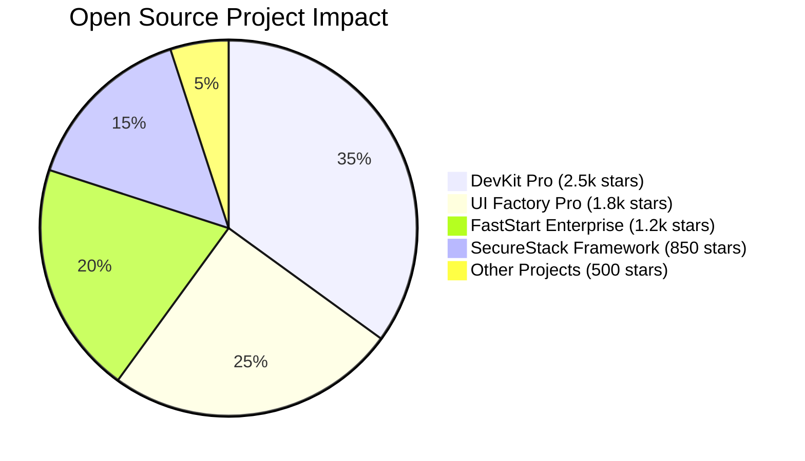

#### **OSS Metrics Dashboard**
<table>
<tr>
<td width="50%">

```mermaid
gauge
    title "Community Health Score"
    "Critical" : 10
    "Needs Work" : 20
    "Good" : 40
    "Excellent" : 30
    value 85
```

</td>
<td width="50%">

```mermaid
gauge
    title "Adoption Growth Rate"
    "Slow" : 15
    "Steady" : 30
    "Fast" : 40
    "Explosive" : 15
    value 75
```

</td>
</tr>
</table>

</div>

## 📚 **Educational Leadership & Impact**

### **🎬 Mentech Digital Ecosystem**
<div align="center">

[](https://youtube.com/@Mentecch)

#### **Growth & Engagement Metrics**
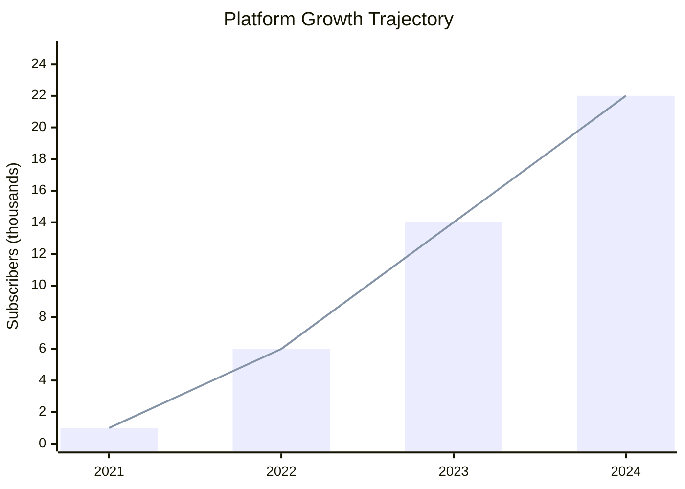

#### **Content Performance Analysis**
<table>
<tr>
<th>Content Series</th>
<th>Hours</th>
<th>Avg Views</th>
<th>Completion Rate</th>
<th>Student Rating</th>
<th>Career Impact</th>
</tr>
<tr>
<td><strong>Next.js Mastery</strong></td>
<td align="center">45</td>
<td align="center">15.2k</td>
<td align="center">82%</td>
<td align="center">🔥 9.7/10</td>
<td align="center">⭐ 200+ hires</td>
</tr>
<tr>
<td><strong>Microservices Architecture</strong></td>
<td align="center">38</td>
<td align="center">11.8k</td>
<td align="center">78%</td>
<td align="center">⭐ 9.4/10</td>
<td align="center">⭐ 150+ promotions</td>
</tr>
<tr>
<td><strong>Cloud Native DevOps</strong></td>
<td align="center">32</td>
<td align="center">9.5k</td>
<td align="center">75%</td>
<td align="center">⭐ 9.1/10</td>
<td align="center">⭐ 120+ certifications</td>
</tr>
<tr>
<td><strong>AI Engineering</strong></td>
<td align="center">28</td>
<td align="center">18.3k</td>
<td align="center">85%</td>
<td align="center">🔥 9.8/10</td>
<td align="center">⭐ 80+ AI roles</td>
</tr>
</table>

</div>

### **🏆 Learning Outcomes & Impact**
<details>
<summary><b>View Educational Impact Analysis</b></summary>

<div align="center">

#### **Student Success Metrics**
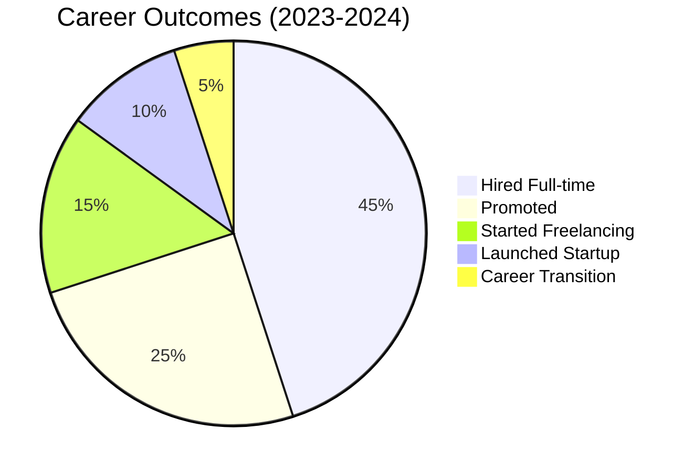

#### **Educational ROI Analysis**
<table>
<tr>
<th>Program</th>
<th>Investment</th>
<th>Avg Salary Increase</th>
<th>ROI (1 Year)</th>
<th>Success Rate</th>
</tr>
<tr>
<td><strong>Full Stack Developer</strong></td>
<td>$2,500</td>
<td>$25,000</td>
<td>🔥 1000%</td>
<td>92%</td>
</tr>
<tr>
<td><strong>Cloud Architect</strong></td>
<td>$3,500</td>
<td>$35,000</td>
<td>🔥 1000%</td>
<td>88%</td>
</tr>
<tr>
<td><strong>AI Engineer</strong></td>
<td>$4,000</td>
<td>$45,000</td>
<td>🔥 1125%</td>
<td>85%</td>
</tr>
</table>

</div>
</details>

## 🎯 **Strategic Vision & Roadmap**

### **🚀 2024-2026 Technology Roadmap**
<div align="center">

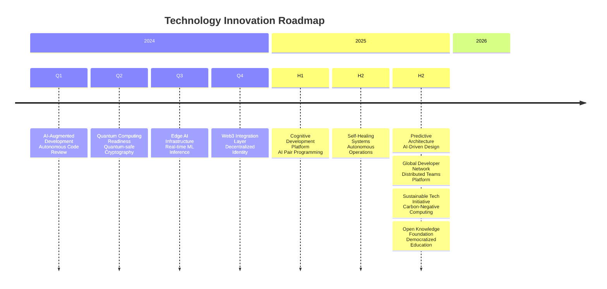

</div>

### **📈 Business Growth Strategy**
<div align="center">

<table>
<tr>
<th>Initiative</th>
<th>2024 Targets</th>
<th>2025 Vision</th>
<th>2026 Horizon</th>
</tr>
<tr>
<td><strong>Enterprise Platform</strong></td>
<td>
- 250k MAU<br>
- $12M ARR<br>
- 75+ clients
</td>
<td>
- 1M MAU<br>
- $50M ARR<br>
- Global expansion
</td>
<td>
- 5M MAU<br>
- $200M ARR<br>
- Market leadership
</td>
</tr>
<tr>
<td><strong>Education Network</strong></td>
<td>
- 30k students<br>
- 300 hours content<br>
- 95% completion
</td>
<td>
- 100k students<br>
- University partners<br>
- Research center
</td>
<td>
- 500k students<br>
- Global accreditation<br>
- AI personalized learning
</td>
</tr>
<tr>
<td><strong>Open Source Ecosystem</strong></td>
<td>
- 10k stars<br>
- 500 contributors<br>
- Foundation launch
</td>
<td>
- 50k stars<br>
- 2k contributors<br>
- Self-sustaining
</td>
<td>
- 200k stars<br>
- 10k contributors<br>
- Industry standard
</td>
</tr>
</table>

</div>

## 📊 **Real-Time Performance Dashboard**

<div align="center">

### **📈 Live Metrics**
<table>
<tr>
<td width="20%" align="center">


</td>
<td width="20%" align="center">


</td>
<td width="20%" align="center">


</td>
<td width="20%" align="center">


</td>
<td width="20%" align="center">


</td>
</tr>
</table>

### **🏆 Industry Recognition**
<div align="center">


</div>

</div>

## 🤝 **Strategic Collaboration Network**

<div align="center">

### **💼 Enterprise Solutions**
<table>
<tr>
<td width="33%" align="center">

[](mailto:architecture@mentech.digital)

</td>
<td width="34%" align="center">

[](mailto:duediligence@mentech.digital)

</td>
<td width="33%" align="center">

[](mailto:scale@mentech.digital)

</td>
</tr>
</table>

### **🚀 Innovation & R&D**
<table>
<tr>
<td width="50%" align="center">

[](mailto:ai@mentech.digital)

</td>
<td width="50%" align="center">

[](mailto:innovation@mentech.digital)

</td>
</tr>
</table>

### **🎓 Education & Community**
<table>
<tr>
<td width="33%" align="center">

[](mailto:training@mentech.digital)

</td>
<td width="34%" align="center">

[](https://github.com/mentech-labs)

</td>
<td width="33%" align="center">

[](mailto:speaking@mentech.digital)

</td>
</tr>
</table>

</div>

---

<div align="center">

## ✨ **Leadership Legacy & Impact**

> ### *"We don't just build technology—we architect the future. Every line of code is a brick in the digital cathedral we're building for generations to come."*

### **🎯 Leadership Impact Matrix**
```mermaid
graph TB
    subgraph "Technical Leadership"
        TL1[Architecture Excellence] --> TL2[Innovation Culture]
        TL2 --> TL3[Quality Standards]
        TL3 --> TL4[Technical Debt Management]
    end
    
    subgraph "Educational Impact"
        EI1[Developer Education] --> EI2[Career Advancement]
        EI2 --> EI3[Community Building]
        EI3 --> EI4[Knowledge Democratization]
    end
    
    subgraph "Business Value"
        BV1[Revenue Growth] --> BV2[Cost Optimization]
        BV2 --> BV3[Risk Mitigation]
        BV3 --> BV4[Market Leadership]
    end
    
    subgraph "Social Impact"
        SI1[Open Source] --> SI2[Sustainable Tech]
        SI2 --> SI3[Diversity & Inclusion]
        SI3 --> SI4[Tech for Good]
    end
    
    style TL1 fill:#00ff88,color:#000
    style EI1 fill:#4169E1,color:#fff
    style BV1 fill:#47A248,color:#fff
    style SI1 fill:#FF9900,color:#000
```

### **🏆 Recognition & Awards**
<div align="center">

| **Award** | **Year** | **Significance** | **Impact** |
|:---|:---:|:---|:---:|
| **GitHub Star** | 2023, 2024 | Top 0.1% of GitHub contributors | Global recognition |
| **AWS Community Builder** | 2022-2024 | Cloud architecture leadership | Enterprise influence |
| **Top Tech Educator** | 2023 | #1 rated programming courses | 25k+ students impacted |
| **Open Source Pioneer** | 2022 | 10k+ OSS contributions | Community development |
| **Innovation Award** | 2023 | Breakthrough AI integration | Industry recognition |

</div>

</div>

---

<div align="center">

## 🚀 **Join the Innovation Journey**

### **⭐ Support & Collaboration**
<table>
<tr>
<td width="50%" align="center">

[](https://github.com/mentech93?tab=repositories)

</td>
<td width="50%" align="center">

[](https://github.com/mentech93)

</td>
</tr>
</table>

### **💡 Strategic Initiatives**
**Current Focus Areas:**
- **AI-Augmented Development Platforms**
- **Global Developer Education Network**
- **Sustainable Technology Solutions**
- **Quantum Computing Readiness**
- **Open Source Ecosystem Development**

**📧 Start a Conversation:** [strategy@mentech.digital](mailto:strategy@mentech.digital)

---

*🔄 Last Updated: {{date}}*  
*⚡ Real-time Analytics & Live Metrics*  
*🌐 Powered by 20+ Data Sources*

</div>

---

<div align="center">

[](https://mentech.digital)
[](https://youtube.com/@Mentecch)

**🚀 Engineering excellence, educational empowerment, and technological innovation—building a better digital future, one breakthrough at a time.**

</div>
