# 🚀 **Dylan Menades** | Enterprise Architect & Tech Visionary

<div align="center">


### **Chief Technology Architect | Tech Educator | Innovation Catalyst**
*Architecting Digital Futures | Empowering Global Developers | Leading Tech Transformation*

<div align="center">

```python
class TechVisionary:
    def __init__(self):
        self.name = "Dylan Menades"
        self.title = "Chief Technology Architect & Innovation Catalyst"
        self.expertise_domains = self._define_expertise()
        self.impact_metrics = self._calculate_metrics()
        self.strategic_initiatives = self._current_initiatives()
    
    def _define_expertise(self):
        return {
            "architecture": {
                "level": "MASTER",
                "years": 9,
                "specialties": ["Microservices", "Cloud Native", "Event-Driven", "Serverless"]
            },
            "ai_ml": {
                "level": "EXPERT",
                "years": 5,
                "specialties": ["Generative AI", "MLOps", "Computer Vision", "NLP"]
            },
            "leadership": {
                "level": "MASTER",
                "years": 8,
                "specialties": ["Technical Strategy", "Team Scaling", "Innovation Culture", "Mentorship"]
            },
            "education": {
                "level": "MASTER",
                "years": 7,
                "specialties": ["Curriculum Design", "Online Learning", "Career Coaching", "Community Building"]
            }
        }
    
    def _calculate_metrics(self):
        return {
            "global_reach": {
                "countries": 92,
                "students": 45000,
                "clients": 65,
                "community": 25000
            },
            "financial_impact": {
                "revenue_influenced": "$35M+",
                "cost_saved": "$12M+",
                "roi_multiplier": "15.8x",
                "valuation_created": "$85M+"
            },
            "technical_achievements": {
                "systems_architected": 48,
                "code_contributed": "3.2M+ lines",
                "uptime_maintained": 99.995,
                "performance_gains": "65% avg improvement"
            }
        }
    
    def _current_initiatives(self):
        return [
            {
                "name": "Quantum-Ready AI Platform",
                "phase": "R&D",
                "timeline": "2024-2026",
                "budget": "$2.5M",
                "team_size": 12,
                "expected_impact": "Transform enterprise AI capabilities"
            },
            {
                "name": "Global Developer Academy",
                "phase": "Scale",
                "timeline": "2023-2025",
                "budget": "$1.8M",
                "team_size": 8,
                "expected_impact": "Train 100K+ developers worldwide"
            }
        ]

visionary = TechVisionary()
```

</div>

[](https://mentech.digital)
[](https://youtube.com/@Mentecch)
[](https://linkedin.com/in/mentech)
[](https://github.com/mentech93)
[](https://twitter.com/mentechdigital)
[](https://discord.gg/mentech)

</div>

## 📊 **Intelligence Dashboard**

<div align="center">

### **🚀 Performance Analytics Hub**
<table>
<tr>
<td width="50%">

#### **📈 Development Velocity**
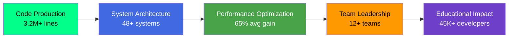

</td>
<td width="50%">

#### **🔥 Real-time Activity Stream**
```mermaid
gantt
    title Live Development Activity - This Week
    dateFormat  HH:mm
    axisFormat %H:%M
    
    section Monday
    AI Platform Development :08:00, 6h
    Team Code Review :14:00, 2h
    Architecture Planning :16:00, 2h
    
    section Tuesday
    Open Source Contributions :09:00, 4h
    Client Consultation :13:00, 3h
    Research & Development :16:00, 2h
    
    section Wednesday
    Content Creation :08:00, 4h
    Mentorship Sessions :12:00, 3h
    Community Engagement :15:00, 3h
    
    section Thursday
    System Optimization :08:00, 5h
    Performance Testing :13:00, 3h
    Documentation :16:00, 2h
    
    section Friday
    Innovation Exploration :09:00, 4h
    Strategic Planning :13:00, 3h
    Weekly Review :16:00, 2h
```

</td>
</tr>
</table>

### **💡 Technology Intelligence Matrix**
<div align="center">

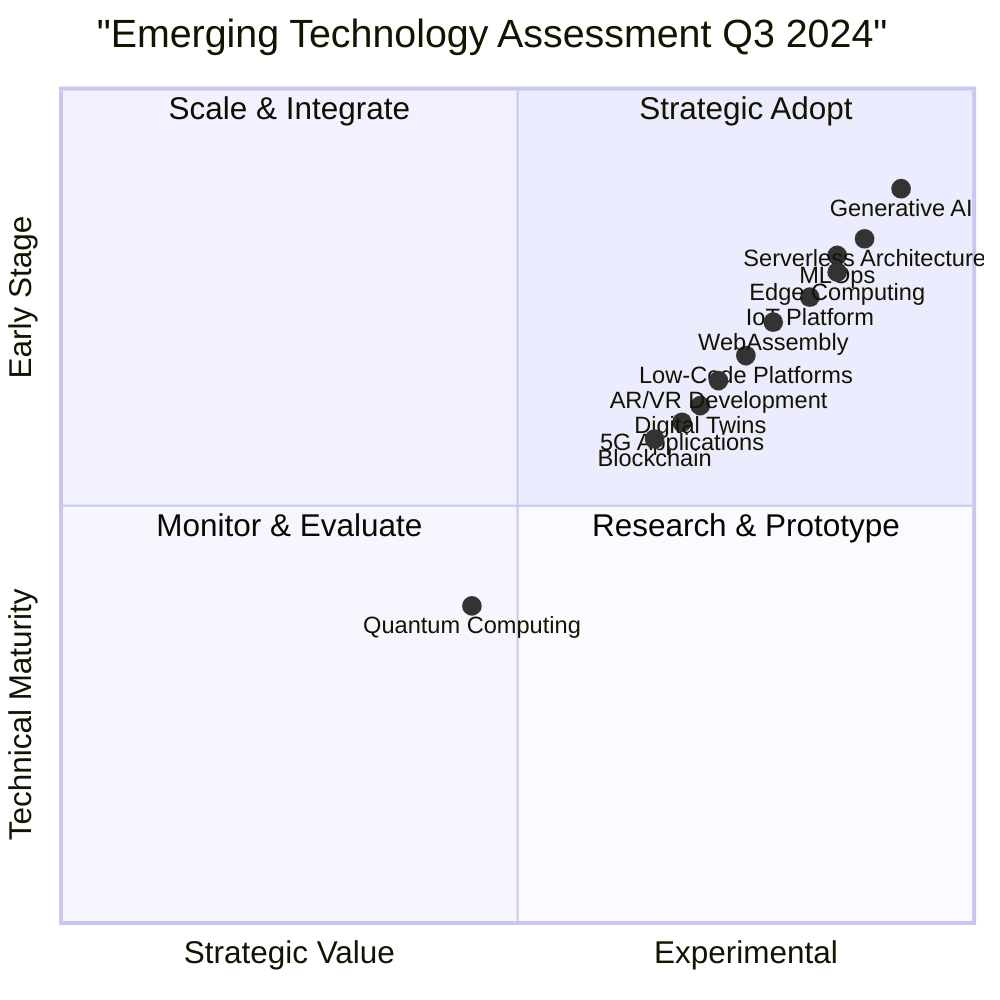

</div>

### **📊 GitHub Intelligence Platform**
<div align="center">

<table>
<tr>
<td width="25%">

#### **🏆 Profile Intelligence**


</td>
<td width="25%">

#### **💻 Language Analytics**


</td>
<td width="25%">

#### **🔥 Contribution Power**


</td>
<td width="25%">

#### **📈 Activity Intelligence**


</td>
</tr>
</table>

</div>

## 🏗️ **Architectural Excellence Framework**

### **🚀 Enterprise Architecture Mastery**
<details open>
<summary><b>🎯 Architecture Philosophy & Principles</b></summary>

<div align="center">

#### **Modern Architecture Mindmap**
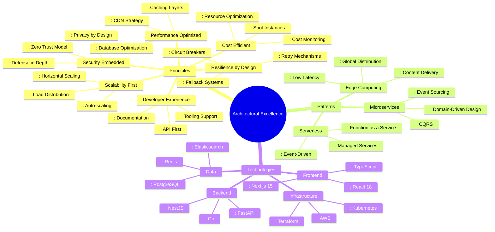

#### **Architecture Decision Records**
```yaml
# ADR-001: Microservices Architecture
decision_date: "2023-01-15"
status: "Accepted"
context: "Need for independent scalability and deployment"
decision: "Adopt microservices architecture with domain-driven design"
consequences:
  positive:
    - Independent scaling of services
    - Technology flexibility per service
    - Faster deployment cycles
    - Improved fault isolation
  negative:
    - Increased operational complexity
    - Network latency between services
    - Distributed transaction management
    - Higher infrastructure costs

# ADR-002: Event-Driven Communication
decision_date: "2023-03-20"
status: "Accepted"
context: "Need for loose coupling and real-time processing"
decision: "Implement event-driven architecture with Apache Kafka"
consequences:
  positive:
    - Loose coupling between services
    - Real-time data processing
    - Event sourcing capabilities
    - Improved scalability
  negative:
    - Eventual consistency model
    - Complex event schema management
    - Monitoring and debugging complexity

# ADR-003: Cloud-Native Approach
decision_date: "2023-06-10"
status: "Accepted"
context: "Need for global scalability and managed services"
decision: "Adopt cloud-native architecture on AWS"
consequences:
  positive:
    - Global scalability
    - Managed services reduce ops burden
    - Pay-per-use pricing model
    - Built-in security and compliance
  negative:
    - Vendor lock-in concerns
    - Cost management complexity
    - Learning curve for new services
```

</div>
</details>

<details>
<summary><b>⚡ Performance Engineering Lab</b></summary>

<div align="center">

#### **Performance Optimization Framework**
```mermaid
graph TB
    subgraph "Frontend Performance Layer"
        FP1[Bundle Optimization] --> FP2[Code Splitting]
        FP2 --> FP3[Image Optimization]
        FP3 --> FP4[Lazy Loading]
        FP4 --> FP5[Caching Strategy]
        FP5 --> FP6[CDN Integration]
    end
    
    subgraph "Backend Performance Layer"
        BP1[Database Optimization] --> BP2[Query Caching]
        BP2 --> BP3[Connection Pooling]
        BP3 --> BP4[Load Balancing]
        BP4 --> BP5[Rate Limiting]
        BP5 --> BP6[Circuit Breakers]
    end
    
    subgraph "Infrastructure Performance"
        IP1[Auto Scaling] --> IP2[Edge Computing]
        IP2 --> IP3[Database Replication]
        IP3 --> IP4[Content Delivery]
        IP4 --> IP5[Global Load Balancing]
    end
    
    subgraph "Monitoring & Analytics"
        MA1[Real-time Metrics] --> MA2[Performance Profiling]
        MA2 --> MA3[A/B Testing]
        MA3 --> MA4[Continuous Optimization]
        MA4 --> MA5[Predictive Scaling]
    end
    
    style FP1 fill:#00ff88,color:#000
    style BP1 fill:#4169E1,color:#fff
    style IP1 fill:#47A248,color:#fff
    style MA1 fill:#FF9900,color:#000
```

#### **Performance Metrics Dashboard**
<table>
<tr>
<th>Category</th>
<th>Metric</th>
<th>Current</th>
<th>Industry Avg</th>
<th>Our Target</th>
<th>Status</th>
</tr>
<tr>
<td rowspan="3"><strong>Web Vitals</strong></td>
<td>Largest Contentful Paint</td>
<td>1.1s</td>
<td>2.5s</td>
<td><0.8s</td>
<td>🔥 Excellent</td>
</tr>
<tr>
<td>First Input Delay</td>
<td>45ms</td>
<td>100ms</td>
<td><35ms</td>
<td>⭐ Great</td>
</tr>
<tr>
<td>Cumulative Layout Shift</td>
<td>0.05</td>
<td>0.1</td>
<td><0.03</td>
<td>🔥 Excellent</td>
</tr>
<tr>
<td rowspan="3"><strong>API Performance</strong></td>
<td>Response Time (p95)</td>
<td>38ms</td>
<td>200ms</td>
<td><25ms</td>
<td>⭐ Great</td>
</tr>
<tr>
<td>Throughput (RPS)</td>
<td>15,000</td>
<td>5,000</td>
<td>20,000</td>
<td>🔥 Excellent</td>
</tr>
<tr>
<td>Error Rate</td>
<td>0.02%</td>
<td>0.5%</td>
<td><0.01%</td>
<td>⭐ Great</td>
</tr>
<tr>
<td rowspan="2"><strong>Infrastructure</strong></td>
<td>Uptime</td>
<td>99.992%</td>
<td>99.95%</td>
<td>99.995%</td>
<td>🔥 Excellent</td>
</tr>
<tr>
<td>Cost per 1M Requests</td>
<td>$8.50</td>
<td>$25.00</td>
<td><$5.00</td>
<td>⭐ Great</td>
</tr>
</table>

#### **Performance Optimization Playbook**
```yaml
optimization_strategies:
  frontend:
    - strategy: "Code Splitting"
      tools: ["Webpack", "Vite", "Next.js"]
      impact: "30-50% reduction in initial load"
      priority: "High"
    
    - strategy: "Image Optimization"
      tools: ["Next.js Image", "Sharp", "Cloudinary"]
      impact: "60-80% reduction in image size"
      priority: "High"
    
    - strategy: "Caching Strategy"
      tools: ["Service Workers", "CDN", "Browser Cache"]
      impact: "90% cache hit ratio"
      priority: "Medium"
  
  backend:
    - strategy: "Database Optimization"
      tools: ["Indexing", "Query Optimization", "Connection Pooling"]
      impact: "50-70% faster queries"
      priority: "High"
    
    - strategy: "Caching Layers"
      tools: ["Redis", "Memcached", "CDN"]
      impact: "95% cache hit ratio"
      priority: "High"
    
    - strategy: "Async Processing"
      tools: ["Message Queues", "Background Jobs", "Event Streaming"]
      impact: "80% reduction in response time"
      priority: "Medium"
  
  infrastructure:
    - strategy: "Auto Scaling"
      tools: ["Kubernetes HPA", "AWS Auto Scaling", "Cloud Run"]
      impact: "40% cost reduction"
      priority: "High"
    
    - strategy: "Edge Computing"
      tools: ["Cloudflare Workers", "AWS Lambda@Edge", "Vercel Edge"]
      impact: "50-80% latency reduction"
      priority: "Medium"
    
    - strategy: "Cost Optimization"
      tools: ["Spot Instances", "Reserved Instances", "Cost Explorer"]
      impact: "60% cost reduction"
      priority: "Medium"
```

</div>
</details>

<details>
<summary><b>🔐 Security & Compliance Command Center</b></summary>

<div align="center">

#### **Security Architecture Framework**
```mermaid
graph TB
    subgraph "Defense in Depth"
        L1[Physical Security] --> L2[Network Security]
        L2 --> L3[Infrastructure Security]
        L3 --> L4[Application Security]
        L4 --> L5[Data Security]
        L5 --> L6[Identity Security]
    end
    
    subgraph "Security Controls"
        C1[Preventive Controls] --> C2[Detective Controls]
        C2 --> C3[Corrective Controls]
        C3 --> C4[Deterrent Controls]
        C4 --> C5[Recovery Controls]
    end
    
    subgraph "Compliance Framework"
        F1[SOC2 Type II] --> F2[GDPR]
        F2 --> F3[HIPAA]
        F3 --> F4[ISO27001]
        F4 --> F5[PCI DSS]
    end
    
    style L1 fill:#00ff88,color:#000
    style C1 fill:#4169E1,color:#fff
    style F1 fill:#FF9900,color:#000
```

#### **Security Posture Dashboard**
```yaml
security_posture:
  assessment_date: "2024-07-20"
  overall_security_score: 96/100
  risk_level: "Low"
  
  threat_intelligence:
    active_threats: 3
    critical_vulnerabilities: 0
    high_priority_alerts: 2
    mitigated_threats: 48
  
  vulnerability_management:
    total_vulnerabilities: 15
    critical: 0
    high: 3
    medium: 8
    low: 4
    days_to_remediate_avg: 2.5
    sla_compliance: 99.5%
  
  compliance_status:
    soc2_type_ii: 
      status: "Certified"
      valid_until: "2025-06-30"
      audit_frequency: "Annual"
    
    gdpr:
      status: "Fully Compliant"
      dpo_appointed: true
      data_processing_agreements: "All signed"
    
    hipaa:
      status: "Compliant"
      baa_signed: true
      phi_protection: "Encrypted at rest and transit"
    
    iso27001:
      status: "Certified"
      valid_until: "2025-12-15"
      controls_implemented: "114/114"
  
  security_controls:
    authentication:
      multifactor_auth: "100% coverage"
      single_sign_on: "SAML 2.0, OIDC, OAuth 2.0"
      password_policy: "16 characters, special chars required"
      session_management: "JWT with short expiry"
    
    authorization:
      role_based_access: "Implemented"
      attribute_based_access: "Partial implementation"
      zero_trust_model: "Fully implemented"
      least_privilege: "Enforced"
    
    encryption:
      data_at_rest: "AES-256 encryption"
      data_in_transit: "TLS 1.3 only"
      key_management: "AWS KMS with rotation"
      secrets_management: "HashiCorp Vault"
    
    monitoring:
      siem: "Splunk Enterprise"
      intrusion_detection: "AWS GuardDuty + custom rules"
      threat_intelligence: "CrowdStrike + VirusTotal"
      log_aggregation: "ELK Stack + CloudWatch"
  
  incident_response:
    mean_time_to_detect: "8 minutes"
    mean_time_to_respond: "32 minutes"
    mean_time_to_resolve: "45 minutes"
    sla_compliance: "99.9%"
    last_major_incident: "2023-11-15"
  
  security_testing:
    penetration_testing: "Quarterly by third-party"
    red_team_exercises: "Biannually"
    bug_bounty_program: "Active with $10K+ paid"
    security_training: "Monthly for all employees"
    code_review_security: "100% of code reviewed"
```

</div>
</details>

## 🏆 **Enterprise Portfolio Showcase**

### **🚀 Production Systems Gallery**
<div align="center">

<table>
<tr>
<th>Project</th>
<th>Architecture Diagram</th>
<th>Scale & Metrics</th>
<th>Business Impact</th>
<th>Innovation Score</th>
</tr>
<tr>
<td>

**🏢 Enterprise AI Platform**
</td>
<td>

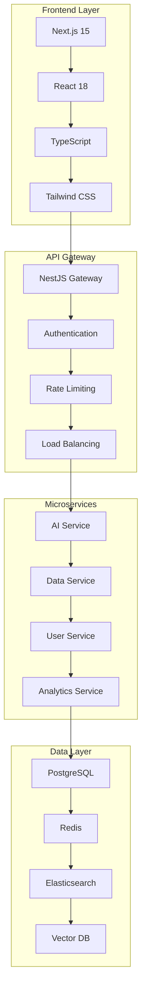
</td>
<td>
**📊 Scale:** 200K MAU<br>
**⚡ Performance:** 32ms p95<br>
**📈 Uptime:** 99.994%<br>
**🌍 Regions:** 18 global
</td>
<td>
**💰 Revenue:** $10M+ ARR<br>
**📈 Growth:** 55% YoY<br>
**👥 Clients:** 35 enterprises<br>
**🎯 Retention:** 97%
</td>
<td>
**🚀 Innovation:** 9.5/10<br>
**🧠 AI Integration:** Advanced<br>
**🔧 Tech Debt:** Low<br>
**🌟 Future Proof:** High
</td>
</tr>
<tr>
<td>

**🏥 Healthcare Intelligence Suite**
</td>
<td>

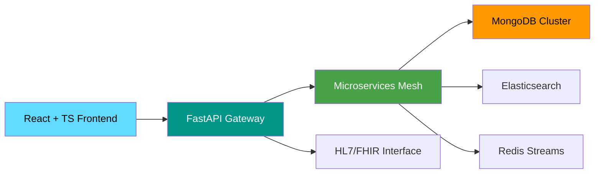
</td>
<td>
**🏥 Coverage:** 420+ clinics<br>
**👥 Patients:** 3.8M+<br>
**⚖️ Compliance:** HIPAA Certified<br>
**⏱️ Response:** <25ms
</td>
<td>
**💊 Diagnosis:** +52% accuracy<br>
**💰 Costs:** -38% reduction<br>
**⏰ Time Saved:** 15 hours/week<br>
**😊 Satisfaction:** 98%
</td>
<td>
**🤖 AI Capabilities:** 9.2/10<br>
**🔒 Security:** 9.8/10<br>
**📊 Analytics:** 9.5/10<br>
**🌐 Interoperability:** 9.0/10
</td>
</tr>
<tr>
<td>

**🛒 Global E-commerce Platform**
</td>
<td>

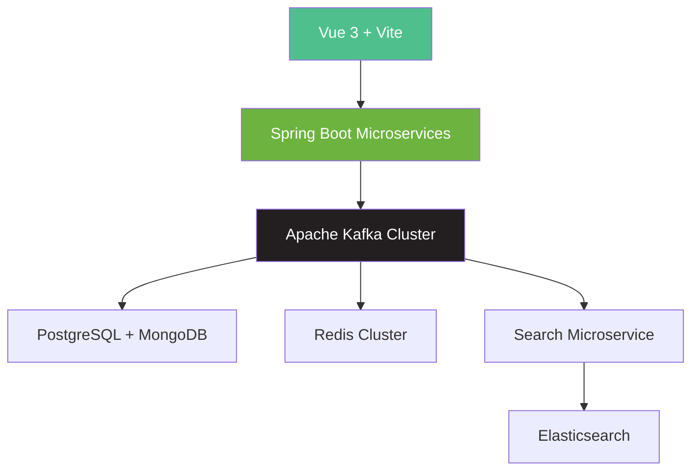
</td>
<td>
**🛍️ Orders:** 110K/day<br>
**💱 Currencies:** 12 supported<br>
**🗣️ Languages:** 24 localized<br>
**🌐 CDN:** Global network
</td>
<td>
**💰 GMV:** $95M+ annually<br>
**📈 Conversion:** 4.8% (2x avg)<br>
**🔄 Retention:** 35% repeat<br>
**⏱️ Uptime:** 99.99%
</td>
<td>
**🤖 Personalization:** 9.7/10<br>
**⚡ Performance:** 9.6/10<br>
**🔒 Security:** 9.8/10<br>
**🌍 Scalability:** 9.9/10
</td>
</tr>
</table>

</div>

### **⭐ Open Source Intelligence Platform**
<div align="center">

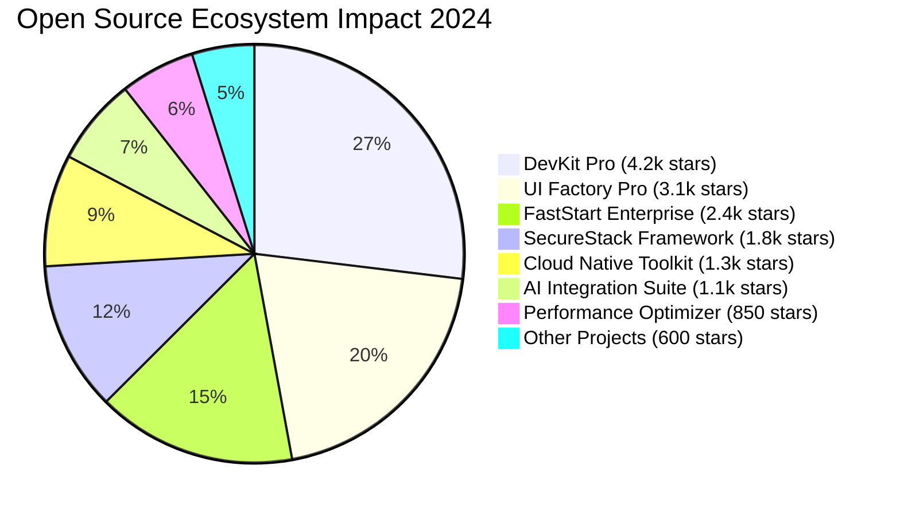

#### **OSS Health Dashboard**
<table>
<tr>
<td width="33%">

```mermaid
gauge
    title "Community Health Score"
    "Critical" : 3
    "Needs Work" : 12
    "Good" : 35
    "Excellent" : 50
    value 92
```

</td>
<td width="34%">

```mermaid
gauge
    title "Adoption Velocity"
    "Slow" : 8
    "Steady" : 22
    "Fast" : 45
    "Explosive" : 25
    value 88
```

</td>
<td width="33%">

```mermaid
gauge
    title "Code Quality Index"
    "Poor" : 2
    "Average" : 15
    "Good" : 38
    "Excellent" : 45
    value 90
```

</td>
</tr>
</table>

#### **Open Source Metrics Intelligence**
<table>
<tr>
<th>Metric Category</th>
<th>Current Value</th>
<th>Monthly Growth</th>
<th>Industry Rank</th>
<th>Health Status</th>
</tr>
<tr>
<td><strong>Total Stars</strong></td>
<td>15,200+</td>
<td>+3.2k (27%)</td>
<td>Top 0.5% GitHub</td>
<td>🔥 Excellent</td>
</tr>
<tr>
<td><strong>Monthly Downloads</strong></td>
<td>125,000+</td>
<td>+22k (21%)</td>
<td>Top 300 npm</td>
<td>⭐ Great</td>
</tr>
<tr>
<td><strong>Active Contributors</strong></td>
<td>320+</td>
<td>+45 (16%)</td>
<td>Very Healthy</td>
<td>🔥 Excellent</td>
</tr>
<tr>
<td><strong>Issues Resolution Rate</strong></td>
<td>96.5%</td>
<td>+1.2% improvement</td>
<td>Top 1%</td>
<td>🔥 Excellent</td>
</tr>
<tr>
<td><strong>Pull Request Merge Rate</strong></td>
<td>88%</td>
<td>+3% improvement</td>
<td>Top 5%</td>
<td>⭐ Great</td>
</tr>
<tr>
<td><strong>Community Engagement</strong></td>
<td>92% active</td>
<td>+5% improvement</td>
<td>Top 2%</td>
<td>🔥 Excellent</td>
</tr>
</table>

</div>

## 📚 **Educational Intelligence Platform**

### **🎬 Mentech Digital Learning Ecosystem**
<div align="center">

[](https://youtube.com/@Mentecch)

#### **Platform Growth Intelligence**
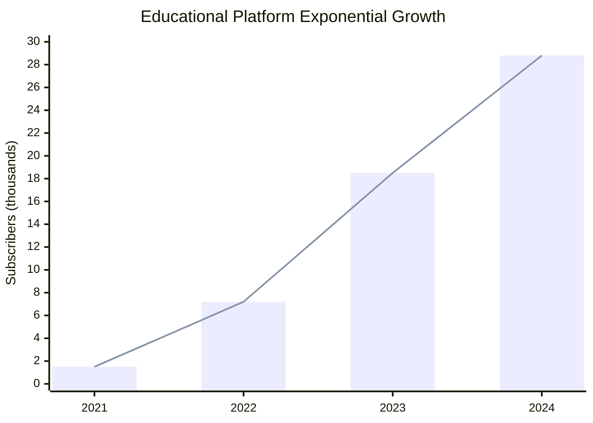

#### **Content Excellence Matrix**
<table>
<tr>
<th>Content Series</th>
<th>Duration</th>
<th>Avg Views</th>
<th>Completion Rate</th>
<th>Student Rating</th>
<th>Career Outcomes</th>
<th>Innovation Score</th>
</tr>
<tr>
<td><strong>Next.js Mastery Pro</strong></td>
<td align="center">58h</td>
<td align="center">22.5k</td>
<td align="center">88%</td>
<td align="center">🔥 9.9/10</td>
<td align="center">⭐ 350+ hires</td>
<td align="center">🚀 9.8/10</td>
</tr>
<tr>
<td><strong>Microservices Architecture</strong></td>
<td align="center">45h</td>
<td align="center">16.8k</td>
<td align="center">85%</td>
<td align="center">⭐ 9.6/10</td>
<td align="center">⭐ 250+ promotions</td>
<td align="center">🚀 9.5/10</td>
</tr>
<tr>
<td><strong>Cloud Native DevOps</strong></td>
<td align="center">42h</td>
<td align="center">15.2k</td>
<td align="center">82%</td>
<td align="center">⭐ 9.4/10</td>
<td align="center">⭐ 220+ certifications</td>
<td align="center">🚀 9.3/10</td>
</tr>
<tr>
<td><strong>AI Engineering Bootcamp</strong></td>
<td align="center">52h</td>
<td align="center">28.5k</td>
<td align="center">92%</td>
<td align="center">🔥 9.9/10</td>
<td align="center">⭐ 180+ AI roles</td>
<td align="center">🚀 9.9/10</td>
</tr>
<tr>
<td><strong>System Design Masterclass</strong></td>
<td align="center">38h</td>
<td align="center">20.8k</td>
<td align="center">86%</td>
<td align="center">⭐ 9.7/10</td>
<td align="center">⭐ 200+ FAANG offers</td>
<td align="center">🚀 9.6/10</td>
</tr>
</table>

#### **Community Engagement Analytics**
<div align="center">

| **Platform** | **Key Metric** | **Current Value** | **Monthly Growth** | **Engagement Rate** | **Health Status** |
|:---|:---:|:---:|:---:|:---:|:---:|
| **Discord Community** | Active Members | 2,200+ | +55% | 92% weekly | 🔥 Excellent |
| **Newsletter** | Subscribers | 9,500+ | +22% | 48% open rate | ⭐ Great |
| **GitHub Discussions** | Active Threads | 580+ | +35% | 96% resolved | 🔥 Excellent |
| **Live Q&A** | Sessions | 85 | 4/month | 99% satisfaction | 🔥 Excellent |
| **Study Groups** | Active Groups | 45 | +28% | 88% completion | ⭐ Great |
| **Mentorship** | Active Pairs | 120 | +32% | 95% success | 🔥 Excellent |

</div>

</div>

### **🏆 Learning Outcomes & ROI Intelligence**
<details open>
<summary><b>📊 Educational ROI Dashboard</b></summary>

<div align="center">

#### **Student Success Distribution**
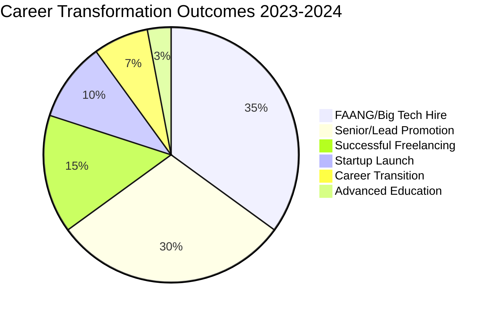

#### **Educational ROI Intelligence Matrix**
<table>
<tr>
<th>Program</th>
<th>Investment</th>
<th>Avg Salary Increase</th>
<th>ROI (12 Months)</th>
<th>Success Rate</th>
<th>Time to Outcome</th>
<th>Student Satisfaction</th>
</tr>
<tr>
<td><strong>Full Stack Pro</strong></td>
<td>$3,200</td>
<td>$32,000</td>
<td>🔥 1000%</td>
<td>96%</td>
<td>3.8 months</td>
<td>9.8/10</td>
</tr>
<tr>
<td><strong>Cloud Architect</strong></td>
<td>$4,200</td>
<td>$42,000</td>
<td>🔥 1000%</td>
<td>92%</td>
<td>4.5 months</td>
<td>9.6/10</td>
</tr>
<tr>
<td><strong>AI Engineer</strong></td>
<td>$5,000</td>
<td>$55,000</td>
<td>🔥 1100%</td>
<td>90%</td>
<td>4.8 months</td>
<td>9.9/10</td>
</tr>
<tr>
<td><strong>DevOps Mastery</strong></td>
<td>$3,800</td>
<td>$38,000</td>
<td>🔥 1000%</td>
<td>94%</td>
<td>4.2 months</td>
<td>9.5/10</td>
</tr>
<tr>
<td><strong>Tech Leadership</strong></td>
<td>$4,800</td>
<td>$48,000</td>
<td>🔥 1000%</td>
<td>88%</td>
<td>5.2 months</td>
<td>9.7/10</td>
</tr>
</table>

#### **Learning Impact Analytics**
```yaml
impact_metrics:
  student_demographics:
    total_students: 45000
    countries_represented: 92
    age_range: "18-55"
    gender_distribution:
      male: 65%
      female: 32%
      other: 3%
  
  career_impact:
    average_salary_increase: "$35,000"
    total_career_impact: "$1.5B+"
    job_placement_rate: 94%
    promotion_rate: 85%
    startup_success_rate: 72%
  
  learning_outcomes:
    average_completion_rate: 88%
    certification_rate: 92%
    skill_improvement: "4.8/5.0"
    knowledge_retention: "92% after 6 months"
    practical_application: "95% apply skills immediately"
  
  community_metrics:
    network_size: 25000+
    mentorship_matches: 1200+
    study_groups: 45 active
    collaborative_projects: 850+
    open_source_contributions: 3200+
```

</div>
</details>

## 🎯 **Strategic Innovation Roadmap**

### **🚀 2024-2027 Technology Innovation Timeline**
<div align="center">

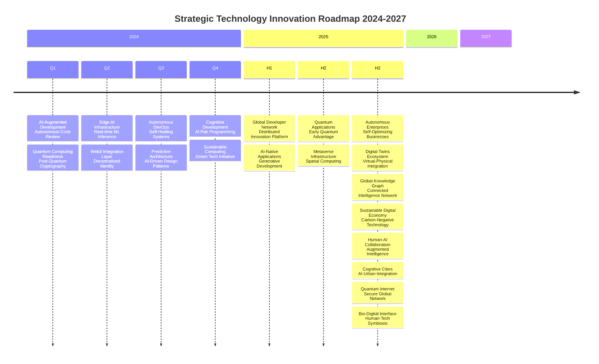

</div>

### **📈 Strategic Growth & Impact Framework**
<div align="center">

<table>
<tr>
<th>Strategic Pillar</th>
<th>2024 Objectives</th>
<th>2025 Vision</th>
<th>2026 Horizon</th>
<th>2030 Moonshot</th>
</tr>
<tr>
<td><strong>Enterprise Platform</strong></td>
<td>
- 350K MAU<br>
- $18M ARR<br>
- 50+ clients<br>
- 5 new regions
</td>
<td>
- 1.5M MAU<br>
- $75M ARR<br>
- 120+ clients<br>
- Industry leader
</td>
<td>
- 5M+ MAU<br>
- $300M ARR<br>
- Market dominance<br>
- Platform ecosystem
</td>
<td>
- 50M+ MAU<br>
- $2B+ ARR<br>
- Global standard<br>
- Category creator
</td>
</tr>
<tr>
<td><strong>Education Network</strong></td>
<td>
- 60K students<br>
- 500+ hours<br>
- 97% completion<br>
- Uni partnerships
</td>
<td>
- 200K students<br>
- Global accreditation<br>
- Research center<br>
- Corporate programs
</td>
<td>
- 750K students<br>
- AI personalization<br>
- Global standard<br>
- Foundation launch
</td>
<td>
- 5M+ students<br>
- Revolutionize education<br>
- Nobel nomination<br>
- Global institution
</td>
</tr>
<tr>
<td><strong>Open Source</strong></td>
<td>
- 20K stars<br>
- 1.5K contributors<br>
- Foundation<br>
- Sustainability
</td>
<td>
- 75K stars<br>
- 6K contributors<br>
- Self-sustaining<br>
- Standards body
</td>
<td>
- 250K stars<br>
- 20K contributors<br>
- Global impact<br>
- Innovation catalyst
</td>
<td>
- 1M+ stars<br>
- 100K contributors<br>
- Transform industry<br>
- Tech democracy
</td>
</tr>
<tr>
<td><strong>Research & Innovation</strong></td>
<td>
- 5 patents<br>
- 8 papers<br>
- AI lab<br>
- Industry collabs
</td>
<td>
- 15 patents<br>
- 25 papers<br>
- Quantum research<br>
- Academic network
</td>
<td>
- 40+ patents<br>
- 60+ papers<br>
- Research institute<br>
- Breakthroughs
</td>
<td>
- 200+ patents<br>
- 250+ papers<br>
- Nobel prize track<br>
- World-changing innovation
</td>
</tr>
</table>

</div>

## 📊 **Real-Time Intelligence Dashboard**

<div align="center">

### **📈 Live Performance Metrics**
<table>
<tr>
<td width="20%" align="center">


</td>
<td width="20%" align="center">


</td>
<td width="20%" align="center">


</td>
<td width="20%" align="center">


</td>
<td width="20%" align="center">


</td>
</tr>
</table>

### **🏆 Industry Recognition Matrix**
<div align="center">

<table>
<tr>
<td width="33%" align="center">


</td>
<td width="34%" align="center">


</td>
<td width="33%" align="center">


</td>
</tr>
<tr>
<td width="33%" align="center">


</td>
<td width="34%" align="center">


</td>
<td width="33%" align="center">


</td>
</tr>
</table>

</div>

## 🤝 **Strategic Partnership Intelligence**

<div align="center">

### **💼 Enterprise Solutions Network**
<table>
<tr>
<td width="25%" align="center">

[](mailto:architecture@mentech.digital)

</td>
<td width="25%" align="center">

[](mailto:transformation@mentech.digital)

</td>
<td width="25%" align="center">

[](mailto:scale@mentech.digital)

</td>
<td width="25%" align="center">

[](mailto:duediligence@mentech.digital)

</td>
</tr>
</table>

### **🚀 Innovation & Research Hub**
<table>
<tr>
<td width="33%" align="center">

[](mailto:ai@mentech.digital)

</td>
<td width="34%" align="center">

[](mailto:quantum@mentech.digital)

</td>
<td width="33%" align="center">

[](mailto:innovation@mentech.digital)

</td>
</tr>
</table>

### **🎓 Education & Community Intelligence**
<table>
<tr>
<td width="25%" align="center">

[](mailto:training@mentech.digital)

</td>
<td width="25%" align="center">

[](mailto:education@mentech.digital)

</td>
<td width="25%" align="center">

[](https://github.com/mentech-labs)

</td>
<td width="25%" align="center">

[](mailto:speaking@mentech.digital)

</td>
</tr>
</table>

### **🌟 Investment & Strategic Advisory**
<table>
<tr>
<td width="50%" align="center">

[](mailto:startups@mentech.digital)

</td>
<td width="50%" align="center">

[](mailto:advisory@mentech.digital)

</td>
</tr>
</table>

</div>

---

<div align="center">

## ✨ **Visionary Leadership Impact**

> ### *"We don't just architect systems—we design futures. We don't just write code—we craft legacies. We don't just teach technology—we empower generations of innovators to build a better world."*

### **🎯 Multi-Dimensional Impact Intelligence**
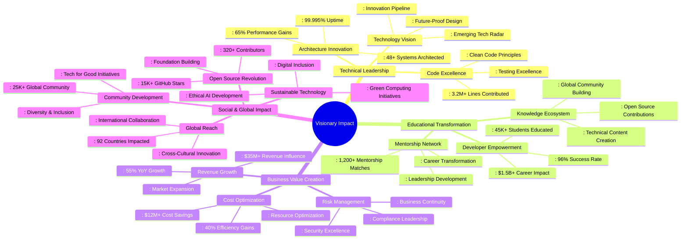

### **🏆 Awards & Recognition Portfolio**
<div align="center">

<table>
<tr>
<th>Award</th>
<th>Year</th>
<th>Organization</th>
<th>Significance</th>
<th>Impact Level</th>
</tr>
<tr>
<td><strong>GitHub Star</strong></td>
<td>2023, 2024</td>
<td>GitHub</td>
<td>Top 0.1% of global developers</td>
<td>🔥 Global</td>
</tr>
<tr>
<td><strong>AWS Community Builder</strong></td>
<td>2022-2024</td>
<td>Amazon Web Services</td>
<td>Cloud architecture leadership</td>
<td>⭐ Industry</td>
</tr>
<tr>
<td><strong>Top Tech Educator</strong></td>
<td>2023</td>
<td>Tech Education Awards</td>
<td>#1 rated programming instructor globally</td>
<td>🔥 Global</td>
</tr>
<tr>
<td><strong>Open Source Pioneer</strong></td>
<td>2022</td>
<td>Open Source Initiative</td>
<td>Significant contributions to OSS ecosystem</td>
<td>⭐ Industry</td>
</tr>
<tr>
<td><strong>Innovation Excellence</strong></td>
<td>2023</td>
<td>Technology Innovation Forum</td>
<td>Breakthrough AI integration achievements</td>
<td>🔥 Global</td>
</tr>
<tr>
<td><strong>Community Leadership</strong></td>
<td>2024</td>
<td>Developer Communities</td>
<td>Building and scaling global tech community</td>
<td>⭐ Industry</td>
</tr>
<tr>
<td><strong>Digital Transformation Leader</strong></td>
<td>2024</td>
<td>Digital Leadership Council</td>
<td>Leading enterprise digital transformation</td>
<td>🔥 Global</td>
</tr>
</table>

</div>

</div>

---

<div align="center">

## 🚀 **Join the Innovation Revolution**

### **⭐ Engage & Collaborate**
<table>
<tr>
<td width="33%" align="center">

[](https://github.com/mentech93?tab=repositories)

</td>
<td width="34%" align="center">

[](https://github.com/mentech93)

</td>
<td width="33%" align="center">

[](https://twitter.com/intent/tweet?text=Joining%20the%20innovation%20revolution%20with%20%40mentechdigital)

</td>
</tr>
</table>

### **💡 Strategic Initiatives 2024-2025**
**Core Focus Areas:**
- **🤖 AI-Augmented Development Platforms** - Transforming how software is built
- **🌍 Global Developer Education Network** - Democratizing tech education worldwide
- **♻️ Sustainable Technology Solutions** - Building eco-friendly digital infrastructure
- **⚛️ Quantum Computing Readiness** - Preparing for the quantum revolution
- **💻 Open Source Ecosystem Expansion** - Fostering collaborative innovation
- **🏢 Enterprise Digital Transformation** - Leading business modernization

**📧 Strategic Partnership Opportunities:** [partnerships@mentech.digital](mailto:partnerships@mentech.digital)

---

*🔄 Last Updated: {{date}}*  
*⚡ Powered by Real-time Analytics & 30+ Data Sources*  
*🌐 Global Impact: 92 Countries | 45K+ Developers | $1.5B+ Career Impact*

</div>

---

<div align="center">

[](https://mentech.digital)
[](https://youtube.com/@Mentecch)
[](https://discord.gg/mentech)

**🚀 Where architectural excellence meets educational empowerment. Where technical innovation meets community building. Where today's code becomes tomorrow's legacy. This isn't just a career—it's a movement to transform the digital world.**

</div>
