# 🚀 Dylan Menades | Arquitetura & Inovação Digital

<div align="center">


### **Arquiteto Full Stack | Tech Lead | Criador de Conteúdo Educativo**
*Transformando complexidade em soluções escaláveis e acessíveis*

[](https://mentech.digital)
[](https://youtube.com/@Mentecch)
[](https://linkedin.com/in/mentech)
[](https://github.com/mentech93)
[](https://mentech.digital/blog)

</div>

## 🎯 **Perfil Executivo**

<div align="center">

```typescript
const techProfile = {
  name: "Dylan Menades",
  title: "Arquiteto de Soluções Full Stack & Tech Educator",
  experience: "8+ anos em arquitetura de sistemas complexos",
  philosophy: "Código é poesia, arquitetura é arte, impacto é realidade",
  
  metrics: {
    projectsInProduction: 12,
    usersImpacted: "50k+",
    uptime: "99.95%",
    educationalContent: "200+ horas",
    communityReach: "25k+ developers"
  },
  
  coreCompetencies: [
    "Microservices Architecture",
    "Cloud Native Solutions",
    "Performance Optimization", 
    "Technical Leadership",
    "Developer Education",
    "Open Source Advocacy"
  ],
  
  currentFocus: {
    primary: "Building next-gen SaaS platforms with AI integration",
    secondary: "Democratizing tech education through content creation",
    community: "Mentoring the next generation of developers"
  }
};
```

</div>

## 📊 **GitHub Intelligence Dashboard**

<div align="center">

### **🏆 Performance Metrics**
| | | |
|:---:|:---:|:---:|
|  |  |  |

### **💡 Code Intelligence**
| | |
|:---:|:---:|
|  |  |

### **🏅 Achievements & Recognition**


</div>

## 🏗️ **Enterprise Tech Stack**

### **🌟 Core Specializations**
<details>
<summary><b>🚀 Full Stack Architecture (Click to expand)</b></summary>

<div align="center">

#### **Frontend Ecosystem**


| **Layer** | **Technologies** | **Expertise Level** |
|:---|:---|:---:|
| **Frameworks** | Next.js 14, React 18, Vue 3, SolidJS | 🔥 Expert |
| **State Management** | Redux Toolkit, Zustand, Jotai, Valtio | 🔥 Expert |
| **UI/UX** | Tailwind CSS, Shadcn/ui, Radix UI, Framer Motion | 🔥 Expert |
| **Data Fetching** | TanStack Query, SWR, Apollo Client, tRPC | 🔥 Expert |
| **Testing** | Vitest, Jest, Testing Library, Cypress, Playwright | ⭐ Advanced |
| **Build Tools** | Vite, Turborepo, Nx, Webpack | ⭐ Advanced |

#### **Backend & Microservices**


| **Component** | **Technologies** | **Deployment** |
|:---|:---|:---:|
| **API Frameworks** | NestJS, FastAPI, Express, Koa | 🐳 Docker |
| **Message Brokers** | Kafka, RabbitMQ, Redis Pub/Sub | ☸️ Kubernetes |
| **Database Layer** | PostgreSQL, MongoDB, Redis, Elasticsearch | 🛡️ HA Setup |
| **Authentication** | Auth.js, Keycloak, Cognito, Auth0 | 🔐 Zero Trust |
| **Monitoring** | Prometheus, Grafana, Datadog, New Relic | 📈 Real-time |

</div>
</details>

<details>
<summary><b>☁️ Cloud & DevOps Excellence (Click to expand)</b></summary>

<div align="center">

#### **Multi-Cloud Strategy**
| **Provider** | **Services** | **Use Cases** |
|:---|:---|:---|
| **AWS** | EC2, S3, RDS, Lambda, ECS, CloudFront | Production workloads, Scalable APIs |
| **Google Cloud** | GKE, Cloud Run, BigQuery, Firebase | ML/AI, Data Analytics, Mobile Backends |
| **Azure** | AKS, App Service, Cosmos DB, DevOps | Enterprise Solutions, .NET Ecosystems |
| **Vercel/Netlify** | Edge Functions, CDN, Serverless | Frontend Hosting, Static Sites |

#### **DevOps Pipeline**


#### **Infrastructure as Code**
```bash
# Terraform Configuration Example
module "production_infra" {
  source = "./modules/aws-eks"
  
  cluster_name    = "mentech-prod"
  node_count      = 5
  instance_type   = "m5.large"
  vpc_cidr        = "10.0.0.0/16"
  
  enable_monitoring = true
  enable_backup     = true
  enable_security   = true
}
```

</div>
</details>

<details>
<summary><b>🧠 AI & Emerging Tech (Click to expand)</b></summary>

<div align="center">

#### **AI Integration Stack**
| **Category** | **Tools & Frameworks** | **Applications** |
|:---|:---|:---|
| **ML Ops** | TensorFlow, PyTorch, Scikit-learn, MLflow | Predictive Analytics, Recommendations |
| **LLM Integration** | OpenAI API, LangChain, Pinecone, Vector DBs | Chatbots, Content Generation, Search |
| **Computer Vision** | OpenCV, YOLO, MediaPipe | Image Processing, Object Detection |
| **NLP** | spaCy, NLTK, Hugging Face, BERT | Sentiment Analysis, Text Classification |

#### **Blockchain & Web3**
| **Technology** | **Projects** | **Expertise** |
|:---|:---|:---:|
| **Smart Contracts** | Solidity, Hardhat, Ethers.js | 🔧 Intermediate |
| **DeFi Protocols** | Web3.js, Moralis, The Graph | 🔧 Intermediate |
| **NFT Platforms** | IPFS, Pinata, OpenSea API | 🔧 Intermediate |
| **DAOs** | Aragon, DAOstack, Snapshot | 🧠 Learning |

</div>
</details>

## 🏆 **Portfolio Highlights**

### **🚀 Production Systems**
<div align="center">

| | Project | Tech Stack | Scale | Impact |
|:---:|:---|:---|:---:|:---|
| 🏢 | **[Enterprise SaaS Platform](https://github.com/mentech93/enterprise-saas)** | `Next.js 14` `NestJS` `PostgreSQL` `Redis` `AWS` | **10k+ MAU** | **$2M+** ARR |
| 🏥 | **[Healthcare Management System](https://github.com/mentech93/healthcare-sys)** | `React` `FastAPI` `MongoDB` `Docker` `K8s` | **50+ clinics** | **HIPAA Compliant** |
| 🛒 | **[E-commerce Microservices](https://github.com/mentech93/ecommerce-ms)** | `Microservices` `Kafka` `Redis` `K8s` `Istio` | **5k+ orders/day** | **99.99% uptime** |
| 🎓 | **[EdTech Platform](https://github.com/mentech93/edtech-platform)** | `Vue 3` `Node.js` `MySQL` `WebRTC` `S3` | **15k+ students** | **95% satisfaction** |

</div>

### **⭐ Open Source Contributions**
<div align="center">

| | Repository | Description | Stars | Downloads |
|:---:|:---|:---|:---:|:---:|
| 🔧 | **[DevKit Pro](https://github.com/mentech93/devkit-pro)** | Complete developer toolkit CLI |  |  |
| 🨠| **[UI Factory](https://github.com/mentech93/ui-factory)** | Component factory with AI generation |  |  |
| ⚡ | **[FastStart Templates](https://github.com/mentech93/faststart)** | Production-ready project templates |  |  |
| 🔠| **[SecureStack](https://github.com/mentech93/securestack)** | Security-first architecture patterns |  |  |

</div>

### **📊 Project Metrics Dashboard**


## 📈 **Educational Impact**

### **🎬 Mentech Digital - Analytics**
<div align="center">

[](https://youtube.com/@Mentecch?sub_confirmation=1)

#### **Growth Metrics**


#### **Content Performance**
| **Series** | **Episodes** | **Avg. Views** | **Completion Rate** | **Impact Score** |
|:---|:---:|:---:|:---:|:---:|
| **Next.js Masterclass** | 15 | 8.5k | 72% | 🔥 9.2/10 |
| **Microservices Deep Dive** | 12 | 6.2k | 68% | ⭐ 8.7/10 |
| **TypeScript Pro** | 10 | 7.1k | 75% | 🔥 9.0/10 |
| **DevOps for Developers** | 8 | 5.8k | 65% | ⭐ 8.5/10 |

#### **Community Engagement**
<div>
  
  
  
  
</div>

</div>

### **📚 Learning Paths Created**
<details>
<summary><b>View Complete Curriculum</b></summary>

#### **🎯 Full Stack Developer Path**
1. **Fundamentals** (HTML/CSS/JS + Git)
2. **Frontend Mastery** (React/TypeScript/Next.js)
3. **Backend Development** (Node.js/APIs/Databases)
4. **DevOps & Deployment** (Docker/CI/CD/Cloud)
5. **Advanced Topics** (Microservices/Performance/Security)

#### **🚀 Specialized Tracks**
- **Frontend Architect** (Design Systems, Performance, Tooling)
- **Backend Engineer** (Scalability, Databases, APIs)
- **DevOps Specialist** (Infrastructure, Automation, Security)
- **Tech Lead** (Architecture, Mentoring, Project Management)

#### **🧪 Hands-on Projects**
Each path includes 5+ real-world projects with code reviews and deployment guidance.

</details>

## 🎯 **Strategic Roadmap 2024-2025**

### **🚀 Technical Vision**


### **📈 Business & Growth Goals**
| **Quarter** | **Technical Goals** | **Content Goals** | **Community Goals** |
|:---|:---|:---|:---|
| **2024 Q1** | Launch AI integration platform | 20k YouTube subscribers | 1k Discord community |
| **2024 Q2** | Open source 3 major tools | 50k monthly blog views | First conference talk |
| **2024 Q3** | Scale to 100k MAU platform | 30k YouTube subscribers | Mentor 100 developers |
| **2024 Q4** | International expansion | 100k newsletter subscribers | Open source foundation |
| **2025** | Platform ecosystem launch | 500k total reach | Global developer network |

## 📊 **Real-time Metrics**

<div align="center">

### **📈 GitHub Analytics**
| | | | |
|:---:|:---:|:---:|:---:|
|  |  |  |  |
|  |  |  |  |

### **🌐 Web Presence**
<div>
  
  
  
  
</div>

</div>

## 🤝 **Strategic Partnerships & Collaboration**

<div align="center">

### **💼 Business Inquiries**
[](https://linkedin.com/in/mentech)
[](mailto:business@mentech.digital)
[](https://calendly.com/mentech-exec)

### **🚀 Technical Collaboration**
[](https://github.com/mentech-labs)
[](https://discord.gg/mentech-dev)
[](https://stackoverflow.com/users/mentech)

### **🎓 Educational Partnerships**
[](https://youtube.com/@Mentecch)
[](https://medium.com/@mentech)
[](https://dev.to/mentech)

### **🌟 Support & Sponsorship**
[](https://github.com/sponsors/mentech93)
[](https://buymeacoffee.com/mentech)
[](https://patreon.com/mentech)

</div>

---

<div align="center">

## ✨ **Leadership Philosophy & Values**

> ### *"Technology should empower, not complicate. Our code should tell stories of innovation, our architecture should enable dreams, and our community should elevate everyone."*

### **🎯 Core Principles**
| **Principle** | **Implementation** | **Impact** |
|:---|:---|:---|
| **📐 Architecture First** | Design reviews, RFC process, documentation | Reduced tech debt by 70% |
| **🧪 Quality as Culture** | TDD, CI/CD, automated testing | 99.9% production stability |
| **📚 Knowledge Sharing** | Weekly tech talks, mentoring, open source | 50+ developers mentored |
| **🚀 Innovation Driven** | 20% time for R&D, hackathons, PoCs | 3 patent-pending solutions |
| **🤝 Community Focus** | OSS contributions, speaking, teaching | 25k+ developers reached |

### **🏆 Recognition & Awards**
- **GitHub Star** (2023, 2024)
- **Top 1% Stack Overflow Contributor**
- **Google Developer Expert** (Nominee)
- **AWS Community Builder**
- **Microsoft MVP** (Nominee)

### **📈 Success Metrics**

```mermaid
graph LR
    A[Technical Excellence] --> B[Business Impact]
    A --> C[Community Growth]
    A --> D[Innovation Output]
    
    B --> B1[$$$ Revenue Growth]
    B --> B2[📈 User Adoption]
    B --> B3[🎯 Client Satisfaction]
    
    C --> C1[👥 Developer Network]
    C --> C2[📚 Educational Content]
    C --> C3[🤝 Partnerships]
    
    D --> D1[🚀 New Technologies]
    D --> D2[💡 Patents & Research]
    D --> D3[🌐 Industry Influence]
```


</div>

---

<div align="center">

## 🚀 **Ready to Build the Future?**

### **⭐ Show Support**
[](https://github.com/mentech93?tab=repositories)
[](https://github.com/mentech93)
[](https://twitter.com/intent/tweet?text=Check%20out%20this%20amazing%20developer%20profile!%20%40mentechdigital)

### **💡 Let's Innovate Together**
**Current Focus Areas:**
- **AI-Powered Development Tools**
- **Scalable Microservices Architecture**
- **Developer Education Platforms**
- **Open Source Ecosystem Development**
- **Sustainable Tech Solutions**

**📧 Start a Conversation:** [innovation@mentech.digital](mailto:innovation@mentech.digital)

---

*🔄 Last Updated: {{date}}*  
*⚡ Powered by GitHub Actions & Real-time APIs*  
*📊 Metrics update every 24 hours*

</div>

---

<div align="center">

[](https://mentech.digital)
[](https://youtube.com/@Mentecch)

**🚀 From code to community, from architecture to impact - building a better digital world, one line at a time.**

</div>
