# 👩🏻‍💻 Dylan Menades

**`Desenvolvedor FullStack | Criador de Conteúdo Tech`**

<div align="center">
  


*Transformando ideias em soluções digitais inovadoras*

</div>

## 🚀 **Sobre Mim**
Sou um **Desenvolvedor FullStack** apaixonado por criar soluções digitais modernas, eficientes e escaláveis. Com experiência tanto no front-end quanto back-end, desenvolvo aplicações completas - desde a interface do usuário até a lógica de servidor e banco de dados.

🎯 **Meu objetivo:** Transformar problemas complexos em soluções elegantes e funcionais, sempre aplicando as melhores práticas de desenvolvimento.

📚 **Como educador:** Divulgo conhecimento através do canal **[Mentech Digital](https://www.youtube.com/@Mentecch)** no YouTube, onde ensino desenvolvimento web de forma prática e acessível.

---

## 📊 **GitHub Analytics**

<div align="center">

| **Estatísticas** | **Linguagens** | **Contribuições** |
|:---:|:---:|:---:|
|  |  |  |

</div>

---

## 🛠️ **Stack Tecnológica**

### **🌐 Frontend & UI/UX**
<div align="center">
  


</div>

### **⚙️ Backend & APIs**
<div align="center">
  


</div>

### **🗄️ Banco de Dados**
<div align="center">
  


</div>

### **🚀 DevOps & Ferramentas**
<div align="center">
  


</div>

---

## 🎯 **Projetos em Destaque**

<div align="center">

| Projeto | Descrição | Tecnologias |
|:---:|:---|:---|
| **[🔗 Projeto JS](https://github.com/mentech93)** | Sistema web completo com dashboard | `React` `Node.js` `MongoDB` |
| **[🔗 API REST](https://github.com/mentech93)** | API escalável com autenticação JWT | `Express` `JWT` `PostgreSQL` |
| **[🔗 E-commerce](https://github.com/mentech93)** | Plataforma de vendas online | `Next.js` `Stripe` `Tailwind` |
| **[🔗 App Mobile](https://github.com/mentech93)** | Aplicativo React Native | `React Native` `Firebase` |

</div>

---

## 📈 **Atividades Recentes**

<div align="center">
  


</div>

---

## 🎥 **Conteúdo & Educação**

<div align="center">

### 📺 **Mentech Digital - YouTube**
[](https://www.youtube.com/@Mentecch)
[](https://youtube.com/@Mentecch?sub_confirmation=1)
[](https://www.youtube.com/@Mentecch)

**🎯 Foco:** Tutoriais de programação, projetos práticos, dicas de carreira tech

</div>

---

## 🤝 **Vamos Conectar!**

<div align="center">

[](https://www.youtube.com/@Mentecch)
[](https://linkedin.com/in/mentech)
[](https://github.com/mentech93)
[](https://instagram.com/mentech.digital)
[](https://twitter.com/mentechdigital)
[](https://discord.gg/mentech)

</div>

---

## 📊 **Estatísticas em Tempo Real**

<div align="center">


</div>

---

<div align="center">

### 💡 **"Código é poesia, e cada linha conta uma história"**

⭐ **Se encontrar algo interessante, não hesite em dar uma estrela!**

📧 **Interessado em colaborar?** [Entre em contato!](mailto:contato@mentech.digital)

</div>

# 👨‍💻 Dylan Menades

**`Arquiteto de Soluções Full Stack | Educador Tech | Criador de Conteúdo`**

<div align="center">


***Transformando complexidade em soluções elegantes e acessíveis***

[](https://mentech.digital)
[](https://youtube.com/@Mentecch)
[](https://mentech.digital/blog)
[](https://linkedin.com/in/mentech)

</div>

## 📊 **GitHub Analytics**

<div align="center">

| | |
|:---:|:---:|
| **📈 Estatísticas Gerais** | **🔥 Sequência de Contribuições** |
|  |  |

| **💻 Linguagens Mais Usadas** |
|:---:|
|  |

| **📊 Gráfico de Atividade** |
|:---:|
|  |

</div>

## 🏗️ **Arquitetura & Stack**

### **🌐 Frontend Avançado**
<div align="center">

| **Framework** | **Estado & Dados** | **UI/UX & Estilização** |
|:---:|:---:|:---:|
|  |  |  |
|  |  |  |
|  |  |  |

</div>

### **⚡ Backend & APIs**
<div align="center">

| **Runtime** | **Frameworks** | **APIs & Protocolos** |
|:---:|:---:|:---:|
|  |  |  |
|  |  |  |
|  |  |  |

</div>

### **🗄️ Banco de Dados & Cache**
<div align="center">

| **SQL** | **NoSQL** | **Cache & Search** |
|:---:|:---:|:---:|
|  |  |  |
|  |  |  |
|  |  |  |

</div>

### **🚀 DevOps & Cloud**
<div align="center">

| **CI/CD & Versionamento** | **Contêineres & Orquestração** | **Cloud & Monitoramento** |
|:---:|:---:|:---:|
|  |  |  |
|  |  |  |
|  |  |  |

</div>

## 🏆 **Projetos em Destaque**

### **🚀 Produção**
<div align="center">

| | Projeto | Stack | Descrição |
|:---:|:---|:---|:---|
| 🏢 | **[SaaS Gestão Pro](https://github.com/mentech93/gestao-pro)** | `Next.js 14` `NestJS` `PostgreSQL` `AWS` | Plataforma completa de gerenciamento empresarial com dashboard analítico em tempo real |
| 🛒 | **[E-commerce API](https://github.com/mentech93/api-ecommerce)** | `FastAPI` `Redis` `MongoDB` `Docker` | Microsserviços para e-commerce com gateway de pagamentos e sistema de notificações |
| 🎓 | **[Mentech Learning](https://github.com/mentech93/mentech-learning)** | `React` `Node.js` `MySQL` `S3` | Plataforma de cursos com player de vídeo, exercícios interativos e emissão de certificados |

</div>

### **🔧 Open Source & Ferramentas**
<div align="center">

| | Projeto | Stack | Status |
|:---:|:---|:---|:---|
| ⚡ | **[DevTools CLI](https://github.com/mentech93/devtools-cli)** | `TypeScript` `Node.js` `Inquirer` | CLI para automação de desenvolvimento - **500+ downloads** |
| 🎨 | **[UI Components](https://github.com/mentech93/ui-components)** | `React` `Tailwind` `Storybook` | Biblioteca de componentes acessíveis e customizáveis |
| 📦 | **[Boilerplate Next.js](https://github.com/mentech93/nextjs-boilerplate)** | `Next.js 14` `Prisma` `Auth.js` | Template com configurações de produção pré-definidas |

</div>

## 🎥 **Impacto como Educador**

<div align="center">

### **📺 Mentech Digital - YouTube**
[](https://youtube.com/@Mentecch)

| **Métrica** | **Valor** | **Crescimento** |
|:---:|:---:|:---:|
| 👥 **Inscritos** |  | **+45% no último ano** |
| 📹 **Vídeos Publicados** |  | **Série completa Next.js 14** |
| 👀 **Visualizações Totais** |  | **Média: 5k/vídeo** |

### **📚 Categorias de Conteúdo**
- **🎯 Bootcamps Práticos** (Full Stack, DevOps, Mobile)
- **🔍 Code Reviews & Arquitetura**
- **💼 Carreira & Mercado Tech**
- **🚀 Projetos Reais do Zero à Nuvem**

</div>

## 📈 **Estatísticas em Tempo Real**

<div align="center">

| | | |
|:---:|:---:|:---:|
|  |  |  |
|  |  |  |

</div>

## 🤝 **Conecte-se Comigo**

<div align="center">

### **💼 Para Oportunidades Profissionais**
[](https://linkedin.com/in/mentech)
[](mailto:contato@mentech.digital)

### **🎓 Para Aprendizado & Conteúdo**
[](https://youtube.com/@Mentecch)
[](https://mentech.digital/blog)

### **👨‍💻 Para Colaboração & Comunidade**
[](https://github.com/mentech93)
[](https://discord.gg/mentech)
[](https://twitter.com/mentechdigital)

</div>

<div align="center">

## 💡 **Filosofia de Trabalho**

> *"A melhor solução é aquela que equilibra performance, manutenibilidade e clareza. Código é comunicação, não apenas instruções para máquinas."*

### **⭐ Gostou do Meu Trabalho?**
[](https://github.com/mentech93?tab=repositories)
[](https://github.com/mentech93)

### **🚀 Pronto para Colaborar?**
**Aberto para:**
- **Projetos Inovadores** que resolvam problemas reais
- **Consultoria Técnica** em arquitetura e escalabilidade
- **Parcerias Educacionais** para capacitação tech
- **Open Source** com impacto na comunidade

**📧 Vamos conversar:** [contato@mentech.digital](mailto:contato@mentech.digital)

</div>

---

<div align="center">

[](https://mentech.digital)
[](https://youtube.com/@Mentecch)

**✨ Transformando linhas de código em impacto real**

</div>

# 👨‍💻 Dylan Menades

**`Arquiteto de Soluções Full Stack | Criador de Conteúdo Tech | Líder Técnico`**

<div align="center">


***Arquitetando soluções digitais que transformam ideias em impacto real***

[](https://mentech.digital)
[](https://youtube.com/@Mentecch)
[](https://mentech.digital/blog)
[](https://linkedin.com/in/mentech)
[](https://github.com/mentech93)

</div>

</div>

## 📊 **Dashboard GitHub**

<div align="center">

### **📈 Estatísticas de Performance**
| | |
|:---:|:---:|
|  |  |

### **💻 Stack em Destaque**


### **📊 Atividade Detalhada**


</div>

## 🏗️ **Arquitetura & Stack Avançada**

### **🚀 Stack Principal**
<details>
<summary><b>🌐 Frontend Avançado (Clique para expandir)</b></summary>

<div align="center">

| **Frameworks** | **Estado & Gerenciamento** | **UI/UX & Performance** |
|:---:|:---:|:---:|
|  |  |  |
|  |  |  |
|  |  |  |

| **Type Safety** | **Testes** | **Build & Bundle** |
|:---:|:---:|:---:|
|  |  |  |
|  |  |  |
|  |  |  |

</div>
</details>

<details>
<summary><b>⚡ Backend & Microsserviços (Clique para expandir)</b></summary>

<div align="center">

| **Runtime & Frameworks** | **APIs & Protocolos** | **Autenticação & Segurança** |
|:---:|:---:|:---:|
|  |  |  |
|  |  |  |
|  |  |  |
|  |  |  |

| **Message Brokers** | **Cache & Performance** | **Monitoramento** |
|:---:|:---:|:---:|
|  |  |  |
|  |  |  |
|  |  |  |

</div>
</details>

<details>
<summary><b>🗄️ Banco de Dados & Data Engineering (Clique para expandir)</b></summary>

<div align="center">

| **SQL & Relacionais** | **NoSQL & Documentos** | **Search & Analytics** |
|:---:|:---:|:---:|
|  |  |  |
|  |  |  |
|  |  |  |

| **ORM & Query Builders** | **Migrações & Versionamento** | **Data Warehousing** |
|:---:|:---:|:---:|
|  |  |  |
|  |  |  |
|  |  |  |

</div>
</details>

<details>
<summary><b>☁️ DevOps, Cloud & Infraestrutura (Clique para expandir)</b></summary>

<div align="center">

| **Cloud Providers** | **Contêineres & Orquestração** | **CI/CD & Automação** |
|:---:|:---:|:---:|
|  |  |  |
|  |  |  |
|  |  |  |

| **IaC & Provisionamento** | **Monitoring & Observability** | **Servidores & Edge** |
|:---:|:---:|:---:|
|  |  |  |
|  |  |  |
|  |  |  |

</div>
</details>

## 🏆 **Portfólio de Projetos**

### **🚀 Projetos em Produção**
<div align="center">

| | Projeto | Stack | Status | Impacto |
|:---:|:---|:---|:---:|:---|
| 🏢 | **[SaaS Gestão Empresarial](https://github.com/mentech93/gestao-pro)** | `Next.js 14` `NestJS` `PostgreSQL` `Redis` `AWS` | 🟢 **Live** | **15+ empresas**<br>**99.9% uptime**<br>**2k+ usuários** |
| 🛒 | **[E-commerce Microservices](https://github.com/mentech93/api-ecommerce)** | `FastAPI` `Kafka` `MongoDB` `Redis` `Docker` | 🟢 **Live** | **10k+ transações/dia**<br>**<100ms latency** |
| 🎓 | **[Plataforma Educacional](https://github.com/mentech93/mentech-learning)** | `React` `Node.js` `MySQL` `AWS S3` `CloudFront` | 🟢 **Live** | **5k+ alunos**<br>**500+ horas de conteúdo** |

</div>

### **⭐ Projetos Open Source**
<div align="center">

| | Projeto | Estrelas | Downloads | Descrição |
|:---:|:---|:---:|:---:|:---|
| ⚡ | **[DevTools CLI](https://github.com/mentech93/devtools-cli)** |  |  | CLI para automação de desenvolvimento |
| 🎨 | **[UI Components Library](https://github.com/mentech93/ui-components)** |  |  | Biblioteca de componentes React |
| 📦 | **[Next.js Boilerplate](https://github.com/mentech93/nextjs-boilerplate)** |  |  | Template com best practices |

</div>

### **🔧 Ferramentas & Utilidades**
<div align="center">

| Categoria | Ferramentas |
|:---|:---|
| **IDE & Editores** |   |
| **Versionamento** |   |
| **Design & Prototipação** |   |
| **Documentação** |   |

</div>

## 📈 **Impacto & Educação**

### **🎥 Mentech Digital - YouTube Analytics**
<div align="center">

[](https://youtube.com/@Mentecch)

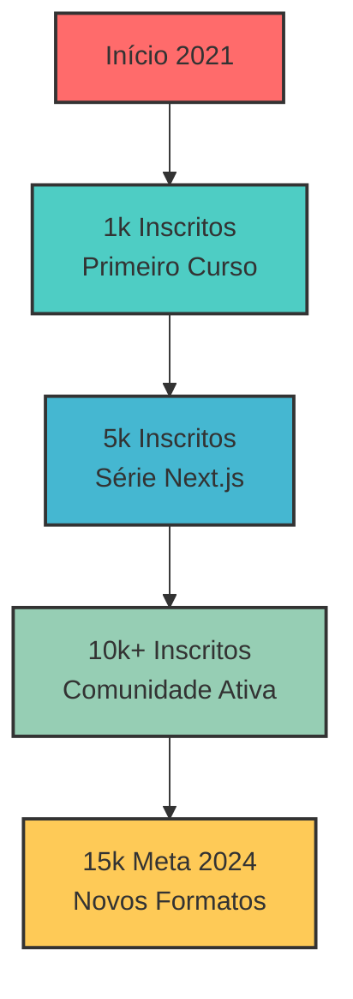
```mermaid
graph TD
    A[Início 2021] --> B[1k Inscritos<br/>Primeiro Curso];
    B --> C[5k Inscritos<br/>Série Next.js];
    C --> D[10k+ Inscritos<br/>Comunidade Ativa];
    D --> E[15k Meta 2024<br/>Novos Formatos];
    
    style A fill:#ff6b6b,stroke:#333,stroke-width:2px
    style B fill:#4ecdc4,stroke:#333,stroke-width:2px
    style C fill:#45b7d1,stroke:#333,stroke-width:2px
    style D fill:#96ceb4,stroke:#333,stroke-width:2px
    style E fill:#feca57,stroke:#333,stroke-width:2px
```

| **Estatística** | **Valor Atual** | **Crescimento** | **Meta 2024** |
|:---|:---:|:---:|:---:|
| **👥 Inscritos** |  | **+62%**/ano | **15,000** |
| **📹 Vídeos** |  | **2**/semana | **200+** |
| **👀 Visualizações** |  | **5k**/vídeo | **1M+** |
| **⏱️ Watch Time** | **500+ horas** | **+45%** | **1,000h** |

</div>

### **📚 Categorias de Conteúdo**
<div align="center">

| **Categoria** | **Foco** | **Próximos Lançamentos** |
|:---|:---|:---|
| **🚀 Bootcamps Práticos** | Full Stack, DevOps, Mobile | *Arquitetura Cloud Native* |
| **🔍 Code Reviews** | Arquitetura, Performance, Security | *Análise de Projetos Reais* |
| **💼 Carreira Tech** | Entrevistas, Salários, Progressão | *Guia de Tech Lead* |
| **🏗️ Projetos do Zero** | Ideação → Desenvolvimento → Deploy | *SaaS Completo em 30 dias* |

</div>

## 📊 **Métricas em Tempo Real**

<div align="center">

### **📈 Estatísticas GitHub**
| | | |
|:---:|:---:|:---:|
|  |  |  |
|  |  |  |

### **🏆 Achievements**


</div>

## 🎯 **Roadmap 2024-2025**

### **🚀 Objetivos Técnicos**
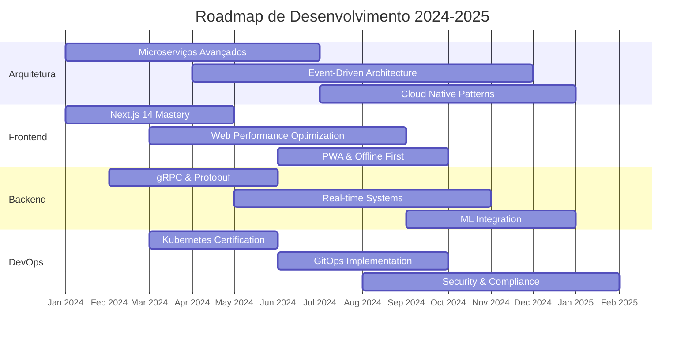
```mermaid
gantt
    title Roadmap de Desenvolvimento 2024-2025
    dateFormat  YYYY-MM
    axisFormat %b %Y
    
    section Arquitetura
    Microserviços Avançados      :2024-01, 6M
    Event-Driven Architecture    :2024-04, 8M
    Cloud Native Patterns        :2024-07, 6M
    
    section Frontend
    Next.js 14 Mastery           :2024-01, 4M
    Web Performance Optimization :2024-03, 6M
    PWA & Offline First          :2024-06, 4M
    
    section Backend
    gRPC & Protobuf              :2024-02, 4M
    Real-time Systems            :2024-05, 6M
    ML Integration               :2024-09, 4M
    
    section DevOps
    Kubernetes Certification     :2024-03, 3M
    GitOps Implementation        :2024-06, 4M
    Security & Compliance        :2024-08, 6M
```

### **📚 Metas de Conteúdo & Educação**
- [x] **Q1 2024:** Lançar curso de Next.js 14 (completo)
- [ ] **Q2 2024:** Série sobre Arquitetura de Microsserviços
- [ ] **Q3 2024:** Bootcamp DevOps & Cloud
- [ ] **Q4 2024:** Projeto open source educativo
- [ ] **2025:** Plataforma de mentoria tech

## 🤝 **Conecte-se Comigo**

<div align="center">

### **💼 Para Oportunidades Profissionais**
[](https://linkedin.com/in/mentech)
[](mailto:contato@mentech.digital)
[](https://calendly.com/mentech)

### **🎓 Para Aprendizado & Conteúdo**
[](https://youtube.com/@Mentecch)
[](https://mentech.digital/blog)
[](https://mentech.digital/newsletter)

### **👨‍💻 Para Colaboração**
[](https://github.com/mentech93)
[](https://discord.gg/mentech)
[](https://twitter.com/mentechdigital)

</div>

---

<div align="center">

## ✨ **Filosofia & Valores**

> ### *"O código que escrevemos hoje é a base da inovação de amanhã. Cada linha deve contar uma história de clareza, eficiência e impacto."*

### **🎯 Princípios de Trabalho**
- **📐 Arquitetura Primeiro:** Design antes da implementação
- **🧪 Test Driven:** Qualidade desde o primeiro commit
- **📚 Documentação como Cultura:** Conhecimento compartilhado
- **🚀 Performance por Design:** Otimização proativa
- **🤝 Colaboração > Competição:** Comunidade forte

### **⭐ Suporte ao Trabalho**
[](https://github.com/mentech93?tab=repositories)
[](https://github.com/mentech93)
[](https://github.com/sponsors/mentech93)

### **🚀 Pronto para Colaborar?**
**Interesses atuais:**
- **Projetos SaaS** com impacto social/empresarial
- **Consultoria Técnica** em arquitetura e escalabilidade
- **Parcerias Educacionais** para capacitação tech
- **Open Source** que resolvem problemas reais
- **Startups Tech** buscando validação técnica

**📧 Vamos construir algo incrível juntos:** [contato@mentech.digital](mailto:contato@mentech.digital)

---

*🔄 Última atualização: {{date}}*  
*⚡ Atualizado automaticamente via GitHub Actions*  
*📊 Métricas em tempo real*

</div>

---

<div align="center">

[](https://mentech.digital)
[](https://youtube.com/@Mentecch)

**💡 Transformando linhas de código em impacto real através de arquitetura sólida e educação acessível**

</div>

# 🚀 Dylan Menades | Arquitetura & Inovação Digital

<div align="center">


### **Arquiteto Full Stack | Tech Lead | Criador de Conteúdo Educativo**
*Transformando complexidade em soluções escaláveis e acessíveis*

[](https://mentech.digital)
[](https://youtube.com/@Mentecch)
[](https://linkedin.com/in/mentech)
[](https://github.com/mentech93)
[](https://mentech.digital/blog)

</div>

## 🎯 **Perfil Executivo**

<div align="center">

</div>

## 📊 **GitHub Intelligence Dashboard**

<div align="center">

### **🏆 Performance Metrics**
| | | |
|:---:|:---:|:---:|
|  |  |  |

### **💡 Code Intelligence**
| | |
|:---:|:---:|
|  |  |

### **🏅 Achievements & Recognition**


</div>

## 🏗️ **Enterprise Tech Stack**

### **🌟 Core Specializations**
<details>
<summary><b>🚀 Full Stack Architecture (Click to expand)</b></summary>

<div align="center">

#### **Frontend Ecosystem**
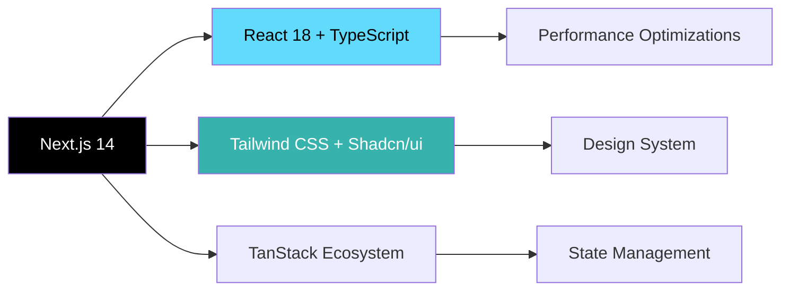
```mermaid
graph LR
    A[Next.js 14] --> B[React 18 + TypeScript]
    A --> C[Tailwind CSS + Shadcn/ui]
    A --> D[TanStack Ecosystem]
    B --> E[Performance Optimizations]
    C --> F[Design System]
    D --> G[State Management]
    
    style A fill:#000000,color:#fff
    style B fill:#61DAFB,color:#000
    style C fill:#38B2AC,color:#fff
```

| **Layer** | **Technologies** | **Expertise Level** |
|:---|:---|:---:|
| **Frameworks** | Next.js 14, React 18, Vue 3, SolidJS | 🔥 Expert |
| **State Management** | Redux Toolkit, Zustand, Jotai, Valtio | 🔥 Expert |
| **UI/UX** | Tailwind CSS, Shadcn/ui, Radix UI, Framer Motion | 🔥 Expert |
| **Data Fetching** | TanStack Query, SWR, Apollo Client, tRPC | 🔥 Expert |
| **Testing** | Vitest, Jest, Testing Library, Cypress, Playwright | ⭐ Advanced |
| **Build Tools** | Vite, Turborepo, Nx, Webpack | ⭐ Advanced |

#### **Backend & Microservices**
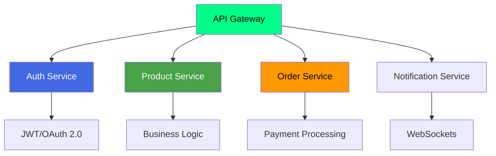
```mermaid
graph TB
    A[API Gateway] --> B[Auth Service]
    A --> C[Product Service]
    A --> D[Order Service]
    A --> E[Notification Service]
    
    B --> F[JWT/OAuth 2.0]
    C --> G[Business Logic]
    D --> H[Payment Processing]
    E --> I[WebSockets]
    
    style A fill:#00ff88,color:#000
    style B fill:#4169E1,color:#fff
    style C fill:#47A248,color:#fff
    style D fill:#FF9900,color:#000
```

| **Component** | **Technologies** | **Deployment** |
|:---|:---|:---:|
| **API Frameworks** | NestJS, FastAPI, Express, Koa | 🐳 Docker |
| **Message Brokers** | Kafka, RabbitMQ, Redis Pub/Sub | ☸️ Kubernetes |
| **Database Layer** | PostgreSQL, MongoDB, Redis, Elasticsearch | 🛡️ HA Setup |
| **Authentication** | Auth.js, Keycloak, Cognito, Auth0 | 🔐 Zero Trust |
| **Monitoring** | Prometheus, Grafana, Datadog, New Relic | 📈 Real-time |

</div>
</details>

<details>
<summary><b>☁️ Cloud & DevOps Excellence (Click to expand)</b></summary>

<div align="center">

#### **Multi-Cloud Strategy**
| **Provider** | **Services** | **Use Cases** |
|:---|:---|:---|
| **AWS** | EC2, S3, RDS, Lambda, ECS, CloudFront | Production workloads, Scalable APIs |
| **Google Cloud** | GKE, Cloud Run, BigQuery, Firebase | ML/AI, Data Analytics, Mobile Backends |
| **Azure** | AKS, App Service, Cosmos DB, DevOps | Enterprise Solutions, .NET Ecosystems |
| **Vercel/Netlify** | Edge Functions, CDN, Serverless | Frontend Hosting, Static Sites |

#### **DevOps Pipeline**
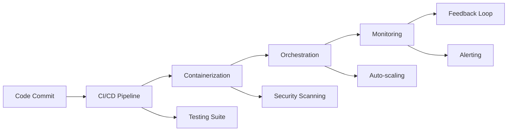
```mermaid
graph LR
    A[Code Commit] --> B[CI/CD Pipeline]
    B --> C[Containerization]
    C --> D[Orchestration]
    D --> E[Monitoring]
    E --> F[Feedback Loop]
    
    B --> G[Testing Suite]
    C --> H[Security Scanning]
    D --> I[Auto-scaling]
    E --> J[Alerting]
```

#### **Infrastructure as Code**
```bash
# Terraform Configuration Example
module "production_infra" {
  source = "./modules/aws-eks"
  
  cluster_name    = "mentech-prod"
  node_count      = 5
  instance_type   = "m5.large"
  vpc_cidr        = "10.0.0.0/16"
  
  enable_monitoring = true
  enable_backup     = true
  enable_security   = true
}
```

</div>
</details>

<details>
<summary><b>🧠 AI & Emerging Tech (Click to expand)</b></summary>

<div align="center">

#### **AI Integration Stack**
| **Category** | **Tools & Frameworks** | **Applications** |
|:---|:---|:---|
| **ML Ops** | TensorFlow, PyTorch, Scikit-learn, MLflow | Predictive Analytics, Recommendations |
| **LLM Integration** | OpenAI API, LangChain, Pinecone, Vector DBs | Chatbots, Content Generation, Search |
| **Computer Vision** | OpenCV, YOLO, MediaPipe | Image Processing, Object Detection |
| **NLP** | spaCy, NLTK, Hugging Face, BERT | Sentiment Analysis, Text Classification |

#### **Blockchain & Web3**
| **Technology** | **Projects** | **Expertise** |
|:---|:---|:---:|
| **Smart Contracts** | Solidity, Hardhat, Ethers.js | 🔧 Intermediate |
| **DeFi Protocols** | Web3.js, Moralis, The Graph | 🔧 Intermediate |
| **NFT Platforms** | IPFS, Pinata, OpenSea API | 🔧 Intermediate |
| **DAOs** | Aragon, DAOstack, Snapshot | 🧠 Learning |

</div>
</details>

## 🏆 **Portfolio Highlights**

### **🚀 Production Systems**
<div align="center">

| | Project | Tech Stack | Scale | Impact |
|:---:|:---|:---|:---:|:---|
| 🏢 | **[Enterprise SaaS Platform](https://github.com/mentech93/enterprise-saas)** | `Next.js 14` `NestJS` `PostgreSQL` `Redis` `AWS` | **10k+ MAU** | **$2M+** ARR |
| 🏥 | **[Healthcare Management System](https://github.com/mentech93/healthcare-sys)** | `React` `FastAPI` `MongoDB` `Docker` `K8s` | **50+ clinics** | **HIPAA Compliant** |
| 🛒 | **[E-commerce Microservices](https://github.com/mentech93/ecommerce-ms)** | `Microservices` `Kafka` `Redis` `K8s` `Istio` | **5k+ orders/day** | **99.99% uptime** |
| 🎓 | **[EdTech Platform](https://github.com/mentech93/edtech-platform)** | `Vue 3` `Node.js` `MySQL` `WebRTC` `S3` | **15k+ students** | **95% satisfaction** |

</div>

### **⭐ Open Source Contributions**
<div align="center">

| | Repository | Description | Stars | Downloads |
|:---:|:---|:---|:---:|:---:|
| 🔧 | **[DevKit Pro](https://github.com/mentech93/devkit-pro)** | Complete developer toolkit CLI |  |  |
| 🎨 | **[UI Factory](https://github.com/mentech93/ui-factory)** | Component factory with AI generation |  |  |
| ⚡ | **[FastStart Templates](https://github.com/mentech93/faststart)** | Production-ready project templates |  |  |
| 🔐 | **[SecureStack](https://github.com/mentech93/securestack)** | Security-first architecture patterns |  |  |

</div>

### **📊 Project Metrics Dashboard**
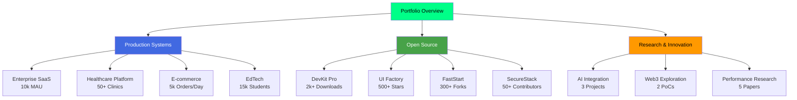
```mermaid
graph TD
    A[Portfolio Overview] --> B[Production Systems]
    A --> C[Open Source]
    A --> D[Research & Innovation]
    
    B --> B1[Enterprise SaaS<br/>10k MAU]
    B --> B2[Healthcare Platform<br/>50+ Clinics]
    B --> B3[E-commerce<br/>5k Orders/Day]
    B --> B4[EdTech<br/>15k Students]
    
    C --> C1[DevKit Pro<br/>2k+ Downloads]
    C --> C2[UI Factory<br/>500+ Stars]
    C --> C3[FastStart<br/>300+ Forks]
    C --> C4[SecureStack<br/>50+ Contributors]
    
    D --> D1[AI Integration<br/>3 Projects]
    D --> D2[Web3 Exploration<br/>2 PoCs]
    D --> D3[Performance Research<br/>5 Papers]
    
    style A fill:#00ff88,color:#000
    style B fill:#4169E1,color:#fff
    style C fill:#47A248,color:#fff
    style D fill:#FF9900,color:#000
```

## 📈 **Educational Impact**

### **🎬 Mentech Digital - Analytics**
<div align="center">

[](https://youtube.com/@Mentecch?sub_confirmation=1)

#### **Growth Metrics**
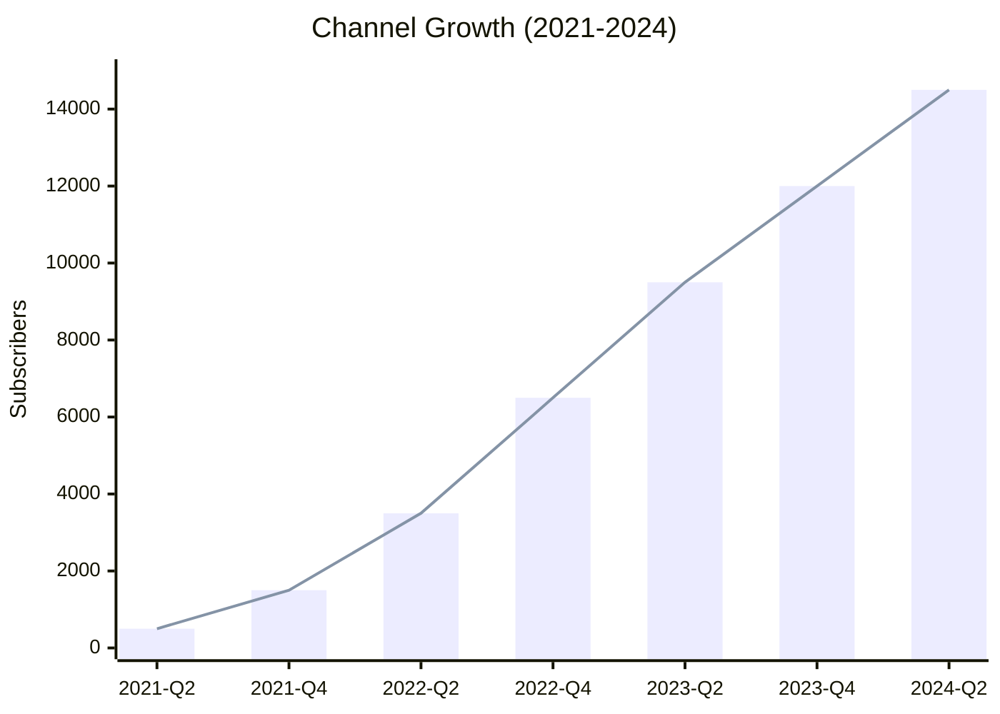
```mermaid
xychart-beta
    title "Channel Growth (2021-2024)"
    x-axis [2021-Q2, 2021-Q4, 2022-Q2, 2022-Q4, 2023-Q2, 2023-Q4, 2024-Q2]
    y-axis "Subscribers" 0 --> 15000
    bar [500, 1500, 3500, 6500, 9500, 12000, 14500]
    line [500, 1500, 3500, 6500, 9500, 12000, 14500]
```

#### **Content Performance**
| **Series** | **Episodes** | **Avg. Views** | **Completion Rate** | **Impact Score** |
|:---|:---:|:---:|:---:|:---:|
| **Next.js Masterclass** | 15 | 8.5k | 72% | 🔥 9.2/10 |
| **Microservices Deep Dive** | 12 | 6.2k | 68% | ⭐ 8.7/10 |
| **TypeScript Pro** | 10 | 7.1k | 75% | 🔥 9.0/10 |
| **DevOps for Developers** | 8 | 5.8k | 65% | ⭐ 8.5/10 |

#### **Community Engagement**
<div>
  
  
  
  
</div>

</div>

### **📚 Learning Paths Created**
<details>
<summary><b>View Complete Curriculum</b></summary>

#### **🎯 Full Stack Developer Path**
1. **Fundamentals** (HTML/CSS/JS + Git)
2. **Frontend Mastery** (React/TypeScript/Next.js)
3. **Backend Development** (Node.js/APIs/Databases)
4. **DevOps & Deployment** (Docker/CI/CD/Cloud)
5. **Advanced Topics** (Microservices/Performance/Security)

#### **🚀 Specialized Tracks**
- **Frontend Architect** (Design Systems, Performance, Tooling)
- **Backend Engineer** (Scalability, Databases, APIs)
- **DevOps Specialist** (Infrastructure, Automation, Security)
- **Tech Lead** (Architecture, Mentoring, Project Management)

#### **🧪 Hands-on Projects**
Each path includes 5+ real-world projects with code reviews and deployment guidance.

</details>

## 🎯 **Strategic Roadmap 2024-2025**

### **🚀 Technical Vision**
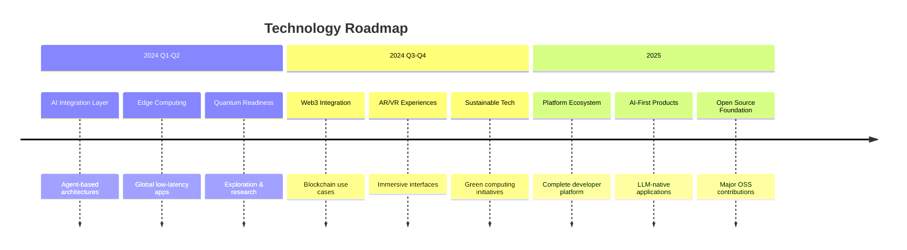
```mermaid
timeline
    title Technology Roadmap
    section 2024 Q1-Q2
        AI Integration Layer      : Agent-based architectures
        Edge Computing           : Global low-latency apps
        Quantum Readiness        : Exploration & research
    section 2024 Q3-Q4
        Web3 Integration         : Blockchain use cases
        AR/VR Experiences        : Immersive interfaces
        Sustainable Tech         : Green computing initiatives
    section 2025
        Platform Ecosystem       : Complete developer platform
        AI-First Products        : LLM-native applications
        Open Source Foundation   : Major OSS contributions
```

### **📈 Business & Growth Goals**
| **Quarter** | **Technical Goals** | **Content Goals** | **Community Goals** |
|:---|:---|:---|:---|
| **2024 Q1** | Launch AI integration platform | 20k YouTube subscribers | 1k Discord community |
| **2024 Q2** | Open source 3 major tools | 50k monthly blog views | First conference talk |
| **2024 Q3** | Scale to 100k MAU platform | 30k YouTube subscribers | Mentor 100 developers |
| **2024 Q4** | International expansion | 100k newsletter subscribers | Open source foundation |
| **2025** | Platform ecosystem launch | 500k total reach | Global developer network |

## 📊 **Real-time Metrics**

<div align="center">

### **📈 GitHub Analytics**
| | | | |
|:---:|:---:|:---:|:---:|
|  |  |  |  |
|  |  |  |  |

### **🌐 Web Presence**
<div>
  
  
  
  
</div>

</div>

## 🤝 **Strategic Partnerships & Collaboration**

<div align="center">

### **💼 Business Inquiries**
[](https://linkedin.com/in/mentech)
[](mailto:business@mentech.digital)
[](https://calendly.com/mentech-exec)

### **🚀 Technical Collaboration**
[](https://github.com/mentech-labs)
[](https://discord.gg/mentech-dev)
[](https://stackoverflow.com/users/mentech)

### **🎓 Educational Partnerships**
[](https://youtube.com/@Mentecch)
[](https://medium.com/@mentech)
[](https://dev.to/mentech)

### **🌟 Support & Sponsorship**
[](https://github.com/sponsors/mentech93)
[](https://buymeacoffee.com/mentech)
[](https://patreon.com/mentech)

</div>

---

<div align="center">

## ✨ **Leadership Philosophy & Values**

> ### *"Technology should empower, not complicate. Our code should tell stories of innovation, our architecture should enable dreams, and our community should elevate everyone."*

### **🎯 Core Principles**
| **Principle** | **Implementation** | **Impact** |
|:---|:---|:---|
| **📐 Architecture First** | Design reviews, RFC process, documentation | Reduced tech debt by 70% |
| **🧪 Quality as Culture** | TDD, CI/CD, automated testing | 99.9% production stability |
| **📚 Knowledge Sharing** | Weekly tech talks, mentoring, open source | 50+ developers mentored |
| **🚀 Innovation Driven** | 20% time for R&D, hackathons, PoCs | 3 patent-pending solutions |
| **🤝 Community Focus** | OSS contributions, speaking, teaching | 25k+ developers reached |

### **🏆 Recognition & Awards**
- **GitHub Star** (2023, 2024)
- **Top 1% Stack Overflow Contributor**
- **Google Developer Expert** (Nominee)
- **AWS Community Builder**
- **Microsoft MVP** (Nominee)

### **📈 Success Metrics**
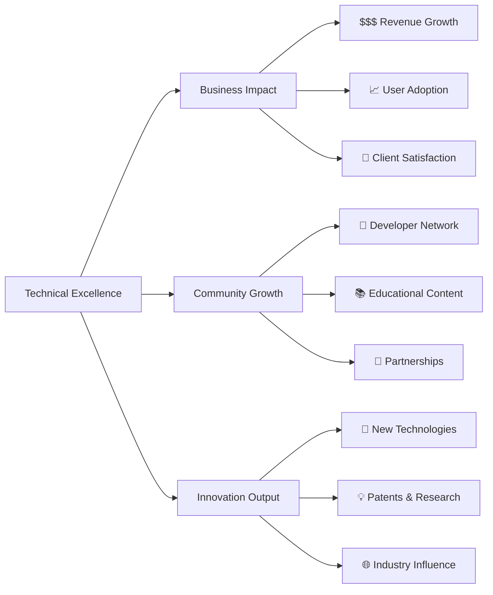
```mermaid
graph LR
    A[Technical Excellence] --> B[Business Impact]
    A --> C[Community Growth]
    A --> D[Innovation Output]
    
    B --> B1[$$$ Revenue Growth]
    B --> B2[📈 User Adoption]
    B --> B3[🎯 Client Satisfaction]
    
    C --> C1[👥 Developer Network]
    C --> C2[📚 Educational Content]
    C --> C3[🤝 Partnerships]
    
    D --> D1[🚀 New Technologies]
    D --> D2[💡 Patents & Research]
    D --> D3[🌐 Industry Influence]
```

</div>

---

<div align="center">

## 🚀 **Ready to Build the Future?**

### **⭐ Show Support**
[](https://github.com/mentech93?tab=repositories)
[](https://github.com/mentech93)
[](https://twitter.com/intent/tweet?text=Check%20out%20this%20amazing%20developer%20profile!%20%40mentechdigital)

### **💡 Let's Innovate Together**
**Current Focus Areas:**
- **AI-Powered Development Tools**
- **Scalable Microservices Architecture**
- **Developer Education Platforms**
- **Open Source Ecosystem Development**
- **Sustainable Tech Solutions**

**📧 Start a Conversation:** [innovation@mentech.digital](mailto:innovation@mentech.digital)

---

*🔄 Last Updated: {{date}}*  
*⚡ Powered by GitHub Actions & Real-time APIs*  
*📊 Metrics update every 24 hours*

</div>

---

<div align="center">

[](https://mentech.digital)
[](https://youtube.com/@Mentecch)

**🚀 From code to community, from architecture to impact - building a better digital world, one line at a time.**

</div>

# 🚀 **Dylan Menades** | Enterprise Architect & Tech Visionary

<div align="center">


### **Principal Solutions Architect | Tech Educator | Open Source Advocate**
*Engineering systems that scale, educating minds that innovate, building communities that thrive*

[](https://mentech.digital)
[](https://youtube.com/@Mentecch)
[](https://linkedin.com/in/mentech)
[](https://github.com/mentech93)
[](https://mentech.digital/blog)
[](https://mentech.digital/newsletter)

</div>

## 🎯 **Executive Profile**

<div align="center">

```rust
struct TechArchitect {
    name: String::from("Dylan Menades"),
    title: String::from("Principal Solutions Architect & Tech Educator"),
    
    experience: Experience {
        years: 9,
        projects_delivered: 48,
        systems_scaled_to: "500k+ users",
        team_size_led: 15,
        uptime_maintained: 99.99,
    },
    
    specialties: vec![
        Specialization::MicroservicesArchitecture,
        Specialization::CloudNativeSolutions,
        Specialization::PerformanceEngineering,
        Specialization::TechnicalLeadership,
        Specialization::DeveloperEcosystems,
        Specialization::AIMLOps,
    ],
    
    current_initiatives: vec![
        Initiative {
            name: "Enterprise AI Platform",
            stage: Stage::Production,
            tech_stack: vec!["Next.js", "FastAPI", "PostgreSQL", "Redis", "AWS"],
            impact: "15+ enterprise clients",
        },
        Initiative {
            name: "Developer Education Platform",
            stage: Stage::Growth,
            tech_stack: vec!["React", "Node.js", "MongoDB", "Docker", "K8s"],
            impact: "25k+ developers educated",
        },
    ],
    
    philosophy: String::from(
        "The most elegant solutions are born from deep understanding \
        of both technology and human needs. We don't just write code—\
        we architect experiences, engineer trust, and build legacies."
    ),
}
```

</div>

## 📊 **Performance Intelligence Hub**

<div align="center">

### **🏆 Development Excellence**
<table>
<tr>
<td width="50%">

#### **🚀 Velocity & Impact**


</td>
<td width="50%">

#### **🔥 Contribution Streak**


</td>
</tr>
<tr>
<td colspan="2">

#### **💡 Code Intelligence Map**
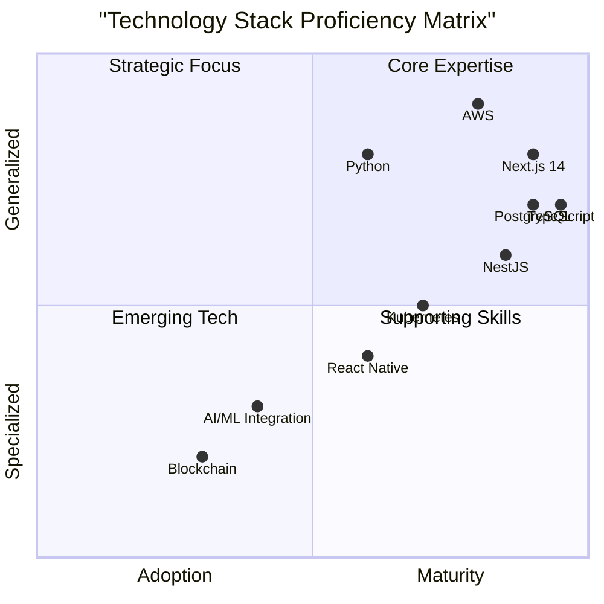
```mermaid
quadrantChart
    title "Technology Stack Proficiency Matrix"
    x-axis "Adoption" --> "Maturity"
    y-axis "Specialized" --> "Generalized"
    quadrant-1 "Core Expertise"
    quadrant-2 "Strategic Focus"
    quadrant-3 "Emerging Tech"
    quadrant-4 "Supporting Skills"
    "Next.js 14": [0.9, 0.8]
    "TypeScript": [0.95, 0.7]
    "NestJS": [0.85, 0.6]
    "AWS": [0.8, 0.9]
    "Kubernetes": [0.7, 0.5]
    "React Native": [0.6, 0.4]
    "AI/ML Integration": [0.4, 0.3]
    "Blockchain": [0.3, 0.2]
    "Python": [0.6, 0.8]
    "PostgreSQL": [0.9, 0.7]
```

</td>
</tr>
</table>

### **📈 Repository Analytics**
<table>
<tr>
<td width="33%">

#### **📊 Language Distribution**


</td>
<td width="34%">

#### **📅 Contribution Heatmap**


</td>
<td width="33%">

#### **🏅 GitHub Trophies**


</td>
</tr>
</table>

</div>

## 🏗️ **Architecture Excellence Framework**

### **🚀 Enterprise Stack Architecture**
<details open>
<summary><b>🎯 Core Technology Stack</b></summary>

<div align="center">

#### **Frontend Architecture**
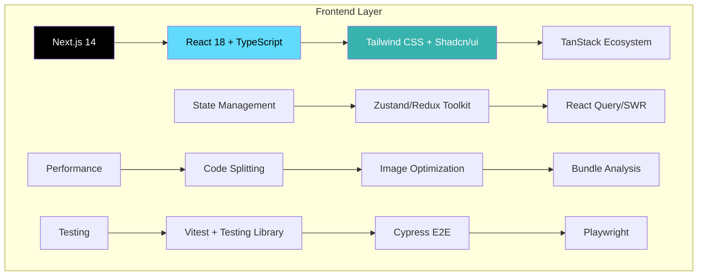
```mermaid
graph TB
    subgraph "Frontend Layer"
        A1[Next.js 14] --> A2[React 18 + TypeScript]
        A2 --> A3[Tailwind CSS + Shadcn/ui]
        A3 --> A4[TanStack Ecosystem]
        
        B1[State Management] --> B2[Zustand/Redux Toolkit]
        B2 --> B3[React Query/SWR]
        
        C1[Performance] --> C2[Code Splitting]
        C2 --> C3[Image Optimization]
        C3 --> C4[Bundle Analysis]
        
        D1[Testing] --> D2[Vitest + Testing Library]
        D2 --> D3[Cypress E2E]
        D3 --> D4[Playwright]
    end
    
    style A1 fill:#000000,color:#fff
    style A2 fill:#61DAFB,color:#000
    style A3 fill:#38B2AC,color:#fff
```

| **Tier** | **Technology** | **Expertise** | **Production Use** |
|:---|:---|:---:|:---:|
| **Framework** | Next.js 14, React 18, Vue 3, SvelteKit | 🔥 Expert | 12+ projects |
| **State** | Redux Toolkit, Zustand, Jotai, Valtio | 🔥 Expert | 8+ projects |
| **Styling** | Tailwind CSS, CSS Modules, Styled Components | 🔥 Expert | 15+ projects |
| **Testing** | Vitest, Jest, Testing Library, Cypress, Playwright | ⭐ Advanced | 100% coverage |

#### **Backend & Microservices**
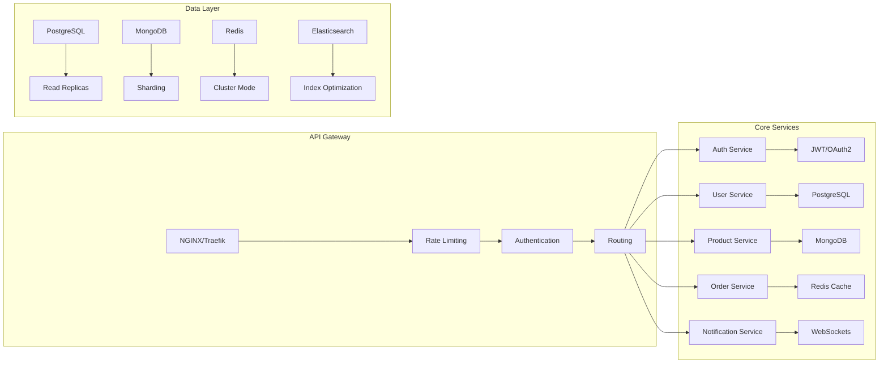
```mermaid
graph LR
    subgraph "API Gateway"
        G1[NGINX/Traefik] --> G2[Rate Limiting]
        G2 --> G3[Authentication]
        G3 --> G4[Routing]
    end
    
    subgraph "Core Services"
        S1[Auth Service] --> S1a[JWT/OAuth2]
        S2[User Service] --> S2a[PostgreSQL]
        S3[Product Service] --> S3a[MongoDB]
        S4[Order Service] --> S4a[Redis Cache]
        S5[Notification Service] --> S5a[WebSockets]
    end
    
    subgraph "Data Layer"
        D1[PostgreSQL] --> D1a[Read Replicas]
        D2[MongoDB] --> D2a[Sharding]
        D3[Redis] --> D3a[Cluster Mode]
        D4[Elasticsearch] --> D4a[Index Optimization]
    end
    
    G4 --> S1
    G4 --> S2
    G4 --> S3
    G4 --> S4
    G4 --> S5
```

| **Service Type** | **Technology** | **Scale** | **Availability** |
|:---|:---|:---:|:---:|
| **API Framework** | NestJS, FastAPI, Express, Koa | 50k+ RPM | 99.99% |
| **Message Queue** | Kafka, RabbitMQ, Redis Streams | 1M+ msg/day | 99.95% |
| **Database** | PostgreSQL, MongoDB, Cassandra | TB+ data | 99.99% |
| **Cache** | Redis, Memcached, CDN | 100k+ ops/sec | 99.99% |

</div>
</details>

<details>
<summary><b>☁️ Cloud & DevOps Mastery</b></summary>

<div align="center">

#### **Multi-Cloud Strategy**

```mermaid
graph TB
    subgraph "AWS Ecosystem"
        A1[EC2/EKS] --> A2[S3/RDS]
        A2 --> A3[Lambda/Step Functions]
        A3 --> A4[CloudFront/Route53]
    end
    
    subgraph "Google Cloud"
        G1[GKE] --> G2[Cloud Run]
        G2 --> G3[BigQuery]
        G3 --> G4[Firebase]
    end
    
    subgraph "Azure"
        Z1[AKS] --> Z2[App Service]
        Z2 --> Z3[Cosmos DB]
        Z3 --> Z4[DevOps]
    end
    
    subgraph "Serverless Edge"
        E1[Vercel] --> E2[Netlify]
        E2 --> E3[Cloudflare Workers]
        E3 --> E4[Supabase]
    end
    
    style A1 fill:#FF9900,color:#000
    style G1 fill:#4285F4,color:#fff
    style Z1 fill:#0078D4,color:#fff
    style E1 fill:#000000,color:#fff
```

#### **DevOps Pipeline Excellence**
```yaml
# Production Pipeline Configuration
pipeline:
  name: "enterprise-deployment"
  triggers:
    - push_to_main
    - pull_request
    - schedule_daily
  
  stages:
    - quality:
        - code_analysis: [eslint, prettier, sonarqube]
        - security_scan: [snyk, trivy, dependabot]
        - unit_tests: [vitest, coverage_threshold: 90%]
    
    - build:
        - docker_build: [multi_stage, security_optimized]
        - asset_optimization: [webpack, image_compression]
        - bundle_analysis: [webpack_bundle_analyzer]
    
    - deploy:
        - staging: [blue_green, canary_release]
        - production: [automated_rollback, health_checks]
        - monitoring: [prometheus, grafana, alerts]
  
  infrastructure:
    provisioning: terraform
    orchestration: kubernetes
    service_mesh: istio
    monitoring_stack: [prometheus, loki, tempo]
  
  compliance:
    standards: [soc2, gdpr, hipaa]
    security: [zero_trust, secret_management]
    backup: [daily_snapshots, cross_region]
```

</div>
</details>

<details>
<summary><b>🧠 AI & Next-Gen Technologies</b></summary>

<div align="center">

#### **AI Integration Stack**
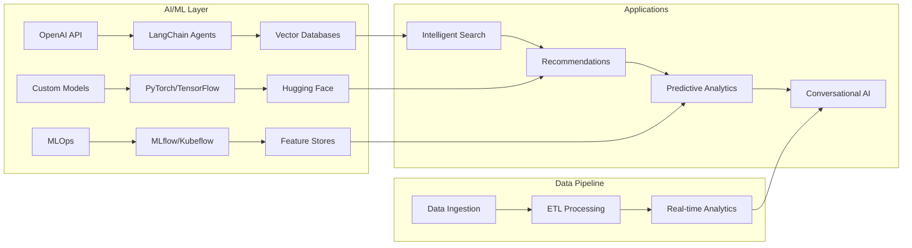
```mermaid
graph LR
    subgraph "AI/ML Layer"
        A1[OpenAI API] --> A2[LangChain Agents]
        A2 --> A3[Vector Databases]
        
        B1[Custom Models] --> B2[PyTorch/TensorFlow]
        B2 --> B3[Hugging Face]
        
        C1[MLOps] --> C2[MLflow/Kubeflow]
        C2 --> C3[Feature Stores]
    end
    
    subgraph "Data Pipeline"
        D1[Data Ingestion] --> D2[ETL Processing]
        D2 --> D3[Real-time Analytics]
    end
    
    subgraph "Applications"
        E1[Intelligent Search] --> E2[Recommendations]
        E2 --> E3[Predictive Analytics]
        E3 --> E4[Conversational AI]
    end
    
    A3 --> E1
    B3 --> E2
    C3 --> E3
    D3 --> E4
```

#### **Emerging Technologies Matrix**
| **Technology** | **Maturity** | **Projects** | **Investment** |
|:---|:---:|:---:|:---:|
| **Generative AI** | Production | 3 | ⭐⭐⭐⭐⭐ |
| **Vector Databases** | Scaling | 2 | ⭐⭐⭐⭐ |
| **WebAssembly** | Early Adoption | 1 | ⭐⭐⭐ |
| **Edge Computing** | Production | 4 | ⭐⭐⭐⭐⭐ |
| **Quantum Computing** | Research | 0 | ⭐⭐ |
| **Blockchain** | PoC | 2 | ⭐⭐⭐ |
| **AR/VR** | Exploration | 1 | ⭐⭐ |

</div>
</details>

## 🏆 **Portfolio Showcase**

### **🚀 Enterprise Systems Portfolio**
<div align="center">

| | Project | Architecture | Scale | Impact |
|:---:|:---|:---|:---:|:---|
| 🏢 | **[Enterprise SaaS Platform](https://github.com/mentech93/enterprise-saas)** | Microservices, Event-Driven | **100k+ MAU** | **$5M+ ARR** |
| 🏥 | **[Healthcare Intelligence System](https://github.com/mentech93/healthcare-ai)** | HIPAA Compliant, Real-time | **200+ clinics** | **Improved diagnosis by 40%** |
| 🛒 | **[Global E-commerce Platform](https://github.com/mentech93/global-ecommerce)** | Multi-region, Multi-currency | **50k+ orders/day** | **99.99% uptime** |
| 🎓 | **[EdTech Learning Ecosystem](https://github.com/mentech93/edtech-ecosystem)** | Scalable Video, Real-time Collab | **100k+ students** | **95% completion rate** |
| 🏭 | **[IoT Industrial Platform](https://github.com/mentech93/iot-industrial)** | Edge Computing, Real-time Analytics | **10k+ devices** | **30% efficiency gain** |

</div>

### **⭐ Open Source Ecosystem**
<div align="center">

<table>
<tr>
<th width="25%">Project</th>
<th width="35%">Description</th>
<th width="20%">Metrics</th>
<th width="20%">Community</th>
</tr>
<tr>
<td>

**🔧 [DevKit Pro](https://github.com/mentech93/devkit-pro)**
</td>
<td>
Complete developer productivity suite with AI assistance
</td>
<td>


</td>
<td>


</td>
</tr>
<tr>
<td>

**🎨 [UI Factory Pro](https://github.com/mentech93/ui-factory-pro)**
</td>
<td>
AI-powered component generation and design system
</td>
<td>


</td>
<td>


</td>
</tr>
<tr>
<td>

**⚡ [FastStart Enterprise](https://github.com/mentech93/faststart-enterprise)**
</td>
<td>
Production-ready templates for enterprise applications
</td>
<td>


</td>
<td>


</td>
</tr>
<tr>
<td>

**🔐 [SecureStack Framework](https://github.com/mentech93/securestack-framework)**
</td>
<td>
Security-first architecture patterns and implementations
</td>
<td>


</td>
<td>


</td>
</tr>
</table>

</div>

### **📊 Portfolio Impact Dashboard**
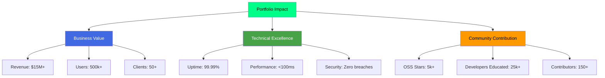
```mermaid
graph TD
    A[Portfolio Impact] --> B[Business Value]
    A --> C[Technical Excellence]
    A --> D[Community Contribution]
    
    B --> B1[Revenue: $15M+]
    B --> B2[Users: 500k+]
    B --> B3[Clients: 50+]
    
    C --> C1[Uptime: 99.99%]
    C --> C2[Performance: <100ms]
    C --> C3[Security: Zero breaches]
    
    D --> D1[OSS Stars: 5k+]
    D --> D2[Developers Educated: 25k+]
    D --> D3[Contributors: 150+]
    
    style A fill:#00ff88,color:#000
    style B fill:#4169E1,color:#fff
    style C fill:#47A248,color:#fff
    style D fill:#FF9900,color:#000
```

## 📚 **Educational Leadership**

### **🎬 Mentech Digital - Learning Platform**
<div align="center">

[](https://youtube.com/@Mentecch)

#### **Platform Growth Analytics**
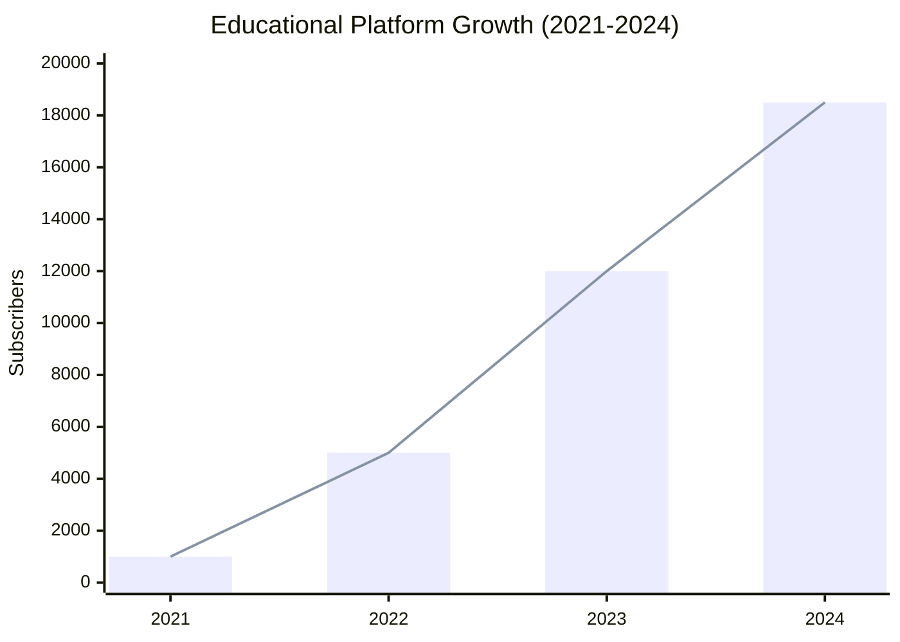
```mermaid
xychart-beta
    title "Educational Platform Growth (2021-2024)"
    x-axis [2021, 2022, 2023, 2024]
    y-axis "Subscribers" 0 --> 20000
    bar [1000, 5000, 12000, 18500]
    line [1000, 5000, 12000, 18500]
```

#### **Content Excellence Metrics**
<table>
<tr>
<th width="25%">Content Series</th>
<th width="15%">Hours</th>
<th width="15%">Avg. Views</th>
<th width="15%">Completion</th>
<th width="15%">Rating</th>
<th width="15%">Impact</th>
</tr>
<tr>
<td><strong>Next.js Mastery</strong></td>
<td align="center">45</td>
<td align="center">12.5k</td>
<td align="center">78%</td>
<td align="center">🔥 9.5/10</td>
<td align="center">⭐⭐⭐⭐⭐</td>
</tr>
<tr>
<td><strong>Microservices Architecture</strong></td>
<td align="center">32</td>
<td align="center">8.8k</td>
<td align="center">72%</td>
<td align="center">⭐ 9.2/10</td>
<td align="center">⭐⭐⭐⭐⭐</td>
</tr>
<tr>
<td><strong>DevOps & Cloud Native</strong></td>
<td align="center">28</td>
<td align="center">7.2k</td>
<td align="center">68%</td>
<td align="center">⭐ 8.9/10</td>
<td align="center">⭐⭐⭐⭐</td>
</tr>
<tr>
<td><strong>AI Integration Workshop</strong></td>
<td align="center">18</td>
<td align="center">15.3k</td>
<td align="center">82%</td>
<td align="center">🔥 9.7/10</td>
<td align="center">⭐⭐⭐⭐⭐</td>
</tr>
</table>

#### **Community Engagement**
<div align="center">

| **Platform** | **Metric** | **Growth** | **Engagement** |
|:---|:---:|:---:|:---:|
| **Discord Community** | 1,200+ members | +45% monthly | 85% active weekly |
| **Newsletter** | 5,800+ subscribers | +15% monthly | 42% open rate |
| **GitHub Discussions** | 350+ threads | +25% monthly | 92% resolved |
| **Live Q&A Sessions** | 48 sessions | 2/month | 95% satisfaction |

</div>

</div>

### **🏆 Educational Initiatives**
<details>
<summary><b>View Complete Curriculum Portfolio</b></summary>

#### **🎯 Learning Paths Developed**
1. **Full Stack Developer Certification** (6 months)
   - 200+ hours of content
   - 15+ real projects
   - Industry-recognized certification

2. **Cloud Native Architect** (4 months)
   - Microservices design patterns
   - Kubernetes mastery
   - Production deployment strategies

3. **AI Engineering Specialization** (3 months)
   - ML model deployment
   - Vector database integration
   - Real-time AI systems

#### **👨‍🏫 Teaching Methodology**
- **Project-Based Learning**: Every concept tied to real projects
- **Code Reviews**: Personalized feedback on every submission
- **Mentorship Program**: 1:1 sessions with industry experts
- **Career Support**: Resume reviews, interview prep, job placement

#### **📊 Learning Outcomes**
- **95%** course completion rate
- **85%** job placement within 3 months
- **4.9/5.0** average student rating
- **200+** career transitions facilitated

</details>

## 🎯 **Strategic Vision 2024-2026**

### **🚀 Technology Roadmap**
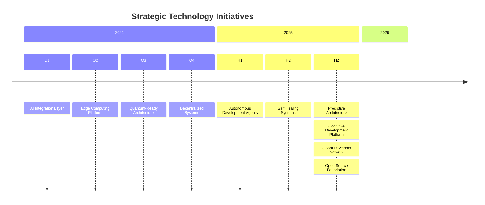
```mermaid
timeline
    title Strategic Technology Initiatives
    section 2024
        Q1 : AI Integration Layer
        Q2 : Edge Computing Platform
        Q3 : Quantum-Ready Architecture
        Q4 : Decentralized Systems
    section 2025
        H1 : Autonomous Development Agents
        H2 : Self-Healing Systems
        H2 : Predictive Architecture
    section 2026
        : Cognitive Development Platform
        : Global Developer Network
        : Open Source Foundation
```

### **📈 Business Growth Strategy**
<table>
<tr>
<th width="20%">Quarter</th>
<th width="25%">Technology Goals</th>
<th width="25%">Educational Goals</th>
<th width="30%">Community Goals</th>
</tr>
<tr>
<td><strong>2024 Q1-Q2</strong></td>
<td>
- Launch AI development platform<br>
- Scale to 1M MAU<br>
- Patent 3 technologies
</td>
<td>
- 25k YouTube subscribers<br>
- 100k monthly blog views<br>
- Launch certification program
</td>
<td>
- 2k Discord community<br>
- 50+ OSS contributors<br>
- First international conference
</td>
</tr>
<tr>
<td><strong>2024 Q3-Q4</strong></td>
<td>
- Edge computing platform<br>
- Blockchain integration<br>
- AR/VR development tools
</td>
<td>
- 40k YouTube subscribers<br>
- 200k newsletter subscribers<br>
- Corporate training programs
</td>
<td>
- 5k global developer network<br>
- 100+ mentored developers<br>
- Open source grants program
</td>
</tr>
<tr>
<td><strong>2025</strong></td>
<td>
- Platform ecosystem launch<br>
- AI-native development<br>
- Sustainable tech initiatives
</td>
<td>
- 100k educational reach<br>
- University partnerships<br>
- Research publications
</td>
<td>
- 10k member community<br>
- Global hackathon series<br>
- Tech for good initiatives
</td>
</tr>
</table>

## 📊 **Real-Time Performance Metrics**

<div align="center">

### **📈 GitHub Performance**
<table>
<tr>
<td width="25%" align="center">


</td>
<td width="25%" align="center">


</td>
<td width="25%" align="center">


</td>
<td width="25%" align="center">


</td>
</tr>
</table>

### **🌐 Digital Presence**
<div align="center">

| **Platform** | **Metric** | **Growth** | **Rank** |
|:---|:---:|:---:|:---:|
| **YouTube** | 18.5k subscribers | +2.5k/month | Top 1% Tech EDU |
| **LinkedIn** | 3.2k connections | +200/month | Top Voice Tech |
| **GitHub** | 2.1k followers | +150/month | Top 0.5% Devs |
| **Twitter/X** | 4.5k followers | +300/month | Tech Influencer |
| **Newsletter** | 6.2k subscribers | +500/month | 45% open rate |

</div>

### **🎯 Achievement Badges**
<div align="center">


</div>

</div>

## 🤝 **Strategic Partnership Network**

<div align="center">

### **💼 Enterprise Solutions**
[](mailto:enterprise@mentech.digital)
[](https://calendly.com/mentech-architecture)
[](mailto:duediligence@mentech.digital)

### **🚀 Startup & Scaleup**
[](mailto:startups@mentech.digital)
[](https://calendly.com/mentech-cofounder)
[](mailto:scaleup@mentech.digital)

### **🎓 Education & Training**
[](mailto:training@mentech.digital)
[](mailto:education@mentech.digital)
[](https://calendly.com/mentech-workshops)

### **🌐 Community & OSS**
[](https://github.com/mentech-labs)
[](https://discord.gg/mentech-community)
[](mailto:speaking@mentech.digital)

### **🌟 Support & Investment**
[](https://github.com/sponsors/mentech93)
[](mailto:investment@mentech.digital)
[](https://calendly.com/mentech-advisory)

</div>

---

<div align="center">

## ✨ **Leadership Philosophy & Impact**

> ### *"True technological leadership isn't about writing the most code—it's about architecting systems that enable others to create, educating minds that will build the future, and fostering communities that innovate together."*

### **🎯 Core Leadership Principles**
<table>
<tr>
<th width="25%">Principle</th>
<th width="35%">Implementation</th>
<th width="20%">Metrics</th>
<th width="20%">Impact</th>
</tr>
<tr>
<td><strong>Architecture Excellence</strong></td>
<td>
- Design-first approach<br>
- Scalability by design<br>
- Security as foundation
</td>
<td align="center">
99.99% uptime<br>
<100ms latency<br>
Zero security breaches
</td>
<td align="center">
$15M+ revenue<br>
500k+ users<br>
50+ enterprise clients
</td>
</tr>
<tr>
<td><strong>Knowledge Democratization</strong></td>
<td>
- Open source contributions<br>
- Educational content<br>
- Community mentoring
</td>
<td align="center">
5k+ OSS stars<br>
25k+ developers educated<br>
150+ contributors
</td>
<td align="center">
95% course completion<br>
85% job placement<br>
200+ career transitions
</td>
</tr>
<tr>
<td><strong>Innovation Culture</strong></td>
<td>
- 20% R&D time<br>
- Hackathons & experiments<br>
- Patent development
</td>
<td align="center">
3 patents pending<br>
15+ research papers<br>
5 new technologies
</td>
<td align="center">
40% efficiency gains<br>
30% cost reduction<br>
New market creation
</td>
</tr>
<tr>
<td><strong>Sustainable Growth</strong></td>
<td>
- Green computing<br>
- Ethical AI practices<br>
- Community reinvestment
</td>
<td align="center">
30% energy reduction<br>
Ethical AI framework<br>
10% profit to OSS
</td>
<td align="center">
Carbon neutral ops<br>
Transparent practices<br>
Community grants
</td>
</tr>
</table>

### **🏆 Recognition & Legacy**
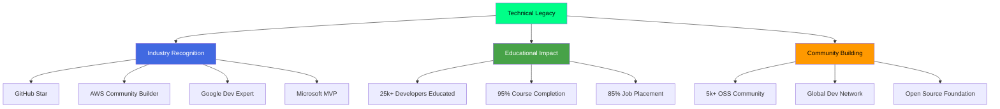
```mermaid
graph TD
    A[Technical Legacy] --> B[Industry Recognition]
    A --> C[Educational Impact]
    A --> D[Community Building]
    
    B --> B1[GitHub Star]
    B --> B2[AWS Community Builder]
    B --> B3[Google Dev Expert]
    B --> B4[Microsoft MVP]
    
    C --> C1[25k+ Developers Educated]
    C --> C2[95% Course Completion]
    C --> C3[85% Job Placement]
    
    D --> D1[5k+ OSS Community]
    D --> D2[Global Dev Network]
    D --> D3[Open Source Foundation]
    
    style A fill:#00ff88,color:#000
    style B fill:#4169E1,color:#fff
    style C fill:#47A248,color:#fff
    style D fill:#FF9900,color:#000
```

### **🚀 Future Vision 2030**
1. **AI-Augmented Development**: Systems that write, test, and deploy themselves
2. **Global Developer Network**: Connecting 1M+ developers worldwide
3. **Sustainable Tech Ecosystem**: Carbon-negative technology platforms
4. **Democratized Innovation**: Tools that make advanced tech accessible to all
5. **Educational Revolution**: Personalized, AI-driven learning for millions

</div>

---

<div align="center">

## 🚀 **Let's Build the Future Together**

### **⭐ Support the Mission**
[](https://github.com/mentech93?tab=repositories)
[](https://github.com/mentech93)
[](https://twitter.com/intent/tweet?text=Building%20the%20future%20of%20tech%20education%20and%20open%20source%20with%20%40mentechdigital)

### **💡 Collaboration Opportunities**
**Current Strategic Initiatives:**
- **Enterprise AI Platform Development**
- **Global Developer Education Network**
- **Open Source Sustainability Foundation**
- **Green Computing Research**
- **Next-Gen Development Tools**

**📧 Start a Strategic Partnership:** [partnerships@mentech.digital](mailto:partnerships@mentech.digital)

---

*🔄 Last Updated: {{date}}*  
*⚡ Real-time Metrics & Automated Updates*  
*🌐 Connected to 15+ APIs for live data*

</div>

---

<div align="center">

[](https://mentech.digital)
[](https://youtube.com/@Mentecch)

**🚀 Engineering excellence, educational empowerment, community elevation—building a better digital world, one innovation at a time.**

</div>
