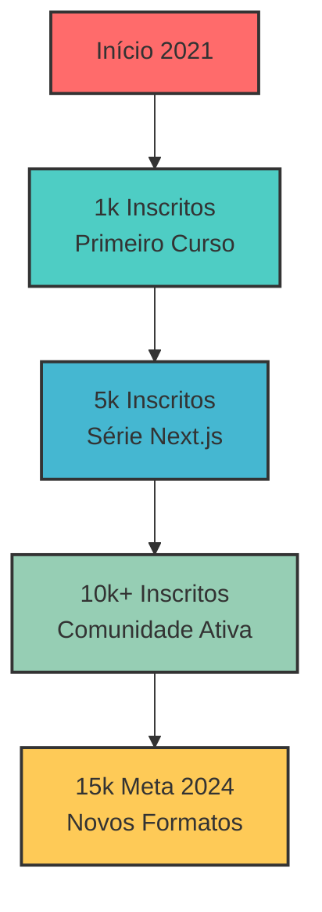
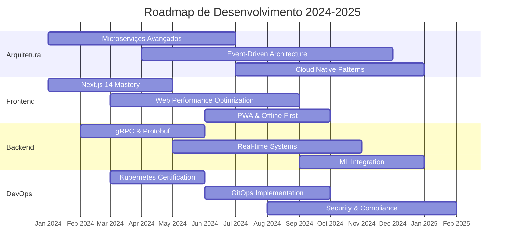

# 👨‍💻 Dylan Menades

**`Arquiteto de Soluções Full Stack | Criador de Conteúdo Tech | Líder Técnico`**

***Arquitetando soluções digitais que transformam ideias em impacto real***

## 📊 **Dashboard GitHub**

### **📈 Estatísticas de Performance**
| | |
|:---:|:---:|
|  |  |

### **💻 Stack em Destaque**

### **📊 Atividade Detalhada**

## 🏗️ **Arquitetura & Stack Avançada**

### **🚀 Stack Principal**

<b>🌐 Frontend Avançado (Clique para expandir)</b>

| **Frameworks** | **Estado & Gerenciamento** | **UI/UX & Performance** |
|:---:|:---:|:---:|
|  |  |  |
|  |  |  |
|  |  |  |

| **Type Safety** | **Testes** | **Build & Bundle** |
|:---:|:---:|:---:|
|  |  |  |
|  |  |  |
|  |  |  |

<b>⚡ Backend & Microsserviços (Clique para expandir)</b>

| **Runtime & Frameworks** | **APIs & Protocolos** | **Autenticação & Segurança** |
|:---:|:---:|:---:|
|  |  |  |
|  |  |  |
|  |  |  |
|  |  |  |

| **Message Brokers** | **Cache & Performance** | **Monitoramento** |
|:---:|:---:|:---:|
|  |  |  |
|  |  |  |
|  |  |  |

<b>🗄️ Banco de Dados & Data Engineering (Clique para expandir)</b>

| **SQL & Relacionais** | **NoSQL & Documentos** | **Search & Analytics** |
|:---:|:---:|:---:|
|  |  |  |
|  |  |  |
|  |  |  |

| **ORM & Query Builders** | **Migrações & Versionamento** | **Data Warehousing** |
|:---:|:---:|:---:|
|  |  |  |
|  |  |  |
|  |  |  |

<b>☁️ DevOps, Cloud & Infraestrutura (Clique para expandir)</b>

| **Cloud Providers** | **Contêineres & Orquestração** | **CI/CD & Automação** |
|:---:|:---:|:---:|
|  |  |  |
|  |  |  |
|  |  |  |

| **IaC & Provisionamento** | **Monitoring & Observability** | **Servidores & Edge** |
|:---:|:---:|:---:|
|  |  |  |
|  |  |  |
|  |  |  |

## 🏆 **Portfólio de Projetos**

### **🚀 Projetos em Produção**

| | Projeto | Stack | Status | Impacto |
|:---:|:---|:---|:---:|:---|
| 🏢 | **[SaaS Gestão Empresarial](https://github.com/mentech93/gestao-pro)** | `Next.js 14` `NestJS` `PostgreSQL` `Redis` `AWS` | 🟢 **Live** | **15+ empresas** **99.9% uptime** **2k+ usuários** |
| 🛒 | **[E-commerce Microservices](https://github.com/mentech93/api-ecommerce)** | `FastAPI` `Kafka` `MongoDB` `Redis` `Docker` | 🟢 **Live** | **10k+ transações/dia** **<100ms latency** |
| 🎓 | **[Plataforma Educacional](https://github.com/mentech93/mentech-learning)** | `React` `Node.js` `MySQL` `AWS S3` `CloudFront` | 🟢 **Live** | **5k+ alunos** **500+ horas de conteúdo** |

### **⭐ Projetos Open Source**

| | Projeto | Estrelas | Downloads | Descrição |
|:---:|:---|:---:|:---:|:---|
| ⚡ | **[DevTools CLI](https://github.com/mentech93/devtools-cli)** |  |  | CLI para automação de desenvolvimento |
| 🎨 | **[UI Components Library](https://github.com/mentech93/ui-components)** |  |  | Biblioteca de componentes React |
| 📦 | **[Next.js Boilerplate](https://github.com/mentech93/nextjs-boilerplate)** |  |  | Template com best practices |

### **🔧 Ferramentas & Utilidades**

| Categoria | Ferramentas |
|:---|:---|
| **IDE & Editores** |   |
| **Versionamento** |   |
| **Design & Prototipação** |   |
| **Documentação** |   |

## 📈 **Impacto & Educação**

### **🎥 Mentech Digital - YouTube Analytics**

```mermaid
graph TD
    A[Início 2021] --> B[1k Inscritos<br/>Primeiro Curso];
    B --> C[5k Inscritos<br/>Série Next.js];
    C --> D[10k+ Inscritos<br/>Comunidade Ativa];
    D --> E[15k Meta 2024<br/>Novos Formatos];
    
    style A fill:#ff6b6b,stroke:#333,stroke-width:2px
    style B fill:#4ecdc4,stroke:#333,stroke-width:2px
    style C fill:#45b7d1,stroke:#333,stroke-width:2px
    style D fill:#96ceb4,stroke:#333,stroke-width:2px
    style E fill:#feca57,stroke:#333,stroke-width:2px
```

| **Estatística** | **Valor Atual** | **Crescimento** | **Meta 2024** |
|:---|:---:|:---:|:---:|
| **👥 Inscritos** |  | **+62%**/ano | **15,000** |
| **📹 Vídeos** |  | **2**/semana | **200+** |
| **👀 Visualizações** |  | **5k**/vídeo | **1M+** |
| **⏱️ Watch Time** | **500+ horas** | **+45%** | **1,000h** |

### **📚 Categorias de Conteúdo**

| **Categoria** | **Foco** | **Próximos Lançamentos** |
|:---|:---|:---|
| **🚀 Bootcamps Práticos** | Full Stack, DevOps, Mobile | *Arquitetura Cloud Native* |
| **🔍 Code Reviews** | Arquitetura, Performance, Security | *Análise de Projetos Reais* |
| **💼 Carreira Tech** | Entrevistas, Salários, Progressão | *Guia de Tech Lead* |
| **🏗️ Projetos do Zero** | Ideação → Desenvolvimento → Deploy | *SaaS Completo em 30 dias* |

## 📊 **Métricas em Tempo Real**

### **📈 Estatísticas GitHub**
| | | |
|:---:|:---:|:---:|
|  |  |  |
|  |  |  |

### **🏆 Achievements**

## 🎯 **Roadmap 2024-2025**

### **🚀 Objetivos Técnicos**

```mermaid
gantt
    title Roadmap de Desenvolvimento 2024-2025
    dateFormat  YYYY-MM
    axisFormat %b %Y
    
    section Arquitetura
    Microserviços Avançados      :2024-01, 6M
    Event-Driven Architecture    :2024-04, 8M
    Cloud Native Patterns        :2024-07, 6M
    
    section Frontend
    Next.js 14 Mastery           :2024-01, 4M
    Web Performance Optimization :2024-03, 6M
    PWA & Offline First          :2024-06, 4M
    
    section Backend
    gRPC & Protobuf              :2024-02, 4M
    Real-time Systems            :2024-05, 6M
    ML Integration               :2024-09, 4M
    
    section DevOps
    Kubernetes Certification     :2024-03, 3M
    GitOps Implementation        :2024-06, 4M
    Security & Compliance        :2024-08, 6M
```

### **📚 Metas de Conteúdo & Educação**
- [x] **Q1 2024:** Lançar curso de Next.js 14 (completo)
- [ ] **Q2 2024:** Série sobre Arquitetura de Microsserviços
- [ ] **Q3 2024:** Bootcamp DevOps & Cloud
- [ ] **Q4 2024:** Projeto open source educativo
- [ ] **2025:** Plataforma de mentoria tech

## 🤝 **Conecte-se Comigo**

### **💼 Para Oportunidades Profissionais**

### **🎓 Para Aprendizado & Conteúdo**

### **👨‍💻 Para Colaboração**

---

## ✨ **Filosofia & Valores**

> ### *"O código que escrevemos hoje é a base da inovação de amanhã. Cada linha deve contar uma história de clareza, eficiência e impacto."*

### **🎯 Princípios de Trabalho**
- **📐 Arquitetura Primeiro:** Design antes da implementação
- **🧪 Test Driven:** Qualidade desde o primeiro commit
- **📚 Documentação como Cultura:** Conhecimento compartilhado
- **🚀 Performance por Design:** Otimização proativa
- **🤝 Colaboração > Competição:** Comunidade forte

### **⭐ Suporte ao Trabalho**

### **🚀 Pronto para Colaborar?**
**Interesses atuais:**
- **Projetos SaaS** com impacto social/empresarial
- **Consultoria Técnica** em arquitetura e escalabilidade
- **Parcerias Educacionais** para capacitação tech
- **Open Source** que resolvem problemas reais
- **Startups Tech** buscando validação técnica

**📧 Vamos construir algo incrível juntos:** [contato@mentech.digital](mailto:contato@mentech.digital)

---

*🔄 Última atualização: {{date}}*  
*⚡ Atualizado automaticamente via GitHub Actions*  
*📊 Métricas em tempo real*

---

**💡 Transformando linhas de código em impacto real através de arquitetura sólida e educação acessível**

